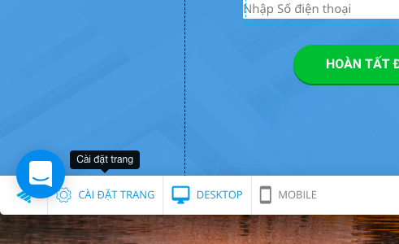
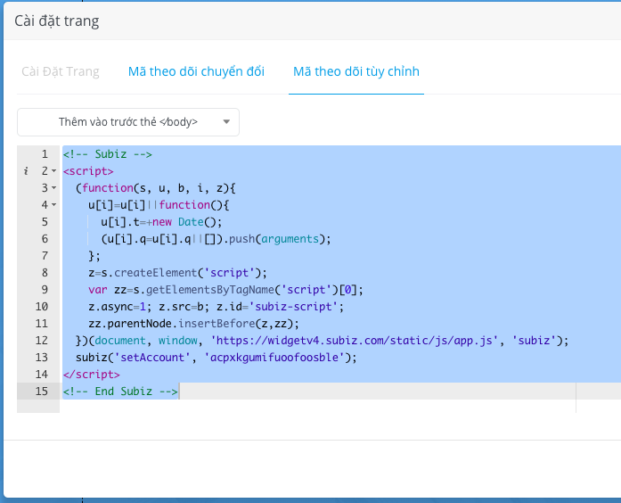
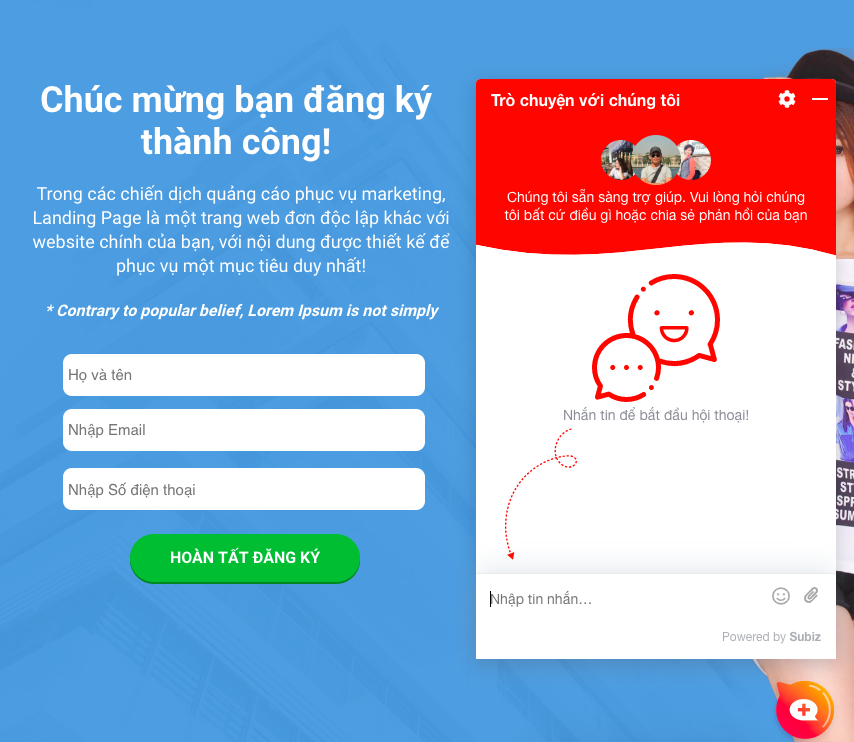
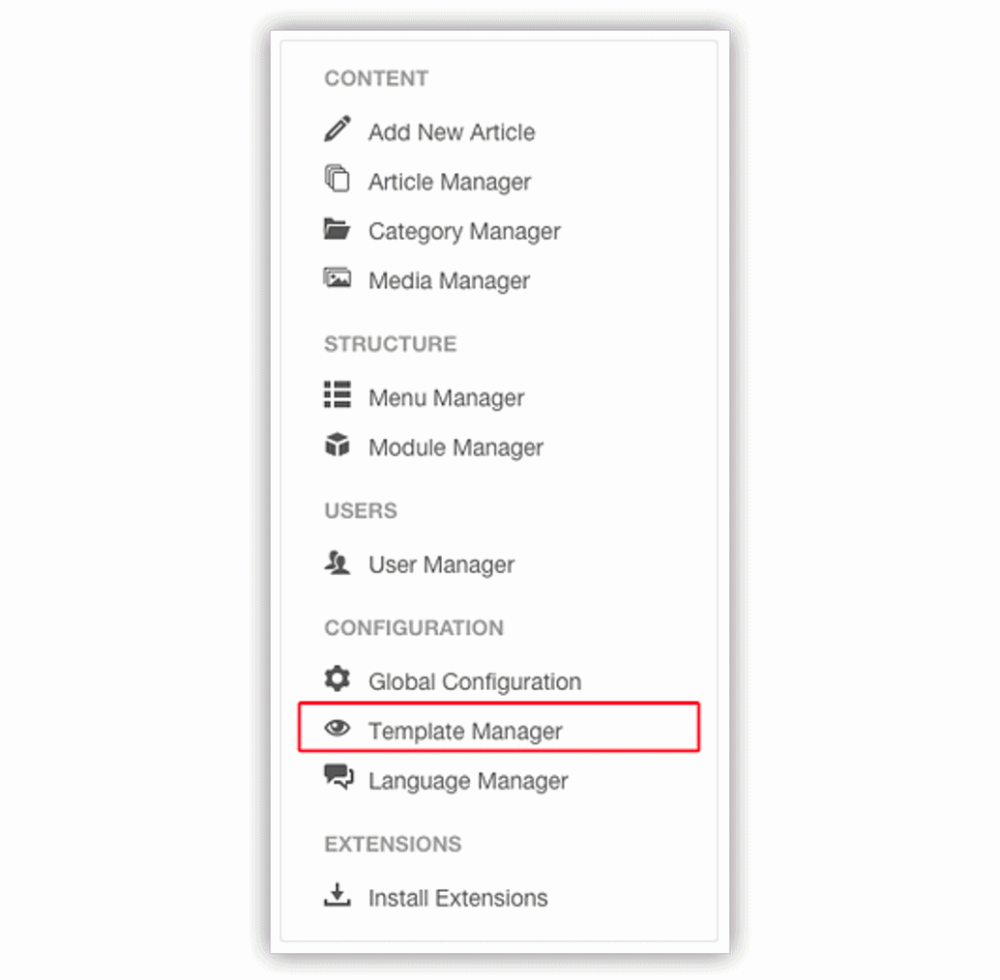
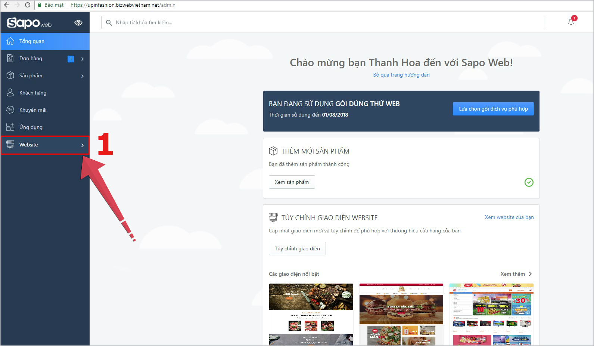
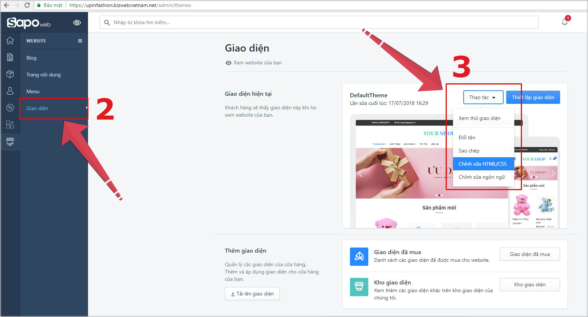
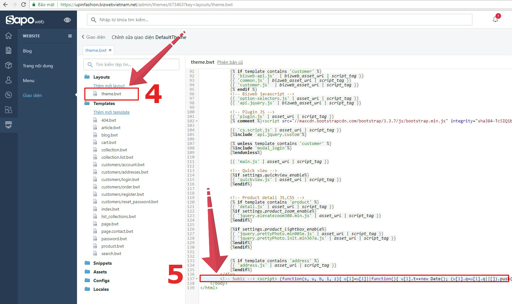

# Tích hợp Subiz Chat trên các nền tảng

### Subiz plugin trên Wordpress \(đang cập nhật\)

**Bước 1**: Cài đặt plug in Subiz  
[Đăng nhập](https://login.wordpress.org/?locale=en_US) tài khoản Wordpress &gt; Mở trang quản lý Admin Panel &gt; Plugins &gt; Tìm kiếm và cài đặt plugin SUBIZ

**Bước 2**: Nhập License ID \(Xem [Mã tài khoản Subiz](https://app.subiz.com/settings/)\) &gt; Lưu 

**Bước 3**: Tùy chỉnh cửa sổ Subiz chat  
Bạn lựa chọn màu sắc cửa sổ chat và button chat phù hợp với website và thương hiệu của bạn &gt; Lưu thay đổi

**Bước 4**: Thông báo trên trình duyệt của khách hàng  
Chọn kiểu mời khách hàng đăng ký nhận thông báo trên trình duyệt, có 3 kiểu cho bạn lựa chọn &gt; Chọn kiểu thông báo &gt; Lưu thay đổi

Lưu ý:

* Kiểu 1 bạn có thể thay đổi ảnh logo công ty và nội dung tin nhắn mời nhận khách nhận thông báo.
* Kiểu 2 và 3 bạn có thể chọn các kiểu hình ảnh \(CTA notification\) kêu gọi nhận thông báo phù hợp với website và theo ý bạn muốn.

### Tích hợp mã nhúng Subiz trên Wordpress

**Bước 1**: Mở trang quản lý WordPress Admin Panel &gt; Appearance &gt; Editor.

**Bước 2**: Tìm file footer.php bên cột bên phải và mở file này.

**Bước 3**: Đăng nhập Subiz &gt; Cài Đặt &gt; [Tích hợp](https://app.subiz.com/settings/install) , sao chép mã nhúng Subiz và dán mã nhúng Subiz vào ngay trước thẻ &lt;/body&gt; trong file footer.php.

### Subiz và Ladipage.vn 

**Bước 1**: Login tài khoản [Ladipage](https://ladipage.vn) và chọn Landing page bạn muốn đặt Subiz. 

**Bước 2**: Trên Ladipage, bạn vào CÀI ĐẶT TRANG tại góc dưới bên phải màn hình. Tại màn hình mở ra, bạn chọn Tab "Mã theo dõi tuỳ chỉnh". 

**Bước 3**: Bạn đăng nhập Subiz &gt; Cài Đặt &gt; [Tích hợp](https://app.subiz.com/settings/install) , sao chép mã nhúng Subiz và dán vào tab "Mã theo dõi tuỳ chỉnh" nói ở bước 2. Bạn chọn vị trí đặt là "Thêm vào trước thẻ &lt;/body&gt;" . Sau đó Save lại.

Bạn xuất bản, và truy cập vào Landing Page để xem sự kết hợp sửa Subiz và Ladipage.

Ngoài ra, bạn cũng có thể tuy chỉnh mầu riêng, button đặc biệt hay cả ngôn ngữ cho cửa sổ Subiz này ngay tại Ladipage. 

### Subiz và Shopify

**Bước 1**: Đăng nhập tài khoản Shopify, tìm đến **Online Store** &gt; **Themes**.

**Bước 2**: Sau đó nhấn vào nút **Action** và chọn **Edit code.**

**Bước 3**: ****Tìm file **theme.liquid** tại menu bên trái.

**Bước 4**: Đăng nhập Subiz &gt; Cài Đặt &gt; [Tích hợp](https://app.subiz.com/settings/install) , sao chép mã nhúng Subiz và dán mã nhúng Subiz trước thẻ &lt;/body&gt; &gt; Chọn **Save**.

### Subiz và Joomla

**Bước 1**: Vào Joomla Admin &gt; Template Manager &gt; Chọn mục Template và Filter theo Site.

**Bước 2**: Chọn Template đang sử dụng &gt; Click vào file Index.php.

**Bước 3**: Đăng nhập Subiz &gt; Cài Đặt &gt; [Tích hợp](https://app.subiz.com/settings/install) , sao chép mã nhúng Subiz và dán mã nhúng Subiz trước thẻ &lt;/body&gt;.

### Subiz và Wix

**Bước 1**: Đăng nhập màn hình Dashboard của Wix, chọn Manage & Edit Site.

**Bước 2**: Click vào Edit Site &gt; Add button &gt; More &gt; HTML iframe. Kéo phần iframe vừa được chọn xuống dưới footer \(có thể điều chỉnh vị trí của iframe\).

**Bước 3**: Đăng nhập Subiz &gt; Cài Đặt &gt; [Tích hợp](https://app.subiz.com/settings/install) , sao chép mã nhúng Subiz và dán mã nhúng Subiz vào Add code &gt; Chọn Save.

### Subiz và Magento

Để tích hợp Subiz trên web Magento của bạn, vui lòng tham khảo hai tùy chọn bên dưới:

#### Lựa chọn 1

* Bước 1: Tìm Magento template tại app/design/frontend/{template}/page/html/head.phtml. Nếu tệp này không tồn tại, thì bạn cần phải kiểm tra xem tệp ứng dụng app/design/frontend/{template}/default/page/html/head.phtml có tồn tại hay không?
* Bước 2: Khi tìm thấy, [sao chép mã nhúng Subiz](https://app.subiz.com/settings/install) và dán ngay trước thẻ &lt;/head&gt; của tệp.

#### Lựa chọn 2

Bạn chỉ cần thực hiện theo lựa chọn này nếu các tệp mẫu được mô tả trong Lựa chọn 1 không tồn tại. Có trường hợp này do một số mẫu Magento có thể không có tệp head.phtml và sử dụng tệp mẫu cơ sở.

* Bước 1: Sao chép tệp ứng dụng app/design/frontend/default/page/html/head.phtml từ mẫu cơ sở mặc địch vào thư mục tùy chỉnh tại app/design/frontend/{template}/page/html/head.phtml.
* Bước 2: Mở tệp, [sao chép mã nhúng Subiz](https://app.subiz.com/settings/install) và dán trước thẻ &lt;/head&gt;.

### Subiz và Sapo Web

**Bước 1**: Đăng nhập trang quản trị website của Sapo &gt; Chọn Website.

**Bước 2**: Chọn **Giao diện &gt; Thao tác &gt; Chỉnh sửa HTML/CSS.**

**Bước 3**: Chọn **Them.bwt** &gt; Tìm thẻ **&lt;/body&gt;** &gt; [Sao chép mã nhúng Subiz](https://app.subiz.com/settings/install) và dán **trước thẻ body** &gt; **Lưu.**

