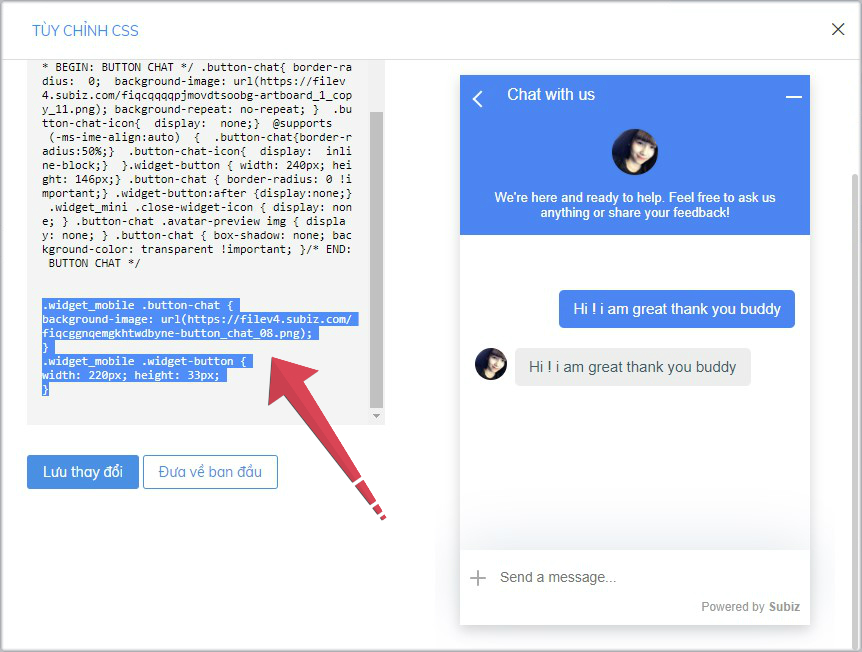

# Tùy chỉnh cửa sổ chat Subiz trên điện thoại

Cửa sổ chat Subiz trên điện thoại di động được thiết kế tối ưu phù hợp với màn hình nhỏ gọn của khách hàng và nâng cao trải nghiệm khách hàng khi vừa tương tác với tư vấn viên vừa lướt web mua hàng.

### 1. Một số điều cần biết về cửa sổ chat trên điện thoại 

* **Chat button** sẽ mặc định hiển thị giống nhau trên phiên bản máy tính và điện thoại
* Bạn có thể tùy chỉnh hình ảnh **chat button** riêng trên điện thoại với mã CSS
* Khi khách click vào **chat button** sẽ mở ra **cửa sổ chat** Subiz
* **Cửa sổ chat** sẽ hiển thị khoảng 90% màn hình, để khách vẫn nhìn thấy link của website mua hàng
* Bạn có thể tùy chỉnh các thành phần của giao diện **cửa sổ chat** với mã CSS
* Tin nhắn tự động của Automation sẽ hiển thị dạng preview tin nhắn, không mở cửa sổ chat.

### 2. Các bước tùy chỉnh cửa sổ chat trên điện thoại với mã CSS

Để sử dụng mã CSS tùy chỉnh cửa sổ chat, bạn thao tác: [Đăng nhập App.subiz.com &gt; Cài đặt &gt; Tài khoản &gt; Cửa sổ hội thoại &gt; Tùy chỉnh CSS](https://app.subiz.com/settings/widget-setting) &gt; Sao chép mã CSS và dán vào phía dưới bảng tùy chỉnh CSS  
 &gt; Lưu thay đổi tại bảng Tùy chỉnh CSS   
&gt; Lưu thay đổi tại mục Cửa sổ hội thoại để hoàn thành



### 3. CSS tùy chỉnh giao diện cửa sổ chat 

* Tùy chỉnh màu sắc chung của cả cửa sổ chat và chat button ****Bạn có thể thay đổi mã màu \#0000

```text
.widget_mobile .color_theme_default {
background-color: #0000;
}
```

* Tùy chỉnh màu sắc thanh tiêu đề cửa sổ chat ****Bạn có thể thay đổi mã màu \#0000

```text
.widget_mobile .widget-header {
background-color: #0000;
}
```

* Tùy chỉnh màu sắc ô tin nhắn trong cửa sổ chat ****Bạn có thể thay đổi mã màu \#0000

```text
.widget_mobile .message-body {
background-color: #0000;
}
```

* Tùy chỉnh màu sắc nút Bắt đầu trò chuyện trong cửa sổ chat ****Bạn có thể thay đổi mã màu \#0000

```text
.widget_mobile .add-new-conversation {
background-color: #0000;
}
```

### 4. CSS tùy chỉnh hình ảnh chat button

* Thay đổi chat button trên điện thoại. Trong đó:  
  * [https://filev4.subiz.com/fiqcggnqemgkhtwdbyne-button\_chat\_08.png](https://filev4.subiz.com/fiqcggnqemgkhtwdbyne-button_chat_08.png): là link hình ảnh chat button. Bạn có thể thay đổi chọn link ảnh của bạn.
  * 60 px: là kích thước chiều dài và chiều cao của hình ảnh chat button.

```text
.widget_mobile .button-chat {
background-image: url(https://filev4.subiz.com/fiqcggnqemgkhtwdbyne-button_chat_08.png);
}
.widget_mobile .widget-button {
width: 60px; height: 60px;
}
```

* Tùy chỉnh vị trí chat button so với màn hình điện thoại Trong đó: 10px là vị trí của chat button so với chân màn hình \(buttom\) và bên phải màn hình \(right\)

```text
.widget_mobile .widget-button {
bottom:10px;
right:10px;
}
```


> Bạn đang có mong muốn tùy chỉnh khác trên cửa sổ chat, hãy  gửi yêu cầu qua Support@Subiz.com để được hỗ trợ tốt nhất!

