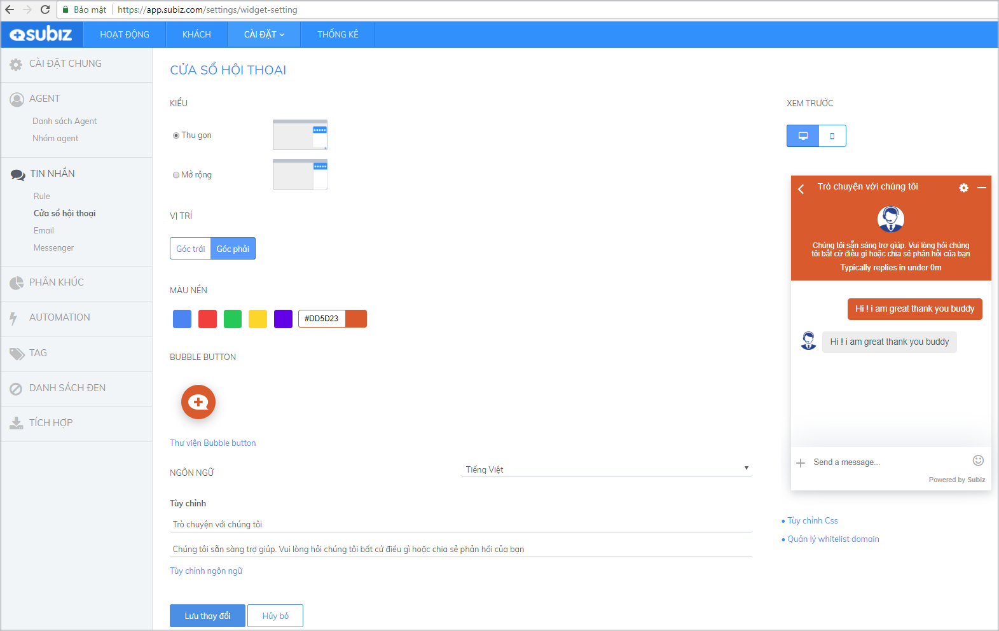
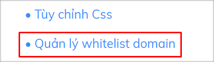
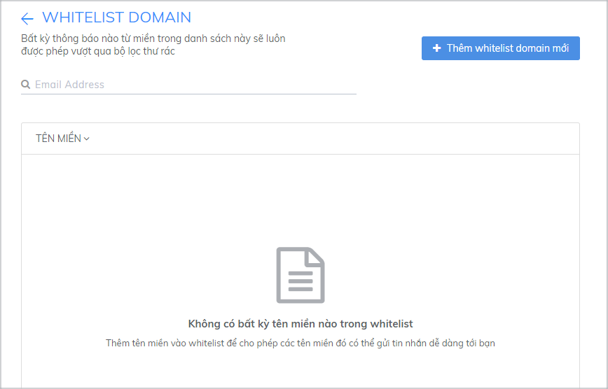

# Tùy chỉnh cửa sổ chat Subiz

**Cửa sổ** [**Subiz**](https://subiz.com/vi/) **chat trên website là nơi khách truy cập trò chuyện với tư vấn viên của doanh nghiệp.** Không  đơn giản là nơi bạn tương tác tư vấn khách hàng, mà còn là nơi bạn khẳng định thương hiệu, chất lượng dịch vụ và tiếng nói của doanh nghiệp.

Để tùy chỉnh cửa sổ chat, bạn đăng nhập tài khoản [**Subiz &gt; Cài đặt &gt; Tài khoản &gt;  Cửa sổ Subiz chat**](https://app.subiz.com/settings/widget-setting)\*\*\*\*

Tại trang Cửa sổ Subiz chat, bạn có thể tùy chỉnh giao diện và ngôn ngữ hiển thị trên cửa sổ chat cho phù hợp với hình ảnh thương hiệu quả website. Cụ thể như sau::

### **Kiểu cửa sổ chat Thu gọn hay Mở rộng**

[Subiz](https://subiz.com/vi/) đã tạo sẵn 2 kiểu kích thước **Thu gọn** hoặc **Mở rộng** cho cửa sổ chat trên website đáp ứng nhu cầu của từng người dùng.

* **Thu gọn:** Kích thước tiêu chuẩn, chiều rộng  x chiều cao là 360px x 580px
* **Mở rộng:** Chiều dài cửa sổ chat toàn màn hình, giúp khách hàng dễ theo dõi cuộc chat với agent.

[Xem thêm thay đổi kích thước chiều rộng, chiều cao cửa sổ chat với mã CSS](https://help.subiz.com/bat-dau-voi-subiz/thiet-lap-moi-truong-tuong-tac/tich-hop-subiz-len-website/bang-ma-css-tuy-chinh-cua-so-chat#thay-doi-chieu-rong-chieu-cao-cua-so-chat).

### Chọn v**ị trí cửa sổ chat**

Bạn có thể chọn vị trí cửa sổ chat xuất hiện trên website tại **Góc trái** hoặc **Góc phải**

Vị trị đặt cửa sổ Subiz cần phù hợp với thiết kế của website, sao cho dễ nhận biết, không đè lên các thiết kế hay ứng dụng khác của website. Hiện tại, một tỷ lệ lớn các doanh nghiệp đặt cửa sổ Subiz tại góc bên phải.

### Chỉnh sửa **màu sắc**

Chọn màu nền cho cửa sổ Subiz trong các màu được gợi ý, hoặc [tùy biến màu sắc riêng với mã CSS.](https://help.subiz.com/bat-dau-voi-subiz/thiet-lap-moi-truong-tuong-tac/tich-hop-subiz-len-website/bang-ma-css-tuy-chinh-cua-so-chat#tuy-bien-mau-sac-tren-cua-so-chat)

Lưu ý: Màu sắc cửa sổ chat có thể tương đồng với màu sắc của thương hiệu, nhưng cũng cần bắt mắt và dễ nhận biết trên website.

### **Tùy chỉnh chat button**

Chat button là hình ảnh kêu gọi và thu hút khách hàng chat trực tuyến trên cửa sổ Subiz chat. Khi khách hàng click vào chat button sẽ mở ra cửa sổ chat.

Bạn có thể chọn Thư viện button có sẵn hoặc thiết kế hình ảnh chat button riêng để truyền tải thông điệp và mang đến cho khách hàng những trải nghiệm thú vị khi truy cập website.

* Thư viện button: Màu sắc của button sẽ tự động thay đổi theo màu nền cửa sổ chat
* Button large: Mẫu button bắt mắt, thu hút khách hàng. Màu sắc button không tự động thay đổi.
* Sử dụng button tùy chỉnh: Khi bạn muốn thiết kê mẫu button riêng. Lưu ý: + Hình ảnh button thiết kế cần định dạng Png, phông nền là transparent. + Kích thước chuẩn là 240 x 120 px. + Tham khảo mẫu button Chat với chúng tôi: [button 1](https://filev4.subiz.com/fiqcggngypeovdudlqyu-button_chat_01.png) - [button 2](https://filev4.subiz.com/fiqcgvyibtxjcxnbjysc-button1_vn.png) - [button 3](https://filev4.subiz.com/fiqcggnolwzgyzltheem-button_chat_05.png) - [button 4](https://filev4.subiz.com/fiqcgvyssbundnpuqkqs-button4_vn.png) - [button 5](https://filev4.subiz.com/fiqcqpihreurxviwekol-artboard_1_copy_9.png) - [button 6](https://filev4.subiz.com/fiqcqpimprgfdctpdtht-artboard_1_copy_10.png) - [button 7](https://filev4.subiz.com/fiqcqpitaljpxccvhmow-artboard_1_copy_11.png) - [button 8](https://filev4.subiz.com/fiqcggnpqqrmggiofklb-button_chat_07.png) - [button 9](https://filev4.subiz.com/fiqcgvyqfhiokhwiqmnz-button3_en.png) - [button 10](https://filev4.subiz.com/fiqcgvysbxbykjcrorum-button4_en.png). + Tham khảo mẫu button chào mừng ngày Quốc Khánh 2/9: [Xem chi tiết](https://subiz.com/blog/viet-nam-tren-website-cua-ban.html)​ + Tham khảo mẫu button Giáng sinh:

### **Thay đổi ngôn ngữ**

Cửa sổ Subiz hỗ trợ 2 ngôn ngữ chính là Tiếng Việt và English. Tại mục NGÔN NGỮ, bạn có thể chọn Tự động hoặc Tiếng Việt hoặc English. Trong đó:

* **Tự động**: Cửa sổ [Subiz chat](https://subiz.com/vi/live-chat.html) tự động nhận diện và hiển thị ngôn ngữ tiếng Anh hoặc tiếng Việt theo địa chỉ IP của khách hàng.
* **Tiếng Việt**: chọn khi doanh nghiệp chỉ phục vụ khách hàng Việt Nam và website hỗ trợ chỉ ngôn ngữ Việt Nam.
* **English**: chọn khi doanh nghiệp phục vụ khách quốc tế và website chỉ hỗ trợ ngôn ngữ tiếng Anh.

[Xem thêm tùy chỉnh nội dung cửa sổ chat với mã HTML, thay đổi ngôn ngữ khách với tệp .po](https://help.subiz.com/bat-dau-voi-subiz/thiet-lap-moi-truong-tuong-tac/tich-hop-subiz-len-website/cac-ngon-ngu-ho-tro-tren-cua-so-subiz-chat)

### **Cài đặt Whitelist domain**

**Whitelist domain** là danh sách các tên miền mà bạn cho phép hiển thị cửa sổ Subiz trên trang đó. Các trang ngoài danh sách whitelist sẽ không thể hiển thị cửa sổ Subiz sau khi đặt mã nhúng.

Ví dụ: Bạn nhập _domain1.com_ và _domain2.com_ tại whitelist thì chỉ có thể đặt mã nhúng [cài đặt cửa sổ Subiz](https://app.subiz.com/settings/widget-setting) trên 2 trang này. Nếu bạn đặt mã nhúng tại trang _domain3.com_ thì cửa sổ sẽ không hiển thị tại trang đó.


Khi danh sách whitelist domain trống, mặc định cửa sổ sẽ hiển thị trên tất cả các trang được đặt mã nhúng.

Cài đặt whitelist domain giúp bạn kiểm soát các trang hiển thị cửa sổ Subiz, tránh trường hợp mã nhúng bị đặt trên các trang bạn không mong muốn.


Thực hiện cài đặt tại phần **Quản lý Whitelist Domain**.

Tại trang Whitelist Domain, click chọn **Thêm Whitelist Domain mới.**

Nhập tên miền và chọn **Thêm** để thêm domain vào danh sách whitelist.

**Để xóa một domain khỏi whitelist,** bạn ấn vào biểu tượng xóa bên cạnh tên domain trong danh sách.

