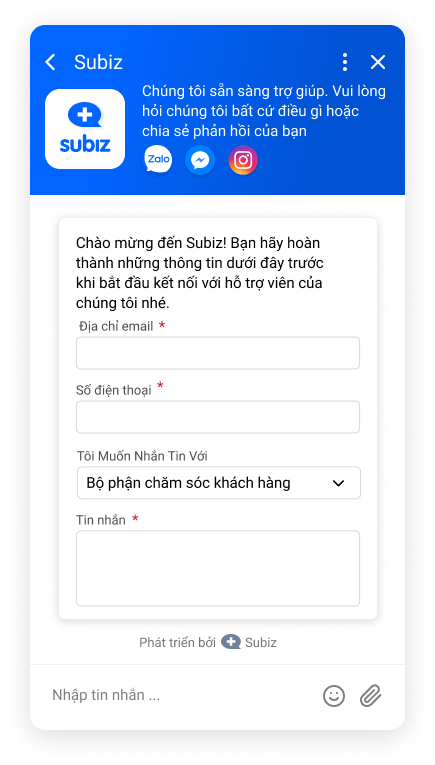
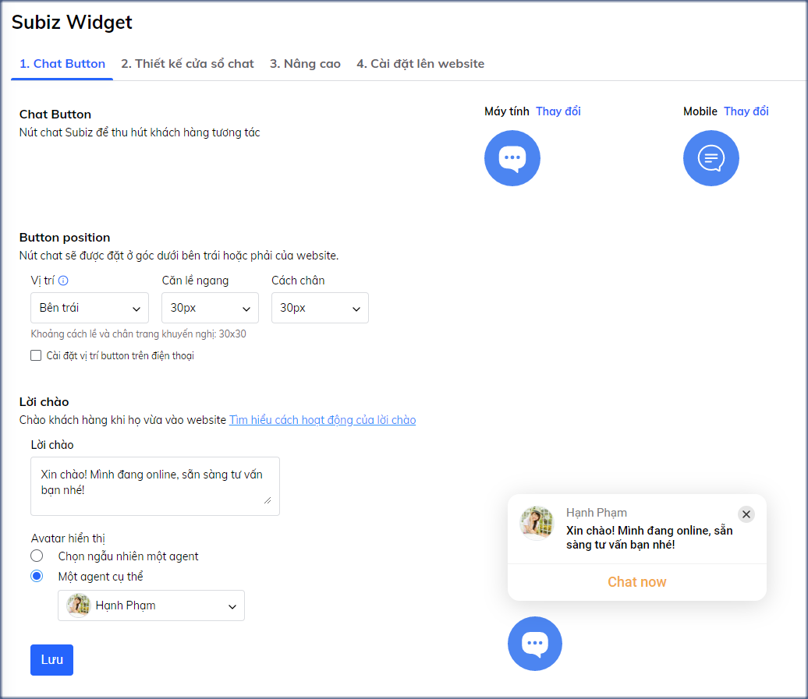
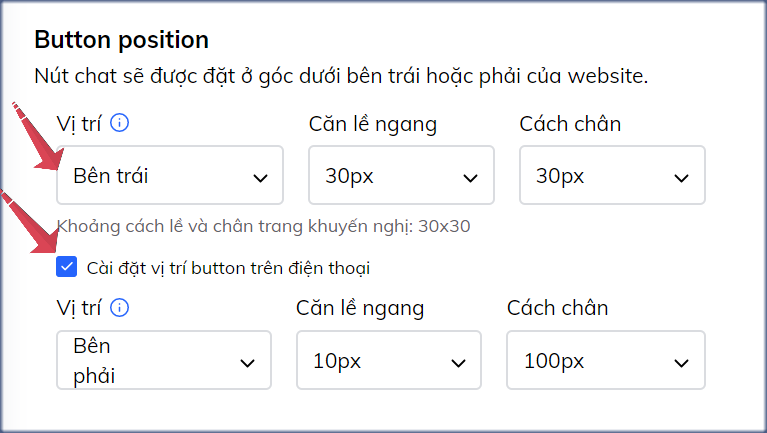
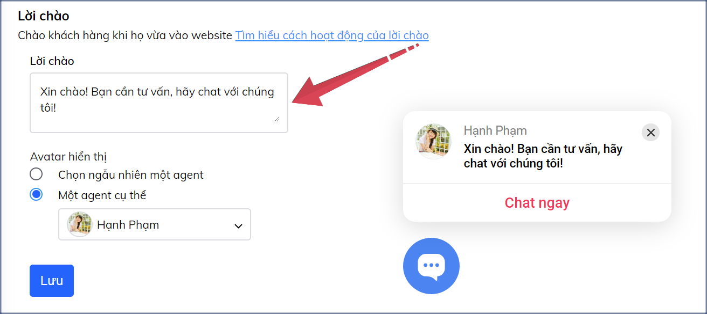
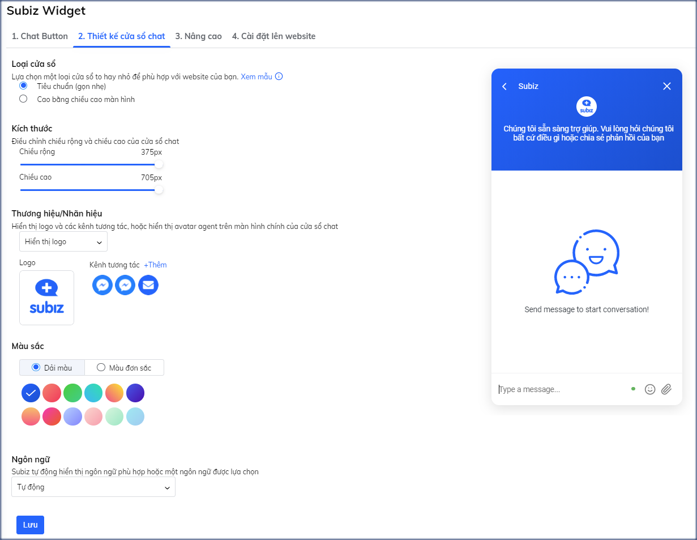
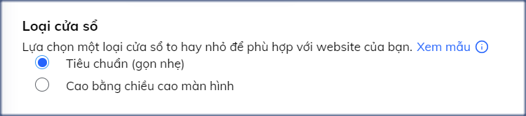
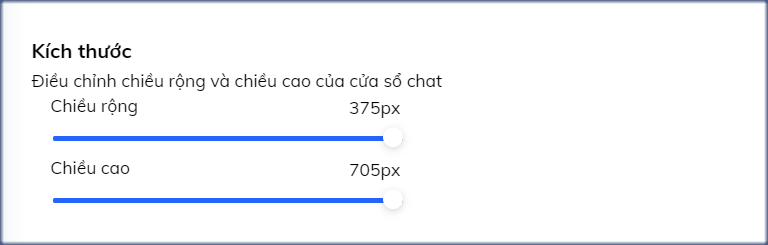
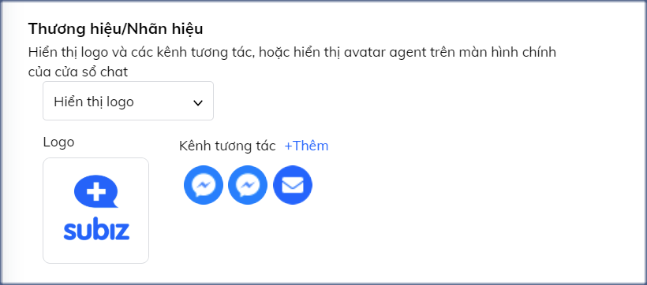
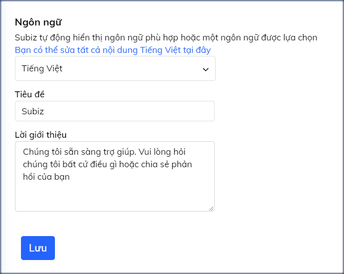
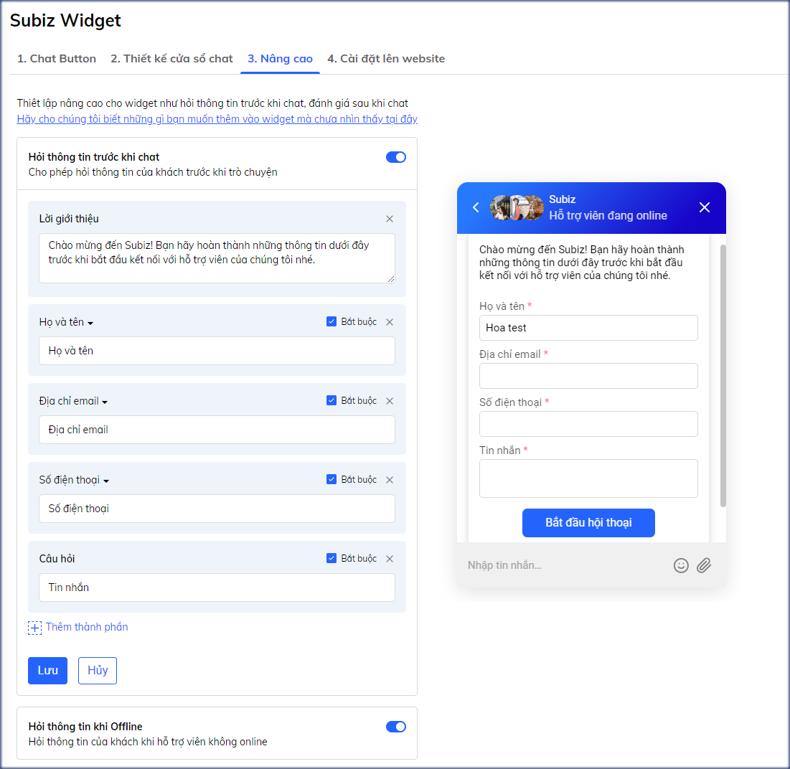

# Tùy chỉnh cửa sổ Subiz chat

Subiz hiểu rằng bạn cần kết nối mạnh mẽ hơn với khách hàng. Đó là lý do tại sao Subiz cập nhật Cửa sổ chat Subiz hoàn toàn mới, dễ dàng tiếp cận và thu hút khách hàng của bạn!

Một số điểm mới trên cửa sổ chat:

* Chào đón tất cả khách truy cập website và kêu gọi khách hàng chat mạnh mẽ hơn.
* Gia tăng nhận diện thương hiệu khi hiện thị logo công ty và các kênh tương tác khách hàng của công ty như Facebook, Zalo, Email,...
* Thu thập thông tin khách hàng nhanh chóng xác định tiềm năng và phân luồng khách hàng mục tiêu.
* Thay đổi cài đặt cửa sổ chat dễ dàng.

Bài viết này sẽ hướng dẫn chi tiết 3 cài đặt trên cửa sổ chat: chat button, cửa sổ chat và nâng cao.   
Chi tiết như sau:

Để bắt đầu tùy chỉnh cửa sổ chat, bạn vào trang [**Cài đặt Cửa sổ Subiz chat**](https://app.subiz.com/settings/widget-setting/chat-button) qua đường link: [https://app.subiz.com/settings/widget-setting/chat-button](https://app.subiz.com/settings/widget-setting/chat-button)

### 1. Chat button kêu gọi chat 

Chat button như một nút kêu gọi chat trên website của bạn. 

Bạn được quyết định hình ảnh hiện thị của chat button, vị trí chat button trên website của mình và lời chào tất cả khách truy cập trang web sao cho phù hợp với giao diện chung của trang web và thu hút khách hàng nhất.



**Hình ảnh button chat**

Bạn có thể lựa chọn mẫu ảnh button có sẵn trên Subiz hoặc tùy ý thiết kế ảnh button riêng của mình và tải lên Subiz.  
Button trên bản máy tính và điện thoại có thể cài đặt khác nhau.

* Chọn bản **Máy tính** hoặc **điện thoại** &gt; Chọn **Thay đổi** 
* Chọn **Thư viện button** để sử dụng mẫu ảnh button có sẵn của Subiz. Hoặc **Sử dụng button tùy chỉnh** để tải ảnh button thiết kế của bạn.

_**Tip nhỏ**_: Ảnh button có thể thiết kế dạng ảnh Gif sinh động, ảnh của chương trình Sales off khuyến mãi sẽ tạo được cảm xúc nơi khách hàng.



**Vị trí button chat trên website**

Bạn chọn đặt button chat ở **Bên phải** hoặc **Bên trái** website, di chuyển **vị trí button cha**t lên cao hoặc xuống thấp so với chân trang web trong khoảng **10px - 100px**.

Chọn Cài đặt vị trí button trên điện thoại bạn khi bạn cần thay đổi vị trí button riêng trên bản điện thoại.

_**Tip nhỏ**_: Theo thói quen của người dùng internet, button chat bên phải website sẽ dễ nhìn, dễ thao tác chat hơn.



**Lời chào khách truy cập**

Lời chào hiện lên cùng button chat khi khách truy cập website, giống như một nhân viên lễ tân niềm nở chào đón khách hàng ghé thăm cửa hàng.

Thay đổi nội dung lời chào và chọn ảnh đại diện của agent chào khách mang lại cảm xúc gần gũi với khách hàng.

_**Tip nhỏ**_: 

* Bạn thường xuyên thay đổi nội dung lời chào để đánh giá hiệu quả lời chào trong chuyển đổi khách hàng hay tăng số lượng chat.
* Lời chào xuất hiện kể cả khi agent online và agent offline, nên bạn cần tạo nội dung lời chào cho phù hợp.



### 2. Thiết kế cửa sổ chat sinh động

Cửa sổ chat là một điểm chạm với khách hàng giúp bạn gia tăng nhận diện thương hiệu công ty và tạo trải nghiệm khách hàng tốt.

Bạn có thể thiết kế lại giao diện cửa sổ chat phù hợp với website và nhóm khách hàng mục tiêu của mình tại trang **Thiết kế cửa sổ chat** qua đường link  
****[**https://app.subiz.com/settings/widget-setting/set-up-subiz-chat**](https://app.subiz.com/settings/widget-setting/set-up-subiz-chat)\*\*\*\*



**Loại cửa sổ chat**

Bạn có thể chọn loại cửa sổ chat phù hợp với trang web là **Tiêu chuẩn** nhỏ gọn hoặc **Cao bằng chiều cao màn hình.**

_**Tip nhỏ**_: Cửa sổ chat cao bằng chiều cao màn hình giúp khách hàng dễ dàng nhìn nội dung chat có kèm hình ảnh, sản phẩm, video,...



**Kích thước**

Bạn được thay đổi kích thước chiều rộng và chiều cao của cửa sổ chat. Chiều rộng tối là 375px. Chiều cao tối đa là 705px.

_**Tip nhỏ**_: Không sửa cửa sổ chat quá nhỏ khiến khách khó xem nội dung chat tư vấn.



**Thương hiệu/ Nhãn hiệu**

Bạn có thể quyết định cho phép hiện thị logo công ty và các kênh tương tác như Facebook, Email, Zalo OA,..., hoặc hiển thị avatar agent trên màn hình chính của cửa sổ chat**.**

_**Tip nhỏ**_: Hiện thị logo và kênh tương tác cho phép khách hàng có nhiều lựa chọn chat trên cửa sổ chat Subiz hoặc chat Fanpage hoặc chat Zalo OA,...



**Màu sắc**

Chọn dải màu bắt mắt hoặc màu đơn sắc cho cửa sổ chat của bạn.

_**Tip nhỏ**_: Màu sắc cửa sổ chat nổi bật so với màu sắc trang web giúp khách dễ dàng nhận biết cửa sổ chat tư vấn.



**Ngôn ngữ**

Cửa sổ chat mặc định đặt chế độ Tự động hiện ngôn ngữ Tiếng Anh hoặc Tiếng Việt theo ngôn ngữ trình duyệt của người dùng.  
Bạn có thể chọn ngôn ngữ cố định Tiếng Việt hoặc Tiếng Anh để thay đổi nội dung Tiêu đề và Lời giới thiệu trên cửa sổ chat.

_**Tip nhỏ**_: Bạn có thể sửa tất cả nội dung ngôn từ trên cửa sổ chat bằng cách sử dụng file ngôn ngữ po, [**xem hướng dẫn chi tiết**](https://help.subiz.com/bat-dau-voi-subiz/thiet-lap-moi-truong-tuong-tac/tich-hop-subiz-len-website/cac-ngon-ngu-ho-tro-tren-cua-so-subiz-chat#3-tuy-chinh-noi-dung-cua-so-chat-voi-file-po).



### 3. Nâng cao thu thập thông tin khách hàng

Trước khi chat, bạn cần thu thập thông tin khách hàng hay tự động phân luồng chat cho nhóm nhân viên phụ trách hoặc xác định tiềm năng của khách hàng.   
Hãy sử dụng chức năng **Nâng cao của cửa sổ chat** qua đường link ****[**https://app.subiz.com/settings/widget-setting/advance**](https://app.subiz.com/settings/widget-setting/advance)  
Tại đây, bạn có thể thiết lập Hỏi thông tin tất cả khách hàng trước khi chat và Hỏi thông tin khách hàng khi agent offline hoặc ngoài giờ làm việc.



Sử dụng hỏi thông tin trước khi chat nếu bạn muốn tất cả khách hàng phải điền thông tin, sau đó mới có thể chat nhắn tin.

* Ưu điểm: Thu thập thông tin khách hàng để phân luồng khách hàng và nhanh chóng xử lý các yêu cầu của khách hàng.
* Nhược điểm: Nhiều khách hàng e ngại điền thông tin trước khi chat nói chuyện nên có thể giảm số lượng chat với khách hàng

Hướng dẫn cài đặt:

* Chọn Hỏi thông tin trước khi chat 
*  Bật ON để sử dụng và chỉnh sửa + Thay đổi lại lời giới thiệu + Thêm thành phần là các thông tin hỏi khách hàng
* Lưu thay đổi để hoàn thành

Tip nhỏ:

* Chọn Bắt buộc khách hàng điền thông tin để tiếp tục chat hoặc Không bắt buộc.
* Phân luồng khách hàng cho nhóm agent phụ trách chat tư vấn.

Ví dụ: Khi bạn có nhiều bộ phận Kinh doanh, Kỹ thuật, Dịch vụ khách hàng, bạn có thể phân luồng khách hàng cho từng nhóm bộ phận nhận và trả lời tư vấn khách hàng. Cụ thể như sau:   
1. Tạo nhóm agent tại trang [**https://app.subiz.com/settings/agents-group**](https://app.subiz.com/settings/agents-group)  
2. Sử dụng **Hỏi thông tin trước khi chat** tại trang ****[**https://app.subiz.com/settings/widget-setting/advance**](https://app.subiz.com/settings/widget-setting/advance)  
Chọn **Thêm thành phần**: **Lựa chọn nói chuyện với**  
Chọn **Tạo nhóm** để thêm nhóm agent đã tạo  



Ngoài giờ làm việc và khi agent offline không sẵn sàng chat, bạn sử dụng Hỏi thông tin khi offline.

Lợi ích: 

* Thông báo cho khách hàng biết Hỗ trợ viên đang offline hoặc Đang ngoài giờ làm việc
* Thu thập thông tin và yêu cầu của khách hàng để phản hồi khách hàng khi agent quay trở lại làm việc.

Hướng dẫn cài đặt:

* Chọn Hỏi thông tin trước khi Offline
*  Bật ON để sử dụng và chỉnh sửa nội dung hỏi khách hàng + Thay đổi lại lời giới thiệu + Thêm thành phần là các thông tin hỏi khách hàng
* Lưu thay đổi để hoàn thành



> Bạn cần thêm tư vấn, hãy liên hệ ngay Subiz qua email Support@Subiz.com!

