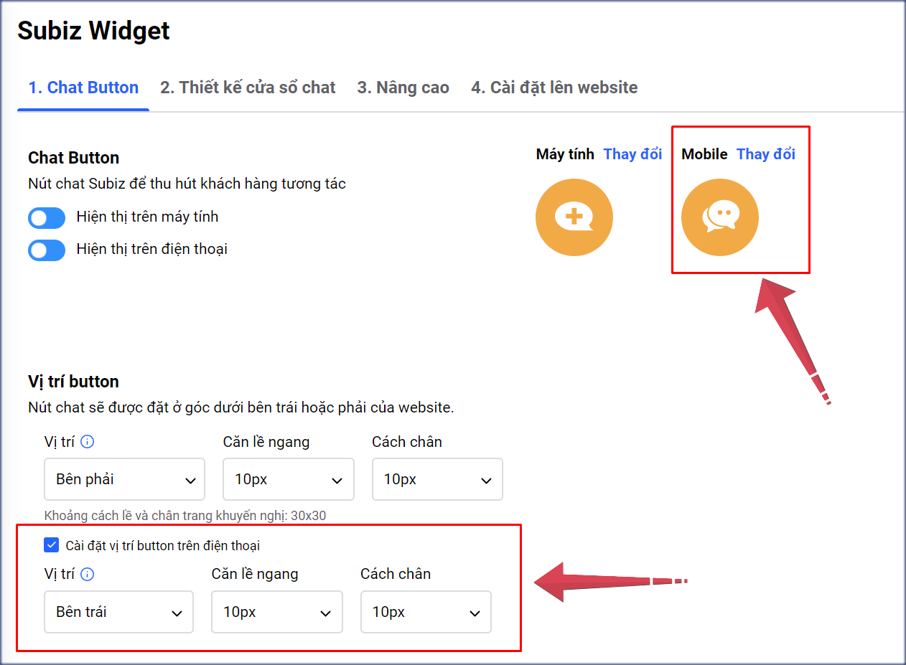

# Tùy chỉnh cửa sổ Subiz chat trên điện thoại

Cửa sổ Subiz chat trên điện thoại di động được thiết kế tối ưu phù hợp với màn hình nhỏ gọn của khách hàng và nâng cao trải nghiệm khách hàng khi vừa tương tác với tư vấn viên vừa lướt web mua hàng.

### 1. Một số điều cần biết về cửa sổ chat trên điện thoại 

* **Chat button** sẽ mặc định hiển thị giống nhau trên phiên bản máy tính và điện thoại.
* Bạn có thể tùy chỉnh hình ảnh **chat button** riêng trên điện thoại..
* Khi khách click vào **chat button** sẽ mở ra **cửa sổ chat** Subiz.
* **Cửa sổ chat** sẽ hiển thị khoảng 90% màn hình, để khách vẫn nhìn thấy link của website mua hàng.
* Tin nhắn tự động của Automation sẽ hiển thị thông báo tin nhắn dạng số tại chat button, không mở cửa sổ chat.

### 2. Tùy chỉnh cửa sổ chat trên điện thoại với CSS

Bạn có thể tùy chỉnh chat button và vị trí chat button trên điện thoại :

* **Chat button**: Trên bản điện thoại, chọn **Thay đổi** để bạn lựa chọn sử dụng thư viện button có sẵn của Subiz hoặc tải hình ảnh button thiết kế riêng của bạn.
* **Hiện thị trên điện thoại**: Bạn có thể OFF để ẩn chat button trên điện thoại và gắn link cửa sổ chat vào hình ảnh hay dòng chữ bất kỳ trên website bản điện thoại. [**Xem thêm hướng dẫn đặt chat button ở bất cứ vị trí nào trên website.**](https://help.subiz.com/bat-dau-voi-subiz/thiet-lap-moi-truong-tuong-tac/tich-hop-subiz-len-website/dat-button-subiz-moi-noi-tren-website-voi-api-js)\*\*\*\*
* **Vị trí button trên điện thoại**: Bạn có thể đặt button sang trái hoặc phải website, điều chỉnh vị trí chính xác của button so với căn lề ngang và cách chân trang.

> Bạn muốn tùy chỉnh khác trên cửa sổ chat, vui lòng gửi yêu cầu qua Support@Subiz.com!

