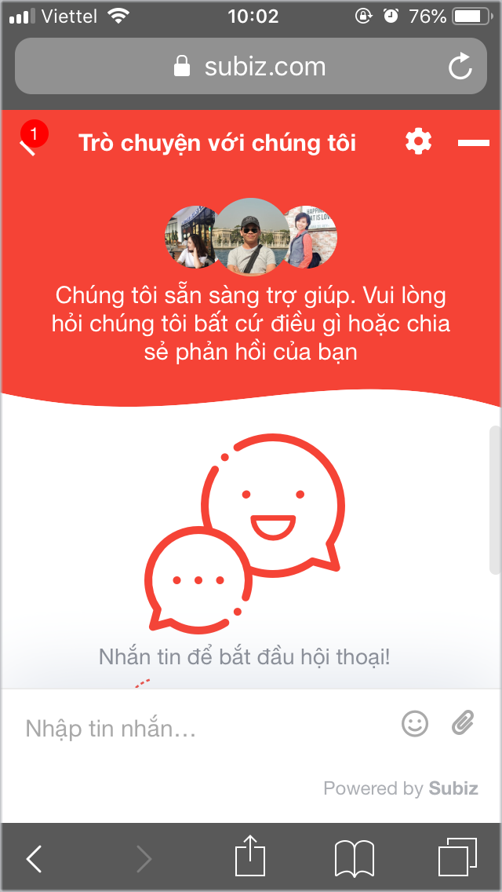
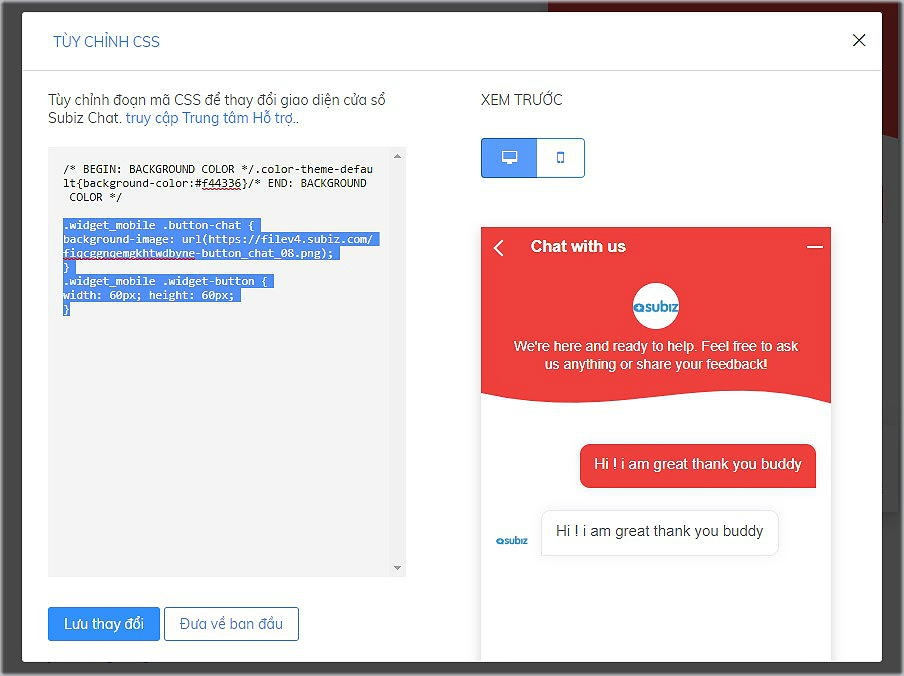

# Tùy chỉnh cửa sổ Subiz chat trên điện thoại

Cửa sổ Subiz chat trên điện thoại di động được thiết kế tối ưu phù hợp với màn hình nhỏ gọn của khách hàng và nâng cao trải nghiệm khách hàng khi vừa tương tác với tư vấn viên vừa lướt web mua hàng.

### 1. Một số điều cần biết về cửa sổ chat trên điện thoại 

* **Chat button** sẽ mặc định hiển thị giống nhau trên phiên bản máy tính và điện thoại
* Bạn có thể tùy chỉnh hình ảnh **chat button** riêng trên điện thoại với mã CSS
* Khi khách click vào **chat button** sẽ mở ra **cửa sổ chat** Subiz
* **Cửa sổ chat** sẽ hiển thị khoảng 90% màn hình, để khách vẫn nhìn thấy link của website mua hàng
* Bạn có thể tùy chỉnh các thành phần của giao diện **cửa sổ chat** với mã CSS
* Tin nhắn tự động của Automation sẽ hiển thị thông báo tin nhắn dạng số tại chat button, không mở cửa sổ chat.

### 2. Tùy chỉnh cửa sổ chat trên điện thoại với CSS

Để sử dụng CSS tùy chỉnh cửa sổ chat, bạn thao tác: [Đăng nhập App.subiz.com &gt; Cài đặt &gt; Tài khoản &gt; Cửa sổ Subiz chat &gt; Tùy chỉnh CSS](https://app.subiz.com/settings/widget-setting) &gt; Sao chép mã CSS tương ứng và dán vào phía dưới bảng tùy chỉnh CSS  
&gt; Lưu thay đổi tại bảng Tùy chỉnh CSS   
&gt; Lưu thay đổi tại mục Cửa sổ Subiz chat để hoàn thành

* [CSS hạ thấp chiều cao cửa sổ chat trên mobile](https://help.subiz.com/bat-dau-voi-subiz/thiet-lap-moi-truong-tuong-tac/tich-hop-subiz-len-website/bang-css-tuy-chinh-cua-so-chat#ha-thap-chieu-cao-cua-so-chat-tren-mobile)
* [CSS tùy chỉnh chat button riêng trên bản mobile](https://help.subiz.com/bat-dau-voi-subiz/thiet-lap-moi-truong-tuong-tac/tich-hop-subiz-len-website/bang-css-tuy-chinh-cua-so-chat#tuy-chinh-chat-button-rieng-ban-mobile)
* [Đặt button Subiz mọi nơi trên website với API Js](https://help.subiz.com/bat-dau-voi-subiz/thiet-lap-moi-truong-tuong-tac/tich-hop-subiz-len-website/dat-button-subiz-moi-noi-tren-website-voi-api-js)

> Bạn muốn tùy chỉnh khác trên cửa sổ chat, vui lòng gửi yêu cầu qua Support@Subiz.com!

