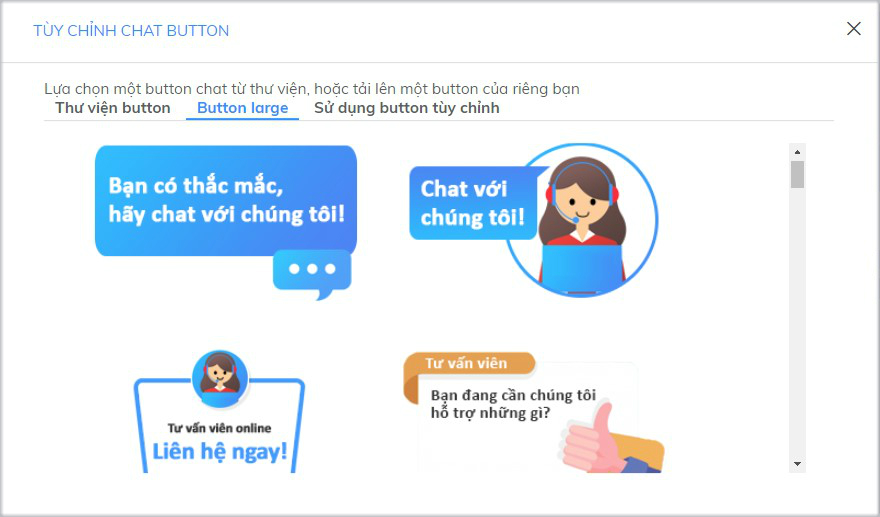

# Tùy chỉnh cửa sổ Subiz chat

**Cửa sổ** [**Subiz**](https://subiz.com/vi/) **chat trên website là nơi khách truy cập trò chuyện với tư vấn viên của doanh nghiệp.** Không  đơn giản là nơi bạn tương tác tư vấn khách hàng, mà còn là nơi bạn khẳng định thương hiệu, chất lượng dịch vụ và tiếng nói của doanh nghiệp.

Để tùy chỉnh cửa sổ chat, bạn đăng nhập tài khoản [**Subiz &gt; Cài đặt &gt; Tài khoản &gt;  Cửa sổ Subiz chat**](https://app.subiz.com/settings/widget-setting)**.**  
Bạn có thể tùy chỉnh giao diện và ngôn ngữ hiển thị trên cửa sổ chat cho phù hợp với hình ảnh thương hiệu quả website.

### **Tùy chỉnh chat button**

Chat button là hình ảnh kêu gọi và thu hút khách hàng chat trực tuyến trên cửa sổ Subiz chat. Khi khách hàng click vào chat button sẽ mở ra cửa sổ chat.

Bạn có thể chọn Thư viện button có sẵn hoặc thiết kế hình ảnh chat button riêng để truyền tải thông điệp và mang đến cho khách hàng những trải nghiệm thú vị khi truy cập website.

* [Thư viện button](https://app.subiz.com/settings/widget-setting?button=default): Màu sắc của button sẽ tự động thay đổi theo màu nền cửa sổ chat
* [Button large](https://app.subiz.com/settings/widget-setting?button=library): Mẫu button bắt mắt, thu hút khách hàng. Màu sắc button không tự động thay đổi.
* [Sử dụng button tùy chỉnh](https://app.subiz.com/settings/widget-setting?button=custom): Khi bạn muốn thiết kế mẫu button riêng. Lưu ý: + Button thiết kế cần định dạng Png, phông nền là transparent. + Kích thước chuẩn là 240 x 146 px.

Xem thêm:

* [Tùy chỉnh vị trí chat button trên website với CSS](https://help.subiz.com/bat-dau-voi-subiz/thiet-lap-moi-truong-tuong-tac/tich-hop-subiz-len-website/bang-ma-css-tuy-chinh-cua-so-chat#vi-tri-chat-button-cua-so-chat-tren-website)
* [Đặt button Subiz mọi nơi trên website ](https://help.subiz.com/bat-dau-voi-subiz/thiet-lap-moi-truong-tuong-tac/tich-hop-subiz-len-website/tuy-chinh-hinh-anh-button-subiz)

### **Kiểu cửa sổ chat Thu gọn hay Mở rộng**

[Subiz](https://subiz.com/vi/) đã tạo sẵn 2 kiểu kích thước **Thu gọn** hoặc **Mở rộng** cho cửa sổ chat trên website đáp ứng nhu cầu của từng người dùng.

* **Thu gọn:** Kích thước tiêu chuẩn, chiều rộng  x chiều cao là 360px x 580px
* **Mở rộng:** Chiều dài cửa sổ chat toàn màn hình, giúp khách hàng dễ theo dõi cuộc chat với agent.

[Xem thêm thay đổi kích thước chiều rộng, chiều cao cửa sổ chat với CSS](https://help.subiz.com/bat-dau-voi-subiz/thiet-lap-moi-truong-tuong-tac/tich-hop-subiz-len-website/bang-ma-css-tuy-chinh-cua-so-chat#thay-doi-chieu-rong-chieu-cao-cua-so-chat).

### Chọn v**ị trí cửa sổ chat**

Bạn có thể chọn vị trí cửa sổ chat xuất hiện trên website tại **Góc trái** hoặc **Góc phải**

Vị trị đặt cửa sổ Subiz cần phù hợp với thiết kế của website, sao cho dễ nhận biết, không đè lên các thiết kế hay ứng dụng khác của website. Hiện tại, một tỷ lệ lớn các doanh nghiệp đặt cửa sổ Subiz tại góc bên phải.

### Chỉnh sửa **màu sắc**

Chọn màu nền cho cửa sổ Subiz trong các màu được gợi ý, hoặc ****[tham khảo thêm tùy biến màu sắc riêng với CSS](https://help.subiz.com/bat-dau-voi-subiz/thiet-lap-moi-truong-tuong-tac/tich-hop-subiz-len-website/bang-ma-css-tuy-chinh-cua-so-chat#tuy-bien-mau-sac-tren-cua-so-chat) để tương đồng với màu sắc của thương hiệu.

### **Thay đổi ngôn ngữ**

Cửa sổ Subiz hỗ trợ 2 ngôn ngữ chính là Tiếng Việt và English. Tại mục NGÔN NGỮ, bạn có thể chọn Tự động hoặc Tiếng Việt hoặc English. Trong đó:

* **Tự động**: Cửa sổ [Subiz chat](https://subiz.com/vi/live-chat.html) tự động nhận diện và hiển thị ngôn ngữ English hoặc tiếng Việt theo địa chỉ IP của khách hàng.
* **Tiếng Việt**: chọn khi doanh nghiệp chỉ phục vụ khách hàng Việt Nam và website hỗ trợ chỉ ngôn ngữ Việt Nam.
* **English**: chọn khi doanh nghiệp phục vụ khách quốc tế và website chỉ hỗ trợ ngôn ngữ tiếng Anh.

[Xem thêm sáng tạo lời  giới thiệu trên cửa sổ chat với mã HTML và tùy chỉnh nội dung cửa sổ chat theo ngôn ngữ khác](https://help.subiz.com/bat-dau-voi-subiz/thiet-lap-moi-truong-tuong-tac/tich-hop-subiz-len-website/cac-ngon-ngu-ho-tro-tren-cua-so-subiz-chat).

###  Quản lý domain whitelist

Domains whitelist là danh sách các địa chỉ tên miền của website mà cửa sổ Subiz Chat được phép hiển thị. Các trang ngoài danh sách whitelist sẽ không thể hiển thị cửa sổ Subiz sau khi đặt mã nhúng.

Ví dụ: Bạn nhập _**Subiz.com**_ ****và _**help.subiz.com**_ tại domains whitelist thì cửa sổ chat sẽ hiển thị trên 2 trang này sau khi tích hợp mã nhúng. Nếu bạn tích hợpmã nhúng tại trang _**docs.subiz.com**_ thì cửa sổ chat sẽ không hiển thị tại trang đó.


 Nếu để trống danh sách Domians whitelist, cửa sổ chat sẽ được hiển thị trên tất cả các website được đặt mã nhúng Subiz.

Cài đặt Domains whitelist giúp bạn kiểm soát các website hiển thị cửa sổ Subiz, tránh trường hợp cửa sổ chat của bạn bị cài đặt trên các trang bạn không mong muốn.


Hướng dẫn quản lý domain whitelist**:** [**Vào cài đặt domains whitelist**](https://app.subiz.com/settings/whitelist-domain) **&gt; Thêm tên miền mới**

