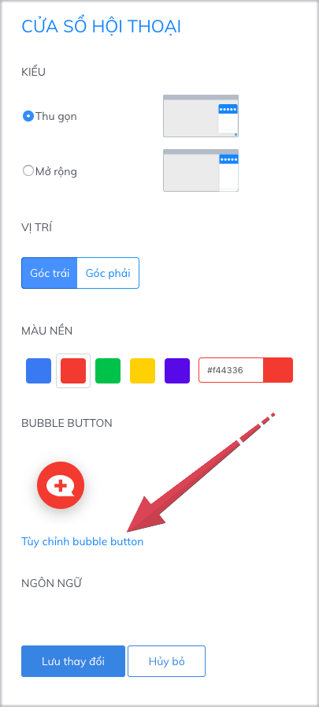
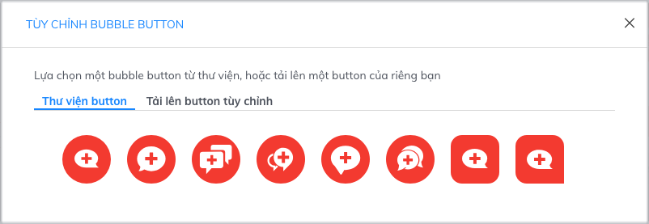
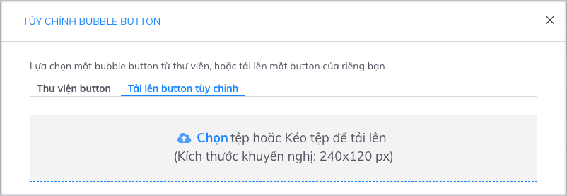
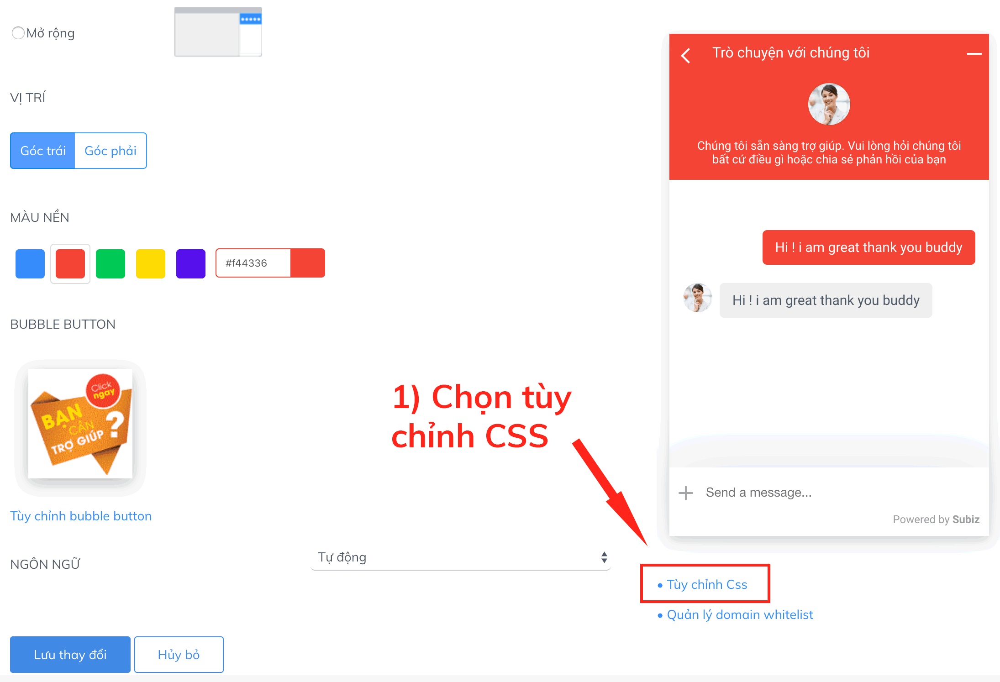
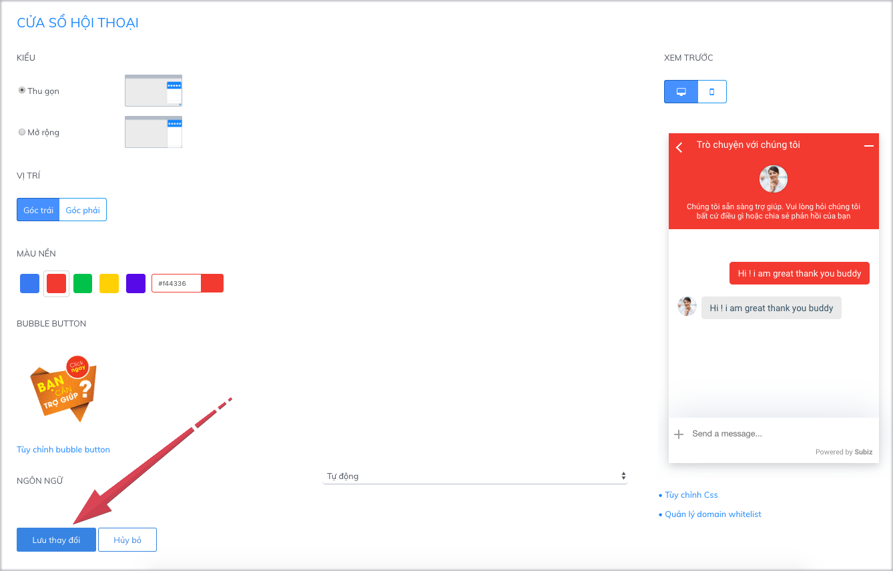

# Tùy chỉnh hình ảnh bubble button

### 1. Bubble button là gì?

Bubble button là hình ảnh kêu gọi và thu hút khách hàng chat trực tuyến trên cửa sổ Subiz chat. Khi khách hàng click vào bubble button sẽ mở ra cửa sổ chat.

Mỗi doanh nghiệp có thể chủ động thiết kế hình ảnh bubble button để truyền tải thông điệp riêng và mang đến cho khách hàng những trải nghiệm thú vị khi truy cập website.

### 2. Hướng dẫn cài đặt bubble button

Hướng dẫn cài đặt bubble button: Đăng nhập Subiz qua link [App.subiz.com &gt; Cài đặt &gt; Tài khoản &gt; Cửa sổ hội thoại &gt; Tùy chỉnh bubble button](https://app.subiz.com/settings/widget-setting)\*\*\*\*

Bạn có thể lựa chọn sử dụng bubble button từ thư viện button của Subiz, hoặc sử dụng hình ảnh button tùy chỉnh của bạn và tải lên Subiz.

### **2.1 Sử dụng thư viện button**

Bạn chọn hình ảnh trong Thư viện button và Lưu thay đổi là sử dụng được luôn.

### **2.2 Sử dụng button tùy chỉnh bất kỳ**

Để sử dụng button tùy chỉnh của bạn, bạn cần có một hình ảnh button theo mong muốn của bạn giúp tạo ấn tượng riêng dành cho khách hàng. Kích thước chuẩn của hình ảnh button là 240 x 120 px.

Hướng dẫn 3 bước để sử dụng button bất kỳ của bạn như sau:

**Bước 1**: Để tải lên hình ảnh button tùy chỉnh của bạn:  
              &gt; Chọn[ Tùy chỉnh bubble button ](https://app.subiz.com/settings/widget-setting)  
              &gt; Tải lên button tùy chỉnh   
              &gt; Chọn tệp hoặc Kéo tệp để tải lên &gt; Nhấp "**X**" để thoát


Xem thêm một số mẫu hình ảnh button: [button 1](https://filev4.subiz.com/fiqcggngypeovdudlqyu-button_chat_01.png) -  [button 2](https://filev4.subiz.com/fiqcgvyibtxjcxnbjysc-button1_vn.png) - [button 3](https://filev4.subiz.com/fiqcggnolwzgyzltheem-button_chat_05.png) - [button 4](https://filev4.subiz.com/fiqcgvyssbundnpuqkqs-button4_vn.png) -   
[button 5](https://filev4.subiz.com/fiqcgvyuaqjoaukkjndw-bubble_06.png) - [button 6 ](https://filev4.subiz.com/fiqcgvyuoczmzfwpltrq-bubble_03.png)- [ button 7](https://filev4.subiz.com/fiqcgvziewizoqbymuqz-bubble.gif) - [button 8](https://filev4.subiz.com/fiqcggnpqqrmggiofklb-button_chat_07.png) - [button 9](https://filev4.subiz.com/fiqcgvyqfhiokhwiqmnz-button3_en.png) - [button 10](https://filev4.subiz.com/fiqcgvysbxbykjcrorum-button4_en.png).  
Một số mẫu button chào mừng ngày Quốc Khánh 2/9: [Xem chi tiết](https://subiz.com/blog/viet-nam-tren-website-cua-ban.html)


**Bước 2**:  Cài đặt CSS tối ưu hình ảnh button:  
               &gt; Chọn Tùy chỉnh CSS   
               &gt; Dán đoạn mã CCS tương ứng ngay phía sau đoạn mã có chứa /\* END: BUTTON CHAT \*/   
               &gt; Lưu thay đổi 

|  | Kiểu cửa sổ hội thoại Thu gọn  | Kiểu cửa sổ hội thoại Mở rộng |
| :--- | :--- | :--- |
| **Mã CSS**   | `.widget_mini .close-widget-icon {display: none;} .button-chat .avatar-preview img {display: none;} .button-chat {box-shadow: none;background-color: transparent !important;} .widget-button {bottom:0;} .new-message-number {top:8px;}.widget_mini .widget_body {bottom:0;}` | `.widget_full .close-widget-icon {display: none;} .button-chat .avatar-preview img {display: none;} .button-chat {box-shadow: none;background-color: transparent !important;}.widget-button {bottom:0;} .new-message-number {display:8px;}.widget_full .widget_body {bottom:0;}` |


Lưu ý: 

* Bạn cần xác định đúng **CỬA SỔ HỘI THOẠI** đang sử dụng **KIỂU**: **Thu gọn** hay **Mở rộng**, để chọn đúng mã CSS.
* Mã CSS chỉ cần đặt 1 lần. Sau này, bạn có thể thay đổi hình ảnh button khác và không cần cài đặt CSS này nữa.
* Khi đã cài đặt mã CSS, nếu bạn muốn sử dụng lại thư viện button của Subiz thì bạn cần xóa đoạn mã này trong mục Tùy chỉnh CSS.


**Bước 3**: Lưu thay đổi để hoàn thành

### 3. Một số mã CSS tối ưu hiển thị button 

Khi bạn sử dụng hình ảnh button bất kỳ của bạn, Subiz có các mã CSS giúp tùy biến và tối ưu hiển thị button trên website.

| Chức năng CC | Cửa sổ hội thoại kiểu Thu gọn | Cửa số hội thoại kiểu Mở Rộng |
| :--- | :--- | :--- |
| CSS tùy chỉnh vị trí buttonsát chân màn hình\(Tối đa 150px\) | `.widget-button {bottom:0px;}` | `.widget-button {bottom:0px;}` |
| CCS tùy chỉnh chiều cao  preview tin nhắn mới\(Tối đa 110px\) | `.button-chat .bubble-chat {bottom: 75px;}` | `.button-chat .bubble-chat {bottom: 75px;}` |
| CSS tùy chỉnh vị trí cửa sổ chat so với chân màn hình\(Tối đa 140 px\) | `.widget_mini .widget_body {bottom:0;}` | `.widget_full .widget_body {bottom:0;}` |

> Bạn có băn khoăn và cần hỗ trợ, vui lòng chat trực tiếp với tư vấn viên trên website [Subiz.com.](https://subiz.com/vi/feature.html)

