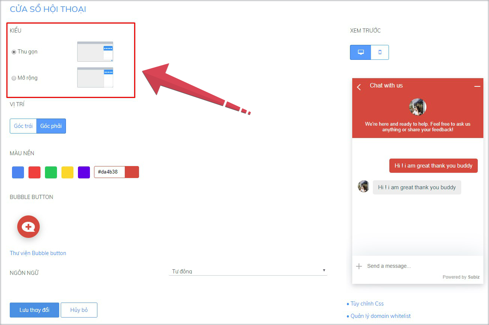
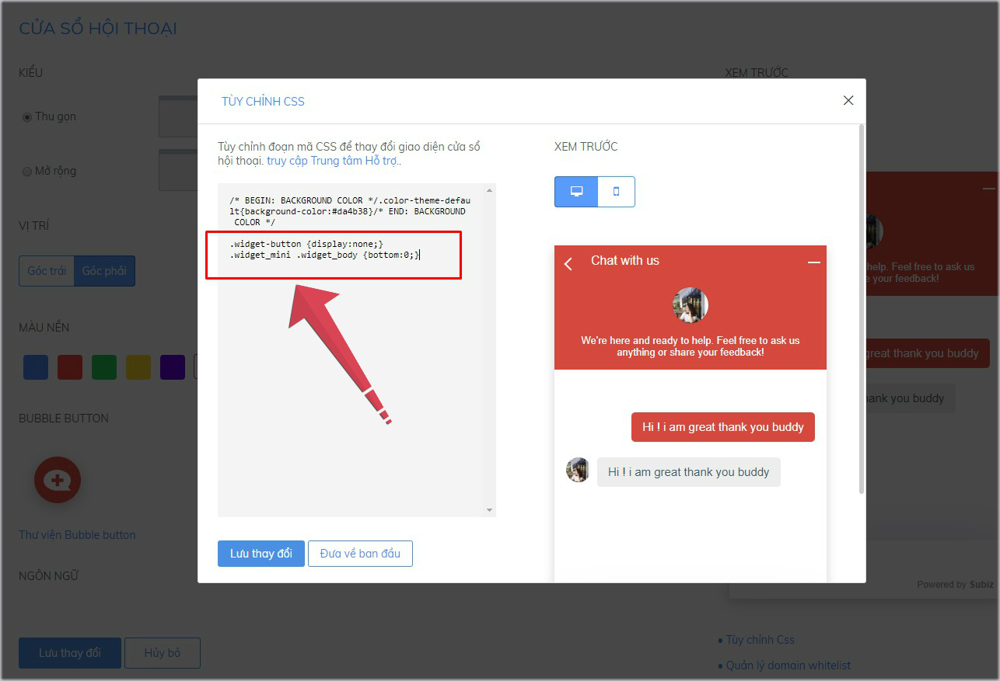

# Tùy chỉnh hình ảnh Button Subiz

Button Subiz là hình ảnh logo của Subiz, được hiển thị mặc định góc bên phải hoặc bên trái trên website sau khi tích hợp. Khách hàng click vào Button sẽ mở ra cửa sổ Subiz chat.

Bạn hoàn toàn có thể sáng tạo hình ảnh Button Subiz và linh hoạt đặt Button này ở bất cứ vị trí nào trên website, với bất cứ hình dáng nào phù hợp với giao diện trang web.

Bạn cần thực hiện hai bước sau:

### 1. Ẩn hình ảnh Button Subiz mặc định

Bạn cần [đăng nhập App.subiz.com &gt; Cài đặt &gt; Tài khoản &gt; Cửa sổ hội thoại &gt; Tùy chỉnh CSS](https://app.subiz.com/settings/widget-setting)

Cửa sổ hội thoại có hai kiểu: Thu gọn và Mở rộng. 



Dưới đây là 2 mã CSS ẩn button Subiz tương ứng với từng kiểu cửa sổ hội thoại. Bạn sao chép và đặt mã CSS này trong bảng Tùy chỉnh CSS rồi Lưu thay đổi.

|                     **Kiểu: Thu gọn** |                 **Kiểu: Mở rộng** |
| --- | --- |
| .widget-button {display:none;} .widget\_mini .widget\_body {bottom:0;} | .widget-button {display:none;} |



###  **2. Gắn link cửa sổ Subiz chat vào bất kỳ vị trí trên website**

Khi cài đặt ẩn button Subiz, khách hàng sẽ không nhìn thấy hình ảnh button và cửa sổ Subiz chat.

Sử dụng API sẽ giúp bạn gắn link cửa sổ chat Subiz vào hình ảnh hoặc đoạn text bất kỳ trên website và tự động mở cửa sổ chat.

* API gắn link cửa sổ Subiz chat vào hình ảnh

```text
<a href="#nogo" onclick="subiz('shrinkWidget')"></a>
```

* API gắn link cửa sổ Subiz chat vào đoạn text

```text
<a href="#nogo" onclick="subiz('expandWidget')">đoạn text của bạn</a>
```


Lưu ý: Bạn cần đặt API này vào trong code website. Người lập trình web hiểu rõ cấu trúc trang web nhất và sẽ dễ dàng cài đặt.


> Bạn gặp khó khăn khi cài đặt, vui lòng chat trực tiếp với tư vấn viên trên website Subiz.com hoặc gửi email Support@Subiz.com.


