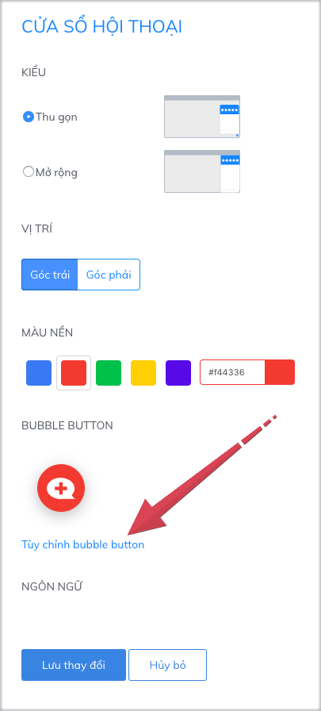
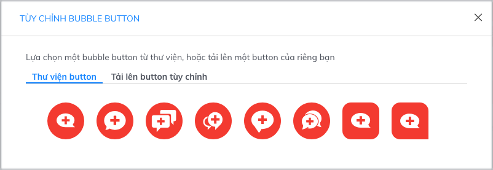

# Tùy chỉnh hình ảnh chat button

### 1. Chat button là gì?

Chat button là hình ảnh kêu gọi và thu hút khách hàng chat trực tuyến trên cửa sổ Subiz chat. Khi khách hàng click vào chat button sẽ mở ra cửa sổ chat.

Mỗi doanh nghiệp có thể chủ động thiết kế hình ảnh chat button để truyền tải thông điệp riêng và mang đến cho khách hàng những trải nghiệm thú vị khi truy cập website.

### 2. Hướng dẫn cài đặt chat button

Hướng dẫn cài đặt chat button: Đăng nhập Subiz qua link [App.subiz.com &gt; Cài đặt &gt; Tài khoản &gt; Cửa sổ hội thoại &gt; Tùy chỉnh chat button](https://app.subiz.com/settings/widget-setting)\*\*\*\*

Bạn có thể lựa chọn sử dụng chat button từ thư viện button của Subiz, hoặc sử dụng hình ảnh button tùy chỉnh của bạn và tải lên Subiz.

### **2.1 Sử dụng thư viện button**

Bạn chọn hình ảnh trong Thư viện button và Lưu thay đổi là sử dụng được luôn.

### **2.2 Sử dụng chat button tùy chỉnh bất kỳ**

Để sử dụng button tùy chỉnh của bạn, bạn cần có một hình ảnh button theo mong muốn của bạn giúp tạo ấn tượng riêng dành cho khách hàng. Kích thước chuẩn của hình ảnh button là 240 x 120 px.

Hướng dẫn 2 bước để sử dụng button bất kỳ của bạn như sau:

**Bước 1**: Để tải lên hình ảnh button tùy chỉnh của bạn:  
              &gt; Chọn[ Tùy chỉnh chat button ](https://app.subiz.com/settings/widget-setting)  
              &gt; Tải lên button tùy chỉnh   
              &gt; Chọn tệp hoặc Kéo tệp để tải lên &gt; Nhấp "**X**" để thoát   


Một số lưu ý:

* Hình ảnh button tùy chỉnh cần định dạng Png, phông nền là transparent.
* Kích thước chuẩn là 240 x 120 px.
* Xem thêm một số mẫu hình ảnh button: [button 1](https://filev4.subiz.com/fiqcggngypeovdudlqyu-button_chat_01.png) -  [button 2](https://filev4.subiz.com/fiqcgvyibtxjcxnbjysc-button1_vn.png) - [button 3](https://filev4.subiz.com/fiqcggnolwzgyzltheem-button_chat_05.png) - [button 4](https://filev4.subiz.com/fiqcgvyssbundnpuqkqs-button4_vn.png) -  [button 5](https://filev4.subiz.com/fiqcqpihreurxviwekol-artboard_1_copy_9.png) - [button 6](https://filev4.subiz.com/fiqcqpimprgfdctpdtht-artboard_1_copy_10.png) -  [button 7](https://filev4.subiz.com/fiqcqpitaljpxccvhmow-artboard_1_copy_11.png) - [button 8](https://filev4.subiz.com/fiqcggnpqqrmggiofklb-button_chat_07.png) - [button 9](https://filev4.subiz.com/fiqcgvyqfhiokhwiqmnz-button3_en.png) - [button 10](https://filev4.subiz.com/fiqcgvysbxbykjcrorum-button4_en.png).
* Một số mẫu button chào mừng ngày Quốc Khánh 2/9: [Xem chi tiết](https://subiz.com/blog/viet-nam-tren-website-cua-ban.html)


**Bước 2**: Lưu thay đổi để hoàn thành

### 3. Một số mã CSS tối ưu hiển thị button 

Khi bạn sử dụng hình ảnh button bất kỳ của bạn, Subiz có các mã CSS giúp tùy biến và tối ưu hiển thị button trên website.  
Các bước cài đặt: [Cửa sổ Subiz chat](https://app.subiz.com/settings/widget-setting) &gt; Tùy chỉnh CSS &gt; Sao chép và dán mã CSS phù hợp vào bảng Tùy chỉnh CSS  &gt; Lưu thay đổi  tại bảng &gt; Lưu thay đổi tại Cửa sổ Subiz chat.

<table>
  <thead>
    <tr>
      <th style="text-align:left">Chức năng CSS</th>
      <th style="text-align:left">Cửa sổ hội thoại kiểu Thu gọn</th>
      <th style="text-align:left">Cửa số hội thoại kiểu Mở Rộng</th>
    </tr>
  </thead>
  <tbody>
    <tr>
      <td style="text-align:left">
        
CSS tùy chỉnh vị trí button

        
so với chân màn hình

        
(Tối đa 150px)

      </td>
      <td style="text-align:left"><code>.widget-button {bottom:0;}</code>
      </td>
      <td style="text-align:left"><code>.widget-button {bottom:0;}</code>
      </td>
    </tr>
    <tr>
      <td style="text-align:left">
        
CCS tùy chỉnh chiều cao
           preview tin nhắn mới

        
(Tối đa 110px)

      </td>
      <td style="text-align:left">
        
<code>.button-chat .bubble-chat {</code>
        

        
<code>bottom: 75px;</code>
        

        
<code>}</code>
        

      </td>
      <td style="text-align:left">
        
<code>.button-chat .bubble-chat {</code>
        

        
<code>bottom: 75px;</code>
        

        
<code>}</code>
        

      </td>
    </tr>
    <tr>
      <td style="text-align:left">
        
CSS tùy chỉnh vị trí cửa sổ chat
           so với chân màn hình

        
(Tối đa 140 px)

      </td>
      <td style="text-align:left"><code>.widget_mini .widget_body {bottom:0;}</code>
      </td>
      <td style="text-align:left"><code>.widget_full .widget_body {bottom:0;}</code>
      </td>
    </tr>
  </tbody>
</table>

> Bạn có băn khoăn và cần hỗ trợ, vui lòng chat trực tiếp với tư vấn viên trên website [Subiz.com.](https://subiz.com/vi/feature.html)

