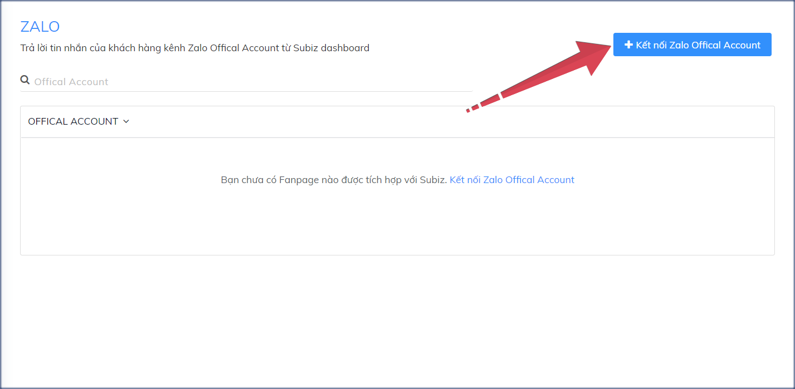
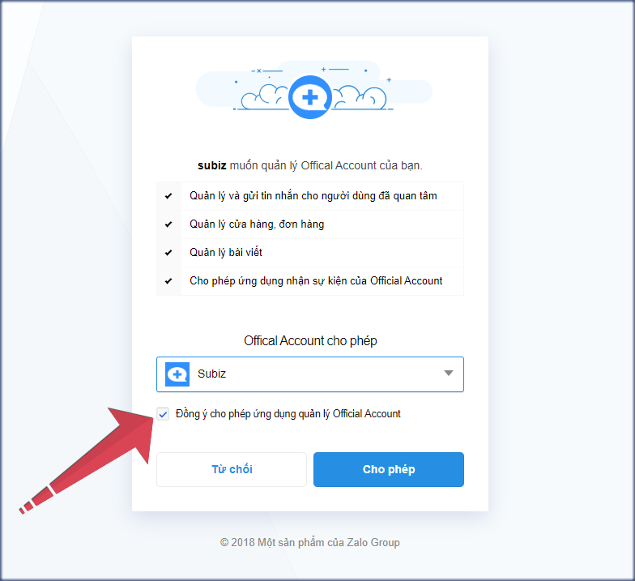
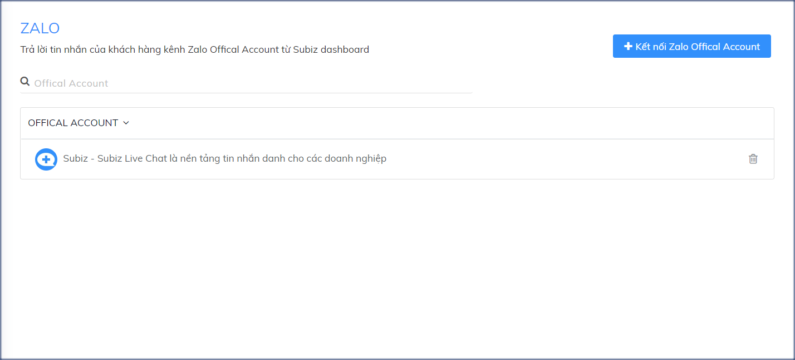
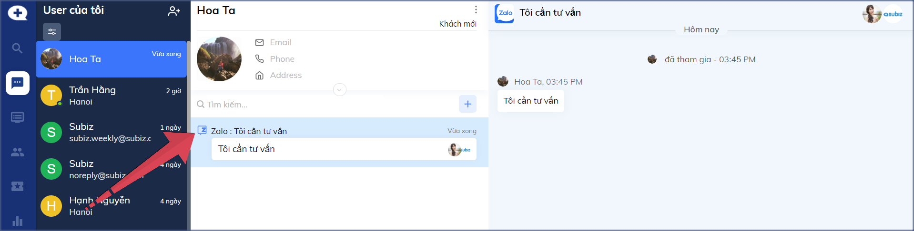

# Tích hợp Zalo OA vào Subiz

Zalo Official Account \(ZOA\), hay hiểu đơn giản là Zalo page cho doanh nghiệp, cho phép tạo shop bán hàng hoặc trang cộng đồng để đăng tin, post bài, chạy quảng cáo Zalo Ads, nhận, gửi tin nhắn giao dịch hàng hóa.

Giờ đây , Zalo OA đã chính thức trở thành một kênh giao tiếp khách hàng trên Subiz, tương tự như các website, fanpage messenger, bình luận fanpage và email, giúp bạn làm việc và quản lý tập trung khách hàng ngay trên một nền tảng tương tác.

Bài viết này sẽ hướng dẫn bạn triển khai kênh Zalo OA vào Subiz.

### Kết nối Zalo OA vào Subiz

Bạn đăng nhập Subiz &gt; Cài đặt &gt; Tin nhắn &gt; Zalo, click đường link: [**https://app.subiz.com/settings/zalo**](https://app.subiz.com/settings/zalo)\*\*\*\*

* Bước 1: Chọn **Kết nối Zalo Official Account**

* Bước 2: Chọn **Đồng ý cho phép  ứng dụng quản lý  Official Account** &gt; **Đồng ý**

Zalo OA được kết nối thành công sẽ hiện thị trên Subiz.

### Quản lý tin nhắn khách hàng từ Zalo OA

Sau khi kết nối Zalo OA vào Subiz, bạn sẽ nhận tất cả tin nhắn của khách hàng và trả lời ngay trên trang [**HOẠT ĐỘNG**](https://app.subiz.com/convo) của Subiz, qua đường link: [https://app.subiz.com/convo](https://app.subiz.com/convo)

Khách hàng đến từ Zalo OA sẽ hiện ảnh đại diện và tên cá nhân trong tài khoản Zalo.   
Bạn phân biệt cuộc chat từ kênh Zalo AO qua icon \`_**Z**_\` như ảnh dưới:

Bên cạnh trả lời tư vấn khách hàng từ Zalo OA, bạn có thể thu thập, lưu trữ thông tin khách hàng và xuất file dữ liệu về máy tính, xem thêm [Quản lý thông tin khách hàng](https://help.subiz.com/su-dung-subiz-nang-cao/quan-ly-du-lieu/quan-ly-va-cap-nhat-thong-tin-user).  

> Bạn cần tư vấn về kênh Zalo trên Subiz? Hãy gửi email cho tư vấn viên qua Support@Subiz.com!

