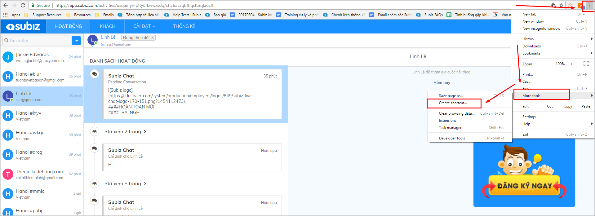
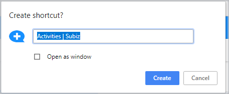
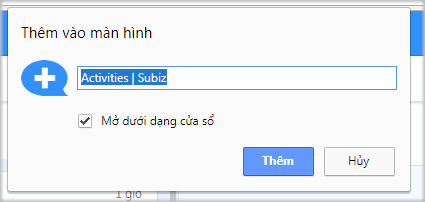
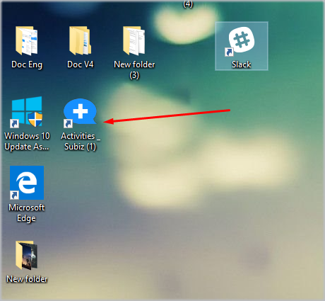
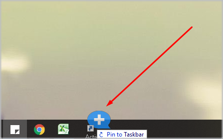

# Trải nghiệm app Subiz

### Tạo App Subiz trên máy tính

Mỗi ngày các Agent cần phải đăng nhập tài khoản [Subiz](https://subiz.com/vi/) để quản lý các tương tác và hỗ trợ khách hàng trực tuyến. Thay vì việc phải nhớ và đăng nhập tài khoản trên [app.subiz.com](https://app.subiz.com/) , các Agent hoàn toàn có thể tạo [App Subiz](https://app.subiz.com/) trên màn hình máy tính để dễ dàng đăng nhập tại khoản nhanh chóng khi bắt đầu ngày làm việc mới.

Trước hết bạn cần đăng nhập tài khoản Subiz trên trình duyệt tại trang đăng nhập [app.subiz.com](https://app.subiz.com/) , sau đó tạo app theo hướng dẫn sau:



Trên trình duyệt Chrome, bạn click vào biểu tượng ba chấm ở góc phải màn hình, sau đó chọn **More tool &gt; Create Shortcut**

Lúc này, trên màn hình máy tính sẽ hiển thị hộp thoại xác nhận yêu cầu, bạn chỉ cần nhấp vào **Create**




Trên trình duyệt Coccoc, bạn click vào biểu tượng **Cốc cốc, chọn Công cụ khác &gt; Thêm máy tính để bàn**

Lúc này, trên màn hình máy tính sẽ hiển thị hộp thoại xác nhận yêu cầu, bạn chỉ cần nhấp vào **Thêm**

  



Khi đó trên màn hình máy tính của bạn sẽ hiển thị app Subiz như sau:

Để thuận tiện trong quá trình làm việc, bạn hoàn toàn có thể gắn [app Subiz](https://app.subiz.com/) vào thanh Taskbar phía dưới màn hình máy tính bằng việc Nhấp chuột phải vào [app Subiz](https://app.subiz.com/) và kéo xuống thanh Taskbar:

Như vậy, những lần làm việc sau này, bạn chỉ cần click vào biểu tượng [Subiz](https://subiz.com/vi/) để nhanh chóng đăng nhập và tương tác tác với khách hàng.

### Sử dụng App Subiz trên di động

Để thuận tiện cho việc nhận thông báo tin nhắn mới, tương tác với khách hàng và online thường xuyên, bạn hoàn toàn có thể sử dụng app[ Subiz trên điện thoại](https://subiz.com/blog/subiz-app-mobile-tuong-tac-manh-me-moi-luc-moi-noi.html).

Bạn truy cập cửa hàng ứng dụng trên di động và tìm kiếm App Subiz, sau đó tải và đăng nhập bằng tài khoản đăng nhập Subiz của bạn. Hoặc tải trực tiếp tại đường link sau:

* **Google Play:** [goo.gl/qo45Xr](https://goo.gl/qo45Xr)
* **App Store:** [goo.gl/FnYbXg](https://goo.gl/FnYbXg)

