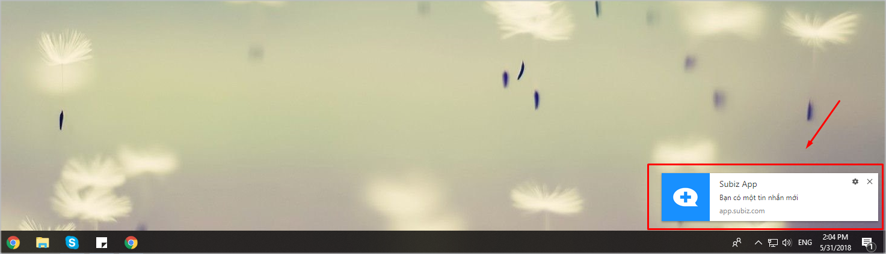
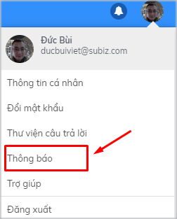
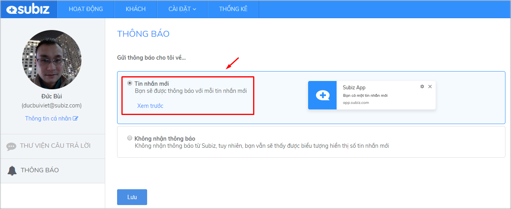
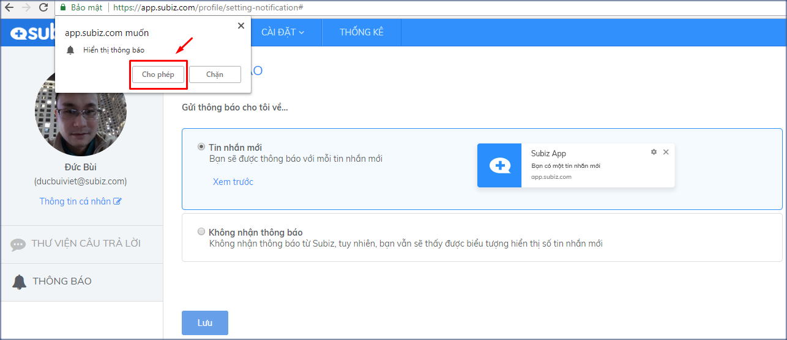
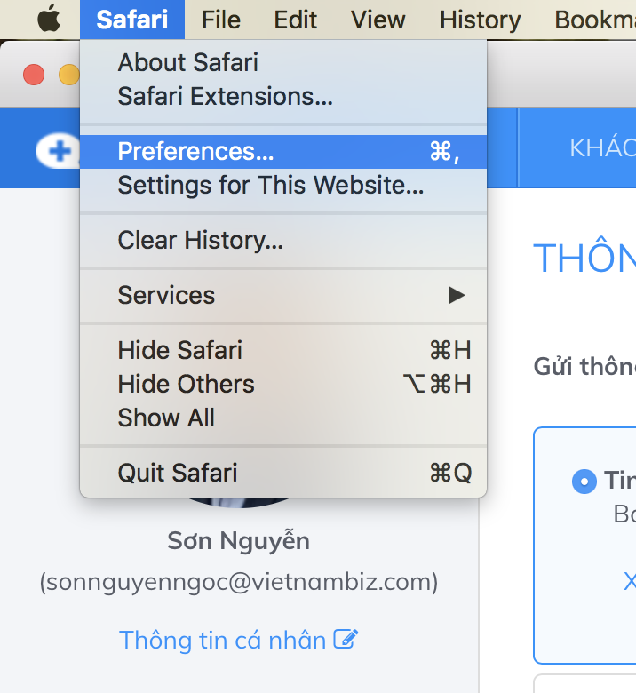
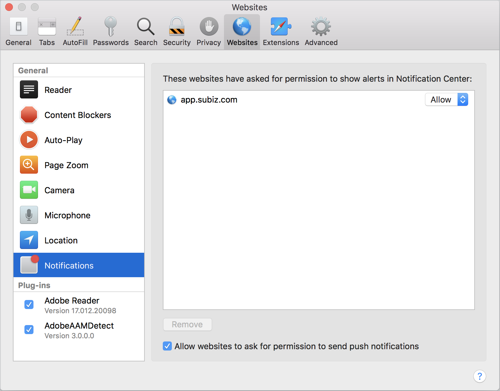
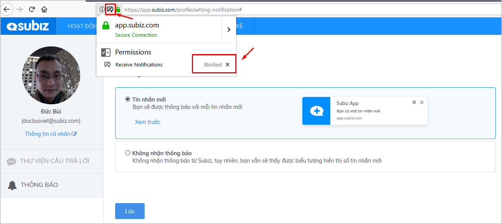
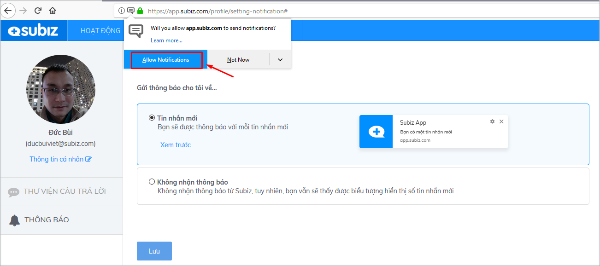

# Cài đặt thông báo tin nhắn mới

Trong quá trình làm việc, agent sẽ phải thao tác với rất nhiều ứng dụng, rất dễ bỏ lỡ cuộc chat với khách hàng.

Cài đặt tính năng thông báo tin nhắn mới sẽ giúp bạn hiển thị cửa sổ pop-up nhỏ ở góc màn hình \(bao gồm thông báo âm thanh\) nhắc nhở khi có tin nhắn mới đến hoặc bất cứ thay đổi nào trên dashboard \(khách vào web, khách gửi yêu cầu chat…\) 

### Các bước cài đặt thông báo tin nhắn mới 

* Vào phần [cài đặt thông báo tin nhắn mới](https://app.subiz.com/profile/setting-notification) \(hoặc Đăng nhập tài khoản &gt; nhấn vào ảnh đại diện góc trên bên phải màn hình &gt; chọn **Thông báo\)**

* Chọn Gửi thông báo tin nhắn mới và Lưu

* Sau khi bạn nhấn Lưu trên trình duyệt sẽ hiện pop-up yêu cầu Cho phép hiển thị thông báo mới. Bạn chọn Cho phép

### Cài đặt thông báo tin nhắn mới trên các trình duyệt

Trong quá trình cài đặt thông báo tin nhắn mới, có thể trình duyệt bạn đang sử dụng đã thiết lập mặc định chặn các thông báo, bạn cần cài đặt cho phép nhận thông báo từ app.subiz.com



Nhấn vào nút **Bảo mật** \(1\) và chọn **cho phép** \(2\) hoặc chỉnh sửa trên phần **Cài đặt trang web** \(3\)


Với các phiên bản mới của Chrome và Cốc Cốc, có thể xảy ra hiện tượng **âm báo tin nhắn mới** không có, do 2 trình duyệt này đã tắt việc tự động mở Audio và Video. Bạn chỉ cần **Đăng xuất** và **Đăng nhập** lại app.subiz.com là được.




Bước 1: Vào Safari &gt; Preferences

Bước 2: Cho phép hiện thông báo từ app.subiz.com




Bước 1: Bỏ Blocked

Bước 2: Cho phép nhận thông báo từ app.subiz.com




