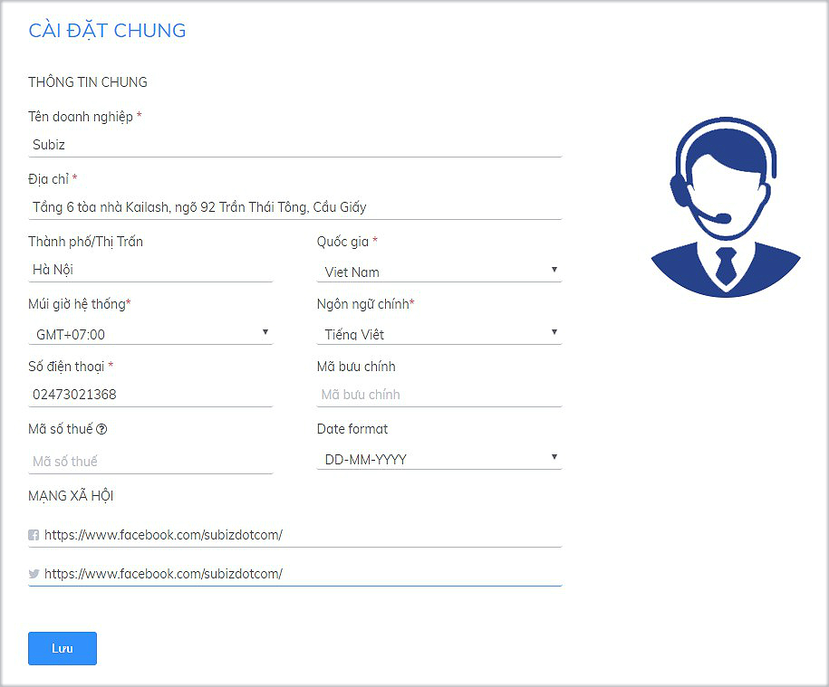

# Cài đặt thông tin doanh nghiêp

**Thông tin doanh nghiệp là các thông tin cơ bản, giúp** [**Subiz**](https://subiz.com/vi/) **dễ dàng liên hệ và hỗ trợ bạn tốt nhất.**

Để cung cấp và chỉnh sửa các thông tin cơ bản của doanh nghiệp, bạn [Đăng nhập tài khoản Subiz](http://app.subiz.com), vào phần [**Cài đặt &gt; Tài khoản &gt; Cài đặt chung**](https://app.subiz.com/settings/)

**Bạn nhập các thông tin doanh nghiệp như sau:**

* **Logo photo**: Ảnh thương hiệu của doanh nghiệp                       \(Lưu ý tải lên ảnh hình vuông, kích thước tối thiếu 200 x 200px\)
* **Tên doanh nghiệp:** Tên thương hiệu của doanh nghiệp
* **Địa chỉ:** Địa chỉ doanh nghiệp
* **Thành phố/ Thị trấn:** Thành phố doanh nghiệp đặt trụ sở
* **Quốc gia:** Quốc gia doanh nghiệp đang kinh doanh
* **Múi giờ:** Múi giờ khu vực của doanh nghiệp, giúp hệ thống xác định khung giờ làm việc của doanh nghiệp
* **Ngôn ngữ chính:** Là ngôn ngữ chính của tài khoản, được tự động xác định khi chủ tài khoản [đăng ký sử dụng Subiz](https://app.subiz.com/register). Giúp [Subiz](https://subiz.com/vi/) xác định ngôn ngữ trên email gửi tới doanh nghiệp
* **Số điện thoại:** Số điện thoại liên hệ của doanh nghiệp
* **Mã bưu chính:** Mã bưu chính theo địa phương của doanh nghiệp
* **Mã số thuế:** Mã số thuế của doanh nghiệp
* **Mạng xã hội:** Nhập link liên kết với các trang mạng xã hội của bạn
* 
Sau khi nhập đầy đủ thông tin, bạn click chọn **Lưu** để lưu thay đổi.

