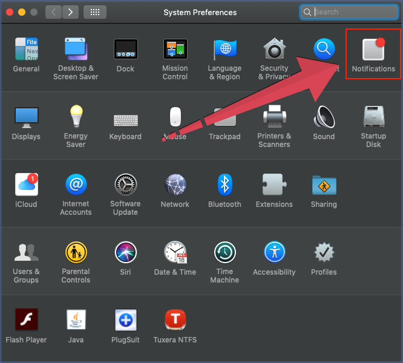

# Không nhận được thông báo tin nhắn mới

Bạn đã cài đặt Thông báo trên Subiz nhưng vẫn không nhận được thông báo khi có tin nhắn mới.  
Bài viết này sẽ chia sẻ tới bạn nguyên nhân và cách xử lý khi không nhận được thông báo tin nhắn mới của Subiz trên máy tính và app mobile.

Đầu tiên, để thử chức năng thông báo tin nhắn mới của Subiz có hoạt động hay không, bạn thao tác như sau: Vào trang cài đặt [**Thông báo tin nhắn**](https://app.subiz.com/profile/setting-notification) ****&gt; Đảm bảo bật **ON** tất cả &gt; Chọn **Lưu** để xem trước có hiện thị pop-up thông báo "_Subiz. You have new message_" không?

Nếu bạn không thấy pop-up thông báo "_Subiz. You have new message_" thì hãy thao tác theo các cách sau: 

### 1. Thông báo trên máy tính

Trên máy tính, bạn đăng nhập Subiz trên trình duyệt nên không nhận được thông báo tin nhắn mới thường do 2 nguyên nhân: Do cài đặt trình duyệt hoặc Do cài đặt trên máy tính. Hướng dẫn khắc phục:



### Trình duyệt Google Chrome:

* Đăng nhập Subiz qua đường link [**https://app.subiz.com/**](https://app.subiz.com/)\*\*\*\*
* Trên tab **https://app.subiz.com/**, chọn icon khóa để xem thông tin trang web
* Chọn **Cho phép** "**Thông báo**" và **Cho phép** "**Âm thanh**"

### Trình duyệt Firefox: 

* Đăng nhập Subiz qua đường link [**https://app.subiz.com/**](https://app.subiz.com/)\*\*\*\*
* Trên tab **https://app.subiz.com/,** chọn icon khóa để xem thông tin trang web
* Xóa bỏ **Blocked** tại mục **Send notifications**
* Chọn **Allow Notifications**

### Trình duyệt Safari: 

* Mở trình duyệt Safari &gt; Chọn **Safari** &gt; Chọn **Preferences** 
* Chọn **Websites** &gt; Chọn **Notifications** &gt; Tìm **App.subiz.com** &gt; Chọn **Allow**




### Trên máy tính Win 10:

* Chọn icon **Action Center** ở góc phải dưới dùng màn hình
* Chọn **All settings** &gt; Tìm kiếm đến trang **Notifications & actions settings**
* Tại mục **Get notifications from these senders** &gt; Bật **ON trình duyệt** bạn sử dụng. Ví dụ: Cho phép trình duyệt Google Chrome thông báo

### Trên máy tính Mac:

* Mở **System Preferences** &gt; Chọn **Notifications** &gt; Chọn trình duyệt **Safari**
* Chọn kiểu thông báo Banner hoặc Alerts và cho phép tất cả như ảnh dưới




### 2. Thông báo trên app mobile

Để kiểm tra cài đặt thông báo trên app mobile, bạn thực hiện theo hướng đẫn chi tiết theo thiết bị như sau:



### Bước 1: Cài đặt thông báo trên app Subiz

* Mở app Subiz
* Chọn ảnh đại diện của agent góc trái màn hình &gt; Mở trang Cài đặt &gt; Bật thông báo ON Notifications như ảnh:

### Bước 2: Cho phép Subiz thông báo trên điện thoại IOS

* Chọn Cài đặt trên điện thoại IOS
* Chọn Thông báo 
* Tìm app Subiz &gt; Bật ON cho phép thông báo




### Bước 1: Cài đặt thông báo trên app Subiz

* Mở app Subiz
* Chọn ảnh đại diện của agent góc trái màn hình &gt; Mở trang Cài đặt &gt; Bật thông báo ON Notifications như ảnh:

### Bước 2: Cho phép Subiz thông báo trên điện thoại Android

* Chọn Cài đặt trên điện thoại Android
* Chọn Ứng dụng và thông báo
* Tìm app Subiz &gt; Bất ON cho phép thông báo




> Bạn vẫn chưa nhận được thông báo tin nhắn mới từ Subiz, hãy liên hệ tư vấn qua Support@Subiz.com!

