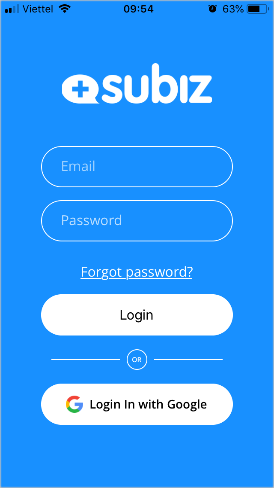
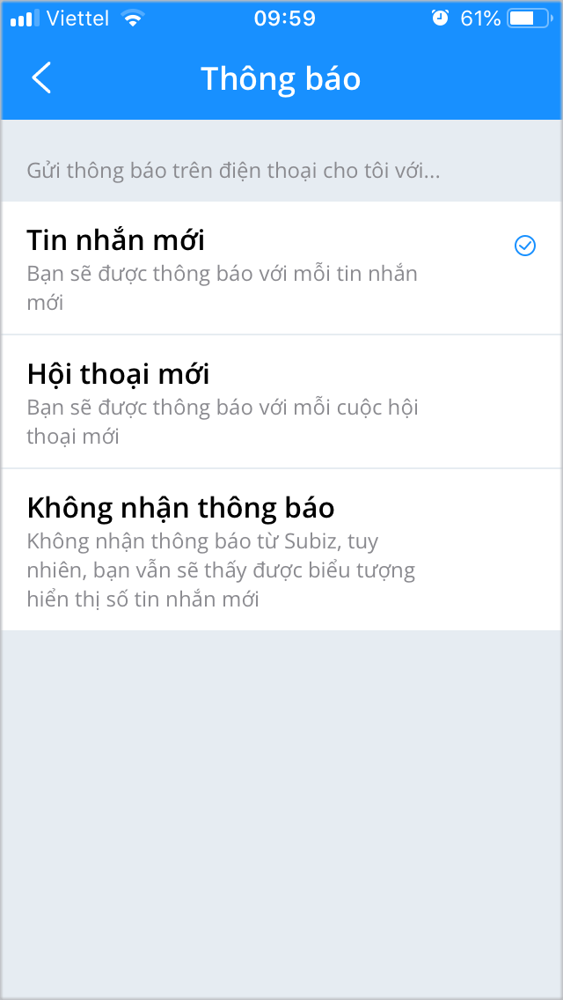
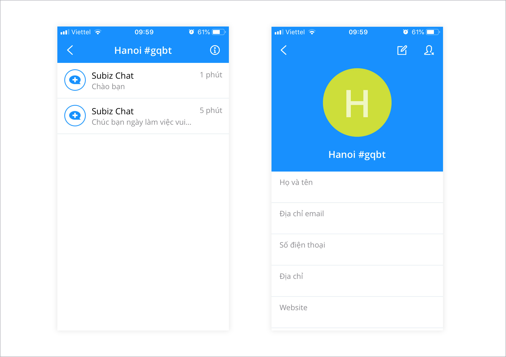
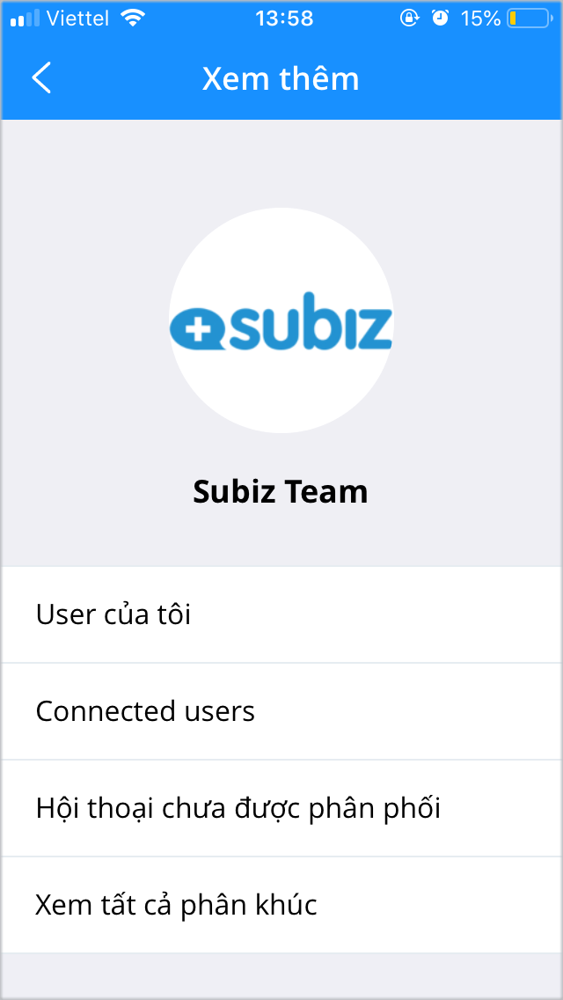

# Ứng dụng Subiz trên điện thoại

 Bạn có thể sử dụng Subiz để luôn kết nối với khách hàng trên thiết bị di động bao gồm Iphone, Android. 

Với ứng dụng Subiz trên điện thoại \(Subiz app mobile\), bạn sẽ cập nhật thông tin và phản hồi khách hàng nhanh chóng, mọi lúc mọi nơi. Bất kỳ ai có tài khoản Subiz đều có thể tải xuống và sử dụng ứng dụng Subiz trên điện thoại hoàn toàn miễn phí.

### **Cài đặt Subiz app mobile** 

Để cài đặt và sử dụng ứng dụng Subiz trên điện thoại, bạn có thể truy cập cửa hàng ứng dụng trên điện thoại qua link:

* **Google Play:** [goo.gl/qo45Xr](https://goo.gl/qo45Xr)
* **App Store:** [goo.gl/FnYbXg](https://goo.gl/FnYbXg)

Tải Subiz về cài đặt và đăng nhập bằng email và mật khẩu như đăng nhập trên máy tính.  
Lưu ý: Bạn có thể chọn đăng nhập Subiz với tài khoản Google trên điện thoại của bạn.

### Một số tính năng hỗ trợ trên Subiz app mobile

### 1. Cài đặt thông báo

Những tin nhắn mới của khách hàng được thông báo tức thời trên màn hình điện thoại của bạn. Bạn sẽ kiểm soát và trả lời các yêu cầu tư vấn kịp thời để không bỏ sót bất cứ cơ hội tương tác khách hàng nào.

Bạn có thể lựa chọn nhận thông báo khi có tin nhắn mới hay cuộc hội thoại mới. Hoặc khi đang bận và chỉ muốn theo dõi và quản lý các cuộc trò chuyện của nhân viên với khách hàng, bạn có thể lựa chọn Không nhận thông báo từ Subiz.

### **2. Quản lý thông tin cá nhân khách hàng**

Subiz gọi chung khách hàng đã có hoạt động tương tác, trò chuyện qua Subiz là user. 

User mới nhắn tin tới sẽ hiển thị mặc định là Tên thành phố + mã user, Quốc gia. Bạn có thể tùy chỉnh và cập nhật thông tin liên hệ của user như Họ tên, địa chỉ email, số điện thoại,... để dễ dàng tìm kiếm và quản lý sau này.

Khi bạn chọn một user, bạn sẽ xem được lịch sử các cuộc trò chuyện với khách hàng từ nhiều kênh như Subiz chat, Messenger, Email.

Đồng thời, hội thoại có tin nhắn mới chưa đọc sẽ hiển thị thông báo đỏ để bạn nhận diện và trả lời khách hàng.

### 3. **Quản lý phân khúc khách hàng**

Phân khúc khách hàng là những nhóm khách hàng được phân chia theo các tiêu chí nhất định.

Subiz có sẵn 3 phân khúc khách hàng mặc định để bạn dễ dàng quản lý được danh sách khách hàng và công việc của nhân viên.

* **User của tôi**: Là danh sách khách hàng đã có tương tác trò chuyện và được chỉ định cho bạn. Mỗi cá nhân agent sẽ có một danh sách User của tôi riêng.
* **Connected users**: Là danh sách tất cả khách hàng đã có tương tác trò chuyện và được phân phối cho các agent của doanh nghiệp. Nhà quản lý sẽ chủ động quan sát và theo dõi được khách hàng cũng như cách tư vấn của nhân viên.
* **Hội thoại chưa được phân phối**: Là danh sách khách hàng có cuộc hội thoại chưa được chỉ định, phân phối cho bất cứ agent nào. Bất cứ agent nào đều có thể trả lời cuộc hội thoại này và khách hàng sẽ được chuyển vào phân khúc User của tôi của agent.

### **Cập nhật phiên bản app Subiz mới nhất**

Subiz thường xuyên cập nhật phiên bản app mobile để nâng cao trải nghiệm người dùng và những tính năng mới.  
Subiz có thông báo Cập nhật phiên bản mới khi bạn đăng nhập ứng dụng Subiz trên điện thoại.   
Hoặc bạn có thể chủ động tìm thấy các phiên bản mới nhất của ứng dụng Subiz bằng cách  truy cập cửa hàng ứng dụng trên điện thoại \(ví dụ: [App Store](https://itunes.apple.com/vn/app/subiz/id1414797772?mt=8), [Google Play](https://play.google.com/store/apps/details?id=com.subiz.mobile4)\). Từ đây, bạn có thể xem có gì mới với ứng dụng và chọn Cập nhật phiên bản mới nhất.  

> Bạn đang cần hỗ trợ? Hãy chat trực tiếp với tư vấn viên tại website [Subiz.com](https://subiz.com/vi/feature.html)!

  
  

