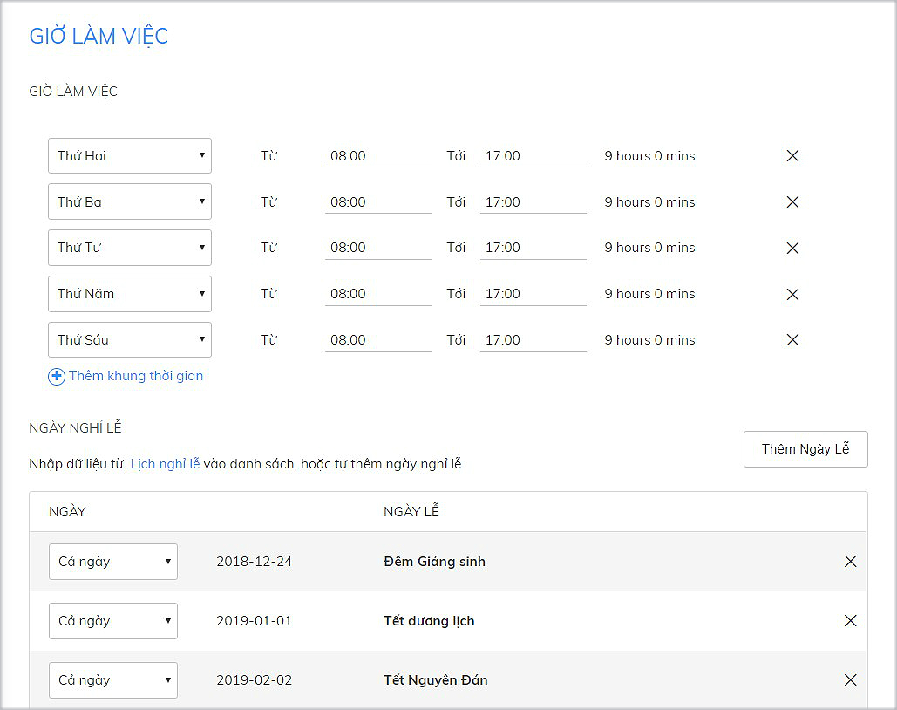
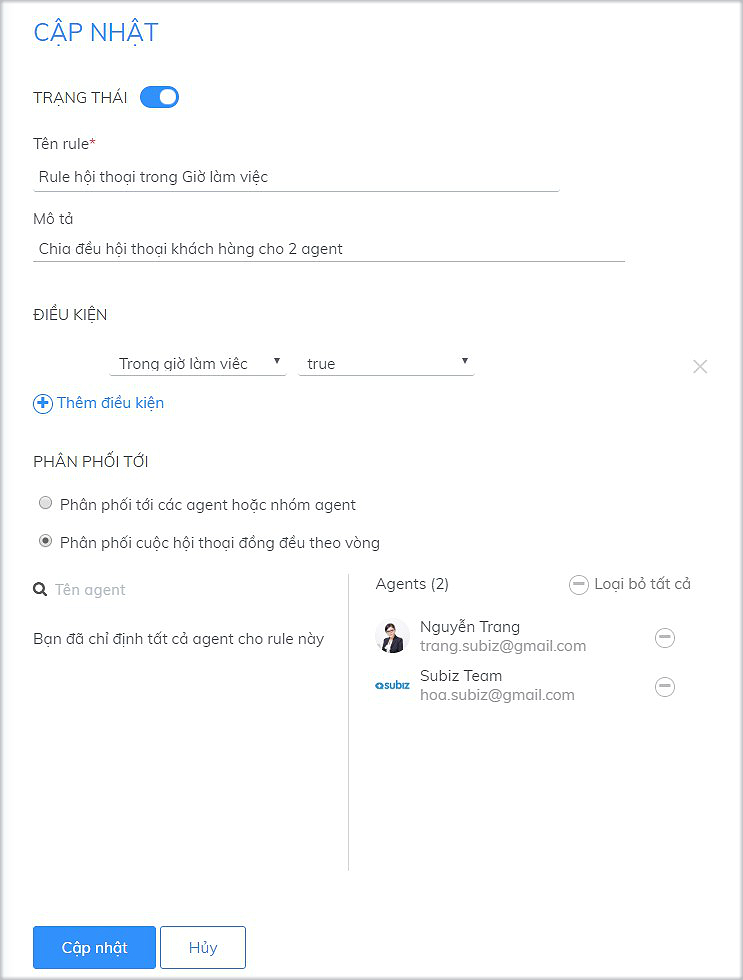
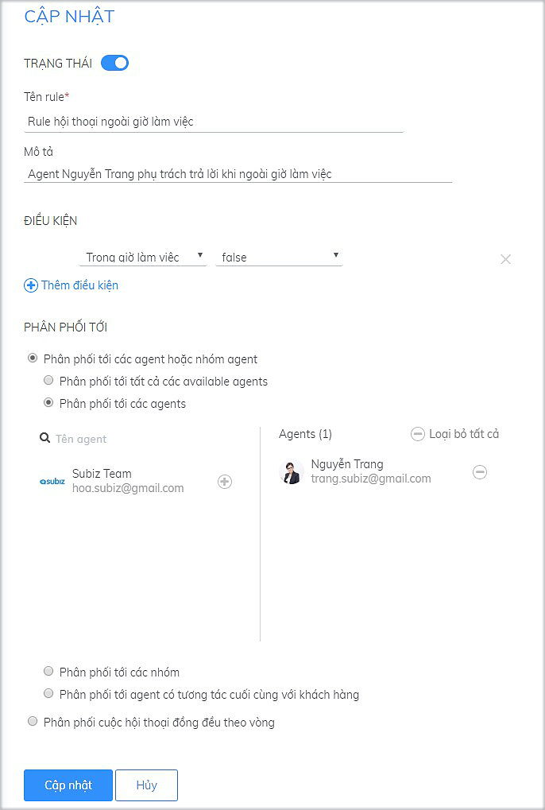

# Cài đặt Giờ làm việc

### Mục đích của cài đặt Giờ làm việc?

Giờ làm việc là chức năng cho phép doanh nghiệp thiết lập Thời gian làm việc trên tài khoản Subiz như Giờ làm việc trong ngày, Ngày làm việc trong tuần và Các ngày nghỉ lễ trong năm.

Mục đích thiết lập Giờ làm việc:  
+ Cho khách hàng biết được khung thời gian có tư vấn viên làm việc.  
+ Tự động trả lời khách hàng khi ngoài giờ làm việc.  
+ Phân phối công việc cho các tư vấn viên \(Agents\) theo Giờ làm việc.

### Cách thiết lập Giờ làm việc

* **Bước 1**: Bạn bắt buộc cài đặt **Múi giờ hệ thống** của tài khoản tại link [https://app.subiz.com/settings/ ](https://app.subiz.com/settings/)Ví dụ: Tại Việt Nam, đặt Múi giờ hệ thống là GMT + 07:00 
* **Bước 2**: Thêm khung thời gian cho Giờ làm việc 
* **Bước 3**: Thêm Ngày Lễ trong năm


Lưu ý: Hệ thống Subiz sẽ lưu khung thời gian Giờ làm việc và tự động nhận biết khung thời gian nghỉ ngoài Giờ làm việc hay nghỉ Ngày Lễ.


### Một số ứng dụng của Giờ làm việc

#### 1. Cài đặt Rule phân phối hội thoại theo Giờ làm việc

Ví dụ: Chia ca làm việc cho các Agents trong Giờ làm việc và Ngoài Giờ làm việc  
Bạn sẽ cần tạo 2 Rule như sau:  
+ Rule 1: Trong giờ làm việc, Rule phân phối hội thoại theo vòng tròn cho 2 agent  
                 _**ĐIỀU KIỆN:**_ chọn _**Trong giờ làm việc - True  
                 PHÂN PHỐI TỚI:**_ chọn _**Phân phối cuộc hội thoại đồng đều theo vòng**_

  
+ Rule 2: Ngoài giờ làm việc, Rule phân phối hội thoại cho 1 agent.  
                _**ĐIỀU KIỆN:**_  chọn _**Trong giờ làm việc - False  
               PHÂN PHỐI TỚI:**_ chọn _**Phân phối tới các agents**_

####  2. Subot tự động trả lời khách hàng ngoài Giờ làm việc

Ví dụ: Khách hàng nhắn tin ngoài giờ làm việc, Subot sẽ tự động trả lời thông báo ngoài giờ làm việc và hỏi thông tin liên hệ của khách hàng.  
Bạn sẽ tạo 2 Rule như sau:  
+ Rule 1: Trong giờ làm việc: Rule phân phối hội thoại cho Agent phụ trách  
+ Rule 2: Ngoai fgiwof làm việc: Rule phân phối hội thoại cho Subot và agent phụ trách  

