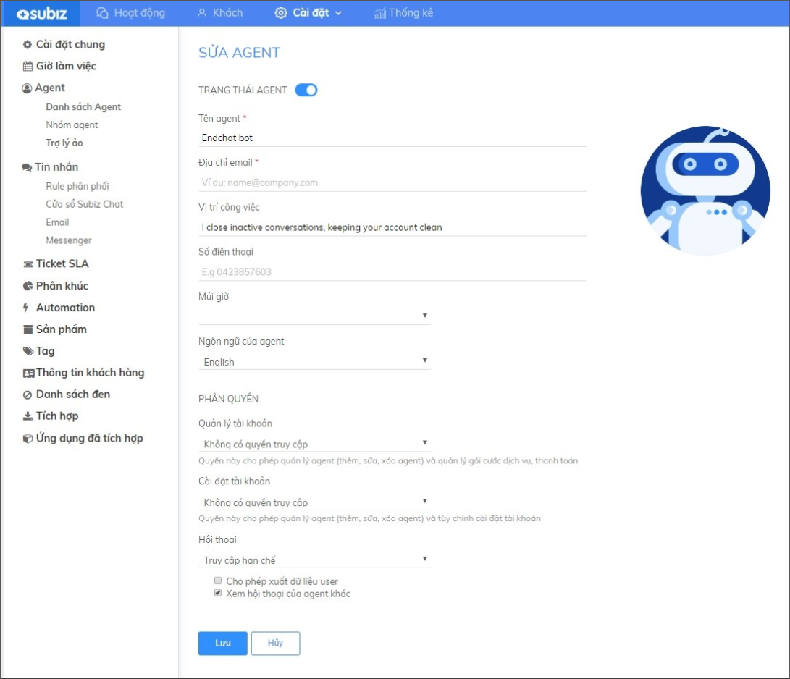
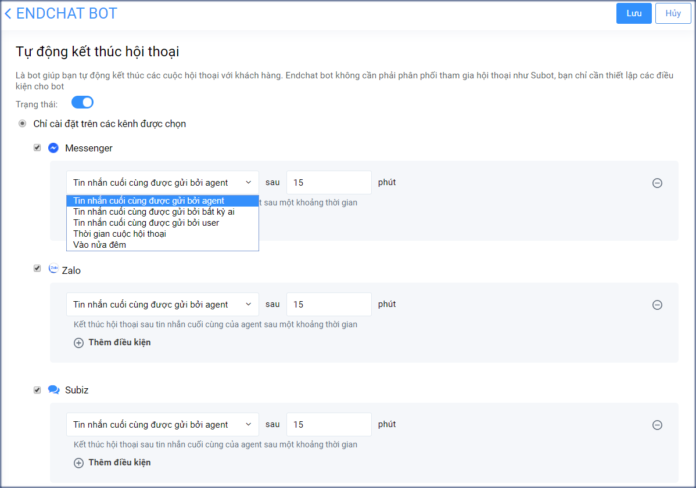
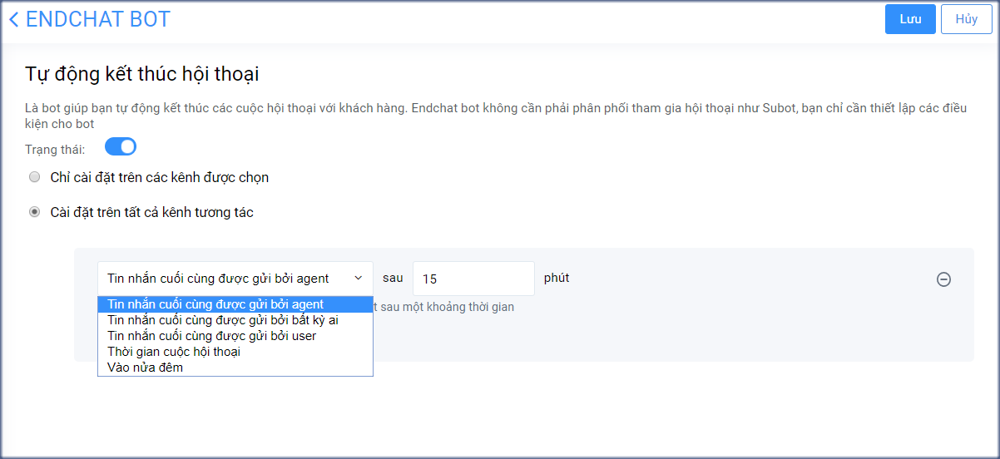

# Endchat Bot

### Endchat bot là gì? 

Endchat bot là một trong các Trợ lý ảo trên Subiz, đây là ứng dụng trên Subiz giúp bạn tự động kết thúc các cuộc hội thoại của khách hàng. Thay vì tự thao tác kết thúc cuộc hội thoại sau khi hỗ trợ khách hàng, bạn có thể tự động hóa quá trình trên cho tất cả hội thoại.   
Từ đó, doanh nghiệp có thể giảm thiểu tối đa việc bỏ sót khách hàng, khách hàng đến sẽ được chuyển đến đúng tư vấn viên đang online sẵn sàng hỗ trợ khách đúng thời điểm.

### Endchat bot hoạt động trên kênh nào?

Subiz hoạt động trên các kênh Chat message như: Subiz chat, Messenger, Zalo.

### Hướng dẫn cài đặt Endchat bot 

Để bắt đầu sử dụng Endchat bot, bạn kích hoạt và cài đặt kịch bản hoạt động của Endchat bot như sau:

1. **Bước 1: Kích hoạt Endchat bot**  Đăng nhập trang quản trị [App.subiz.com -&gt; Cài đặt -&gt; Tài khoản -&gt; Danh sách agent -&gt; Endchat bot](https://app.subiz.com/settings/agents-edit?id=agqhpdunrnvxvwstfl) -&gt; chuyển trạng thái sang ON.

      ****2. **Bước 2: Cài đặt kịch bản cho Endchat Bot**   
Để cài đặt kịch bản Endchat bot, bạn truy cập trang [Cài đặt -&gt; Agent -&gt; Trợ lý ảo](https://app.subiz.com/settings/bots) -&gt; Chọn tùy chỉnh agent Endchat bot và thiết lập kịch bản theo các gợi ý sau đây:

* Để chọn 1 kênh cụ thể chạy Endchat bot, bạn chọn **Chỉ cài đặt trên các kênh được chọn** và chọn kênh  như Messenger hoặc Subiz chat hoặc Zalo; sau đó chọn thời điểm chạy Endchat bot phù hợp, cụ thể: + Sau X phút kể từ tin nhắn cuối cùng gửi bởi agent + Sau X phút kể từ tin nhắn cuối cùng gửi bởi bất kỳ ai + Sau X phút kể từ tin nhắn cuối cùng được gửi với user + Sau X phút hoạt động \(thời gian\) cuộc hội thoại + Vào nửa đêm theo thời gian cài đặt múi giờ hệ thống tại trang [https://app.subiz.com/settings/](https://app.subiz.com/settings/)

* Để tất cả các kênh đều tự động kết hội thoại, bạn chọn **Cài đặt trên tất cả kênh tương tác** và thay đổi thời điểm chạy Endchat bot.


**Lưu ý:**

* Endchat bot là một agent, có thể tích hợp miễn phí.
* EndChat bot chỉ cần bật ON trạng thái hoạt động và thiết lập điều kiện để EndChat bot chạy, không cần phải phân phối tham gia hội thoại như Subot.


> Bạn cần thêm hỗ trợ sử dụng Endchat bot, vui lòng gửi email tới Support@Subiz.com.

