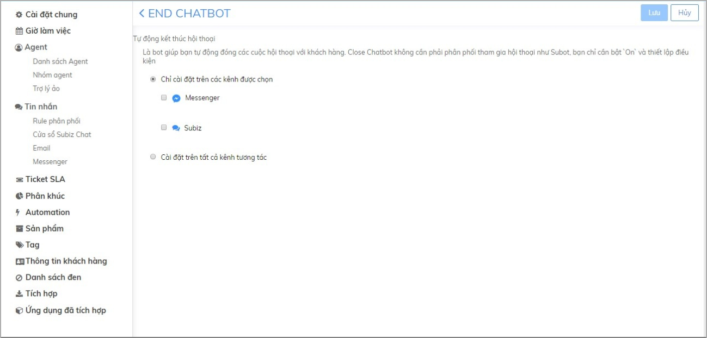

# Endchat Bot

### Endchat Bot là gì? 

End chat bot là một robot có sẵn trong tài khoản Subiz giúp bạn tự động đóng các cuộc hội thoại của khách hàng. Từ đó, doanh nghiệp có thể nâng cao năng suất làm việc, giảm thiểu tối đa việc bỏ sót khách hàng trong trường hợp agent trước đó không online hay khách hàng liên hệ yêu cầu hỗ trợ vấn đề mà agent đó không phụ trách. 

Bạn có thể thiết lập các điều kiện để Endchat Bot hoạt động như: Chọn kênh hoạt động, thời gian tự động kết thúc hội thoại, hội thoại được kết thúc từ đối tượng nào.

### Kích hoạt Endchat bot 

Để bắt đầu sử dụng Endchat Bot, bạn kích hoạt và xây dựng kịch bản hoạt động của Endchat Bot như sau:

* **Bước 1: Kích hoạt Endchat Bot** 

Đăng nhập trang quản trị [App.subiz.com -&gt; Cài đặt -&gt; Tài khoản -&gt; Danh sách agent -&gt; Endchat Bot](https://app.subiz.com/settings/agents-edit?id=agqhpdunrnvxvwstfl) -&gt; chuyển trạng thái sang Active.

* **Bước 2: Thiết lập kịch bản cho Endchat Bot** 

Endchat bot hoạt động trên hai kênh chính là: Subiz chat và Messenger. Bạn có thể chọn một trong hai kênh trên hoặc đồng thời hai kênh như hình dưới đây:

Endchat Bot đã được cài đặt mặc định 4 kịch bản kết thúc hội thoại sau:

* Tin nhắn cuối cùng được gửi bởi agent: Kết thúc hội thoại sau tin nhắn cuối cùng của agent sau một khoảng thời gian.
* Tin nhắn cuối cùng được gửi bởi bất kỳ ai: Kết thúc hội thoại sau tin nhắn cuối cùng sau một khoảng thời gian. 
* Tin nhắn cuối cùng được gửi bởi user: Kết thúc hội thoại sau tin nhắn cuối cùng của user sau một khoảng thời gian. 
* Thời gian cuộc hội thoại: Kết thúc hội thoại sau khoảng thời gian nhất định. 
* Vào nửa đêm: Kết thúc tất cả hội thoại vào nửa đêm. 

Bạn có thể click vào Endchat Bot để tùy chỉnh kênh hoạt động của Endchat Bot, kịch bản kết thúc hội thoại cho từng kênh, thời gian chạy của từng hành động \(tính theo phút\) hoặc xóa/ thêm hành động bất kỳ. 


**Lưu ý:**

* Endchat Bot là một agent, có thể tích hợp miễn phí.
* EndChat bot không cần phải phân phối tham gia hội thoại như Subot, bạn chỉ cần bật Active agent và thiết lập điều kiện để agent hoạt động


