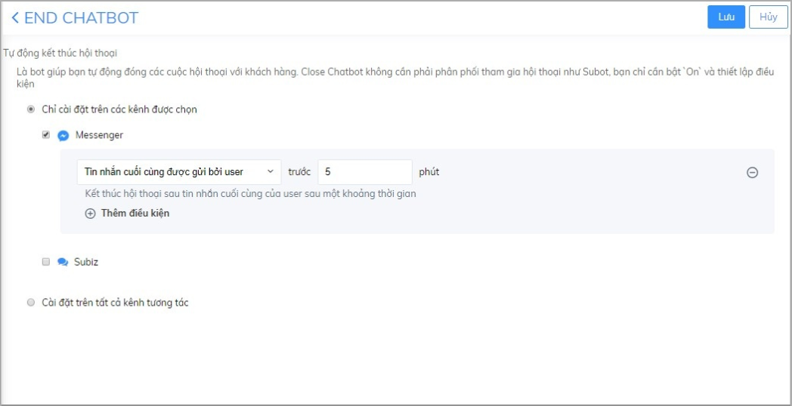
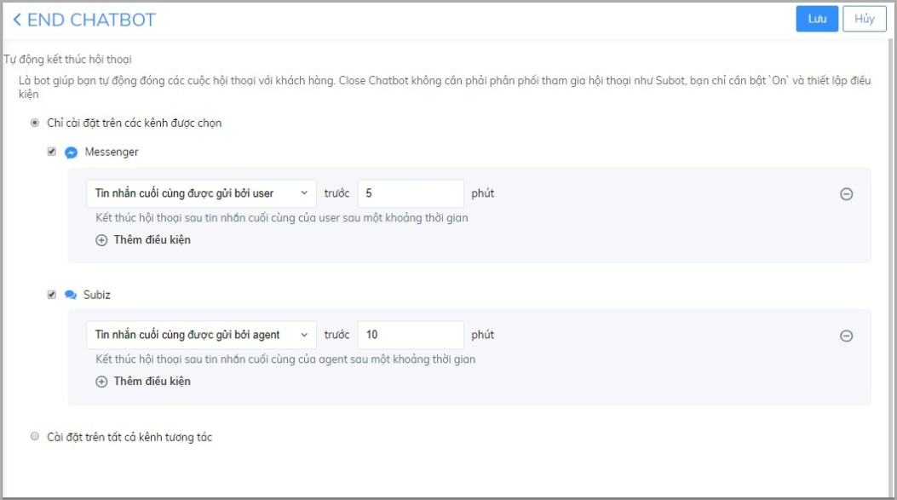
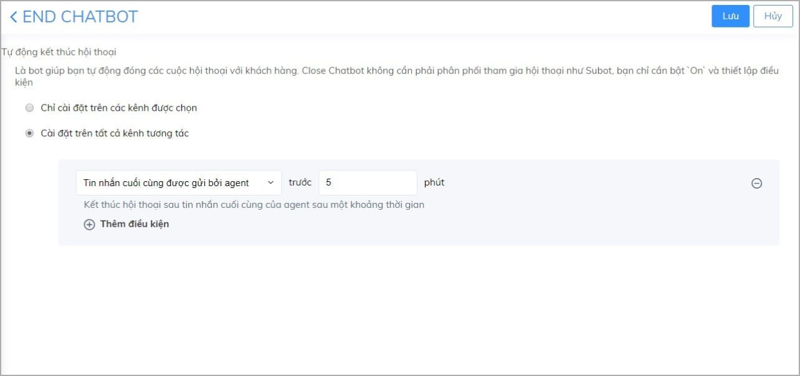
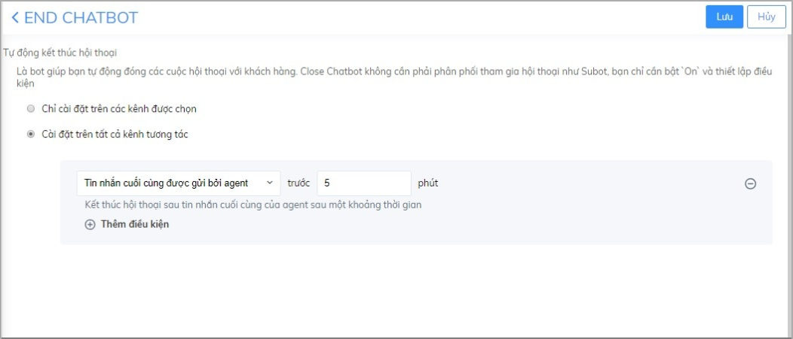
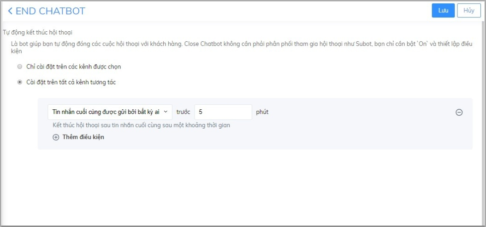
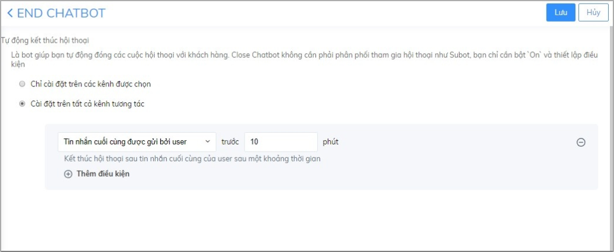
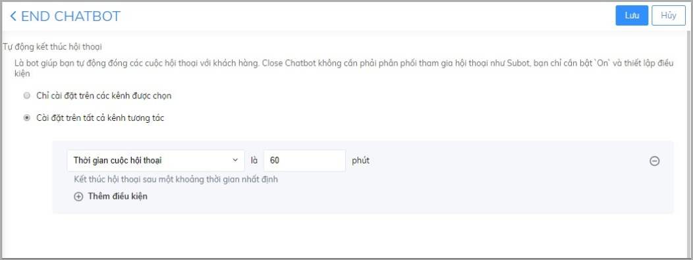
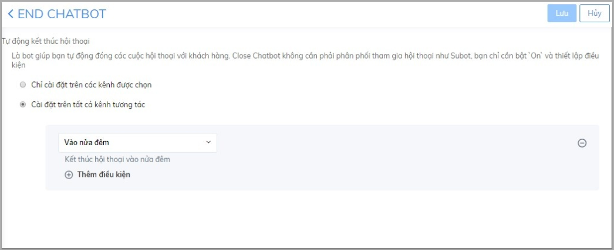

# Endchat Bot

### Endchat Bot là gì? 

End chat bot là một trong các Trợ lý ảo trên Subiz, đây là ứng dụng trên Subiz giúp bạn tự động kết thúc các cuộc hội thoại của khách hàng. Thay vì tự thao tác kết thúc cuộc hội thoại sau khi hỗ trợ khách hàng, bạn có thể tự động hóa quá trình trên cho tất cả hội thoại. Từ đó, doanh nghiệp có thể giảm thiểu tối đa việc bỏ sót khách hàng, khách hàng đến sẽ được chuyển đến tư vấn viên đang online để được hỗ trợ kịp thời.

### Kích hoạt Endchat bot 

Để bắt đầu sử dụng Endchat Bot, bạn kích hoạt và xây dựng kịch bản hoạt động của Endchat Bot như sau:

* **Bước 1: Kích hoạt Endchat Bot** 

Đăng nhập trang quản trị [App.subiz.com -&gt; Cài đặt -&gt; Tài khoản -&gt; Danh sách agent -&gt; Endchat Bot](https://app.subiz.com/settings/agents-edit?id=agqhpdunrnvxvwstfl) -&gt; chuyển trạng thái sang Active.

* **Bước 2: Thiết lập kịch bản cho Endchat Bot** 

Endchat bot hoạt động trên hai kênh chính là: Subiz chat và Messenger. Bạn có thể chọn một trong hai kênh trên hoặc đồng thời hai kênh như hình dưới đây:

* Cài đặt trên Kênh được chọn: Cài đặt kết thúc hội thoại trên 1 trong hai kênh Messenger hay Subiz.

Thêm vào đó, bạn có thể cài đặt kịch bản kết thúc hội thoại cho từng kênh như sau:

* Cài đặt trên tất cả Kênh tương tác: Cài đặt Kết thúc hội thoại đồng thời trên 2 kênh Messenger và Subiz.

Endchat Bot đã được cài đặt mặc định 4 kịch bản kết thúc hội thoại sau:

* Tin nhắn cuối cùng được gửi bởi agent: Kết thúc hội thoại sau tin nhắn cuối cùng của agent sau một khoảng thời gian.

**Ví dụ:** Sau 5 phút không có tin nhắn mới từ agent Endchat Bot tự động Kết thúc hội thoại.

* Tin nhắn cuối cùng được gửi bởi bất kỳ ai: Kết thúc hội thoại sau tin nhắn cuối cùng sau một khoảng thời gian. 

**Ví dụ:** Sau 5 phút không nhận được tin nhắn từ user hoặc agent, Endchat Bot sẽ tự động Kết thúc hội thoại.

* Tin nhắn cuối cùng được gửi bởi user: Kết thúc hội thoại sau tin nhắn cuối cùng của user sau một khoảng thời gian. 

**Ví dụ:** Sau 10 phút không nhận được tin nhắn từ user \(Khách hàng\) Endchat Bot tự động Kết thúc hội thoại.

* Thời gian cuộc hội thoại: Kết thúc hội thoại sau khoảng thời gian nhất định. 

**Ví dụ:** Sau 60 phút kể từ khi bắt đầu hội thoại Endchat Bot tự động Kết thúc hội thoại.

* Vào nửa đêm: Kết thúc tất cả hội thoại vào nửa đêm. 


**Lưu ý:**

* Endchat Bot là một agent, có thể tích hợp miễn phí.
* EndChat bot không cần phải phân phối tham gia hội thoại như Subot, bạn chỉ cần Active và thiết lập điều kiện để EndChat bot hoạt động


