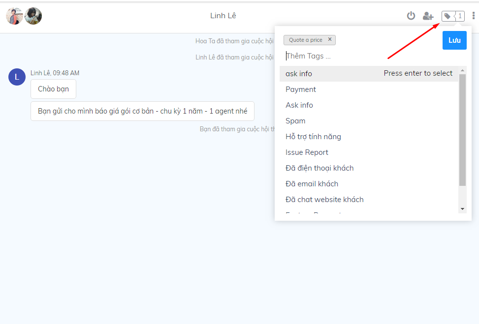

# Gắn Tag cuộc hội thoại

Subiz Tag là chức năng cho phép gắn thẻ cuộc hội thoại, giúp Agent có thể dễ dàng quản lý, theo dõi, phân loại cuộc tương tác với khách hàng.

Hướng dẫn dưới đây sẽ giúp Agent tìm hiểu thêm về cách tạo và sử dụng tính năng thẻ cuộc chat.

### Cách tạo Tags

Đế  tạo một tag mới  Agent vào phần[ Cài đặt &gt; Tài khoản &gt; Tags &gt; Tạo tag mới ](https://app.subiz.com/settings/tags)  

Tại đây, Agent có thể tạo thêm tag để dễ dàng phân loại các cuộc hội thoại của mình:

Các tag được tạo sẽ hiển thị trong danh sách như sau:

### Gắn tags cuộc tương tác

Để gắn tag, Agent click vào biểu tượng gắn tag trong cuộc hội thoại và lựa chọn tag phù hợp trong danh sách có sẵn và Lưu lại.

Khi gắn tag thành công, phía dưới cuộc hội thoại sẽ hiển thị thông báo như sau:


**Lưu ý:**

* Agent có thể gắn tag cuộc hội thoại trên tất cả các kênh
* Agent có thể gắn nhiều hơn một tag trong một cuộc hội thoại
* Agent có thể gắn tag kể cả khi cuộc hội thoại đã kết thúc


### Xóa Tag

Để xóa tag, Agent click vào dấu " x " của tag đã chọn sau đó Lưu lại

### Thống kê tag

Agent có thể thống kê số lượng các tag theo kênh, thời gian, nội dung tag...tại mục thống kê

Agent có thể tham khảo thêm [Hướng dẫn thống kê cuộc hội thoại theo tag ](https://help.subiz.com/~/edit/drafts/-LGSwFXFYwgtmox4Y70e/bao-cao-and-thong-ke#thong-ke-tag)để quản lý các tag một cách hiệu quả.  

