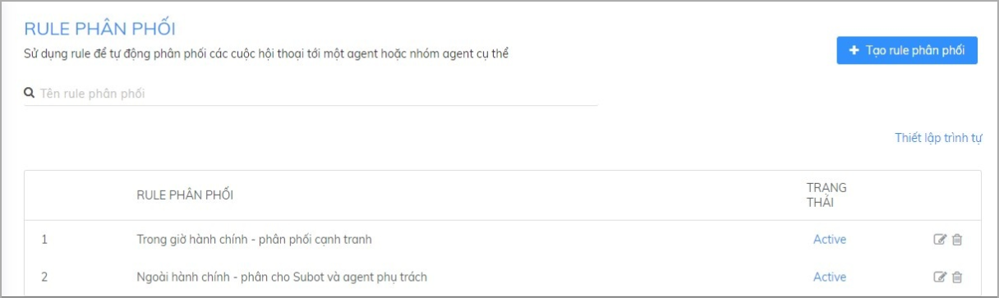
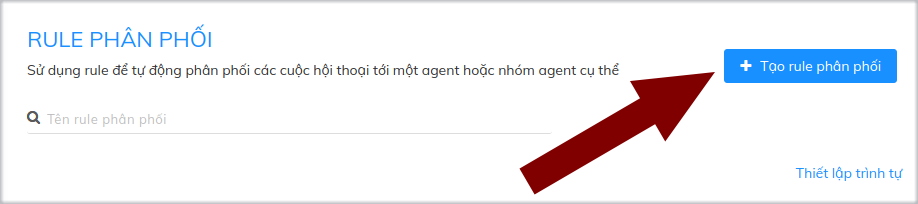
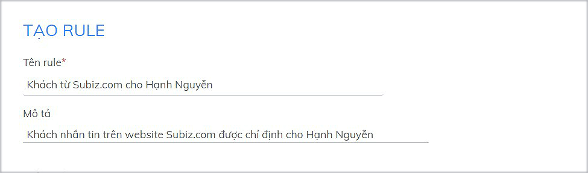
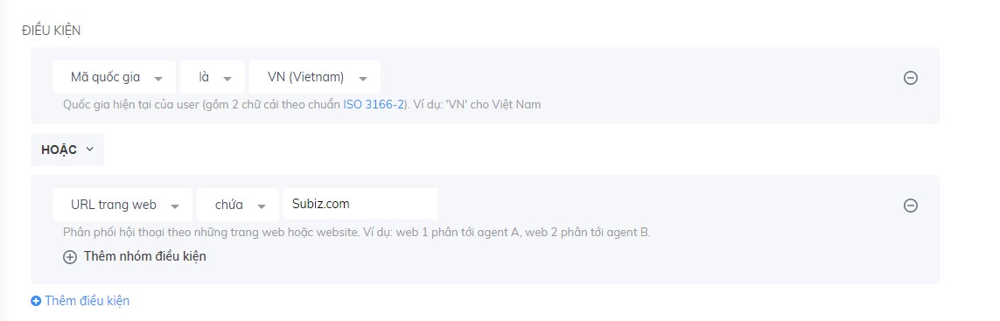
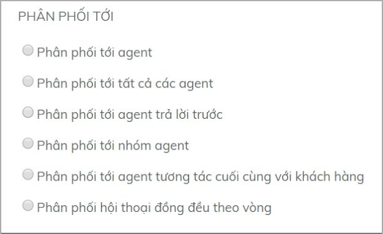

# Tạo Rule phân phối mới

## Rule phân phối hội thoại là gì? 

Rule phân phối là tính năng bản lề của Subiz - giúp doanh nghiệp phân luồng khách hàng. Thay vì phải lựa chọn bộ phận một cách thủ công và chờ đợi được kết nối, bạn có thể thực hiện quy trình trên một cách hoàn toàn tự động, giúp đẩy mạnh hiệu suất công việc theo đó kết nối đến các tư vấn viên nhanh nhất. 

## Rule phân phối hội thoại hoạt động thế nào? 

Tùy theo nhu cầu phân chia hội thoại, bạn có thể cài đặt một hay nhiều Rule phân phối kết hợp. Rule hoạt động theo thứ tự từ trên xuống dưới, Rule nào đứng phía trên sẽ áp dụng trước. Thứ tự các Rule bạn có thể sắp xếp tại mục Thiết lập trình tự.

Ví dụ, một doanh nghiệp có 3 agent là các sales hoạt động đồng thời trong giờ hành chính. Ngoài giờ làm việc bạn muốn gửi thông báo cho khách hàng bạn đang không online và mời khách để lại thông tin. Bạn sẽ cài đặt 2 Rule như sau:

* Trong giờ làm việc: áp dụng cơ chế giao khách cạnh tranh – ai trả lời trước sẽ chuyển chat cho người đó.

* Ngoài giờ làm việc: Phân cho 1 agent phụ trách chính và Subot - Bot tự động Trả lời và Hỏi thông tin.

Hai Rule trên sẽ cài đặt theo thứ tự như sau:

## Tạo Rule mới

Để tạo rule mới, bạn [đăng nhập Subiz](https://app.subiz.com/login) và vào phần[ **Cài đặt &gt; Tài khoản &gt; Rule &gt; Tạo Rule mới**](https://app.subiz.com/settings/add-rule)\*\*\*\*

### Bước 1: Điền tên và mô tả Rule

* **Tên:** Đặt tên để gọi và phân biệt các Rule cài đặt
* **Mô tả**: Mô tả mục đích cài đặt Rule

### Bước 2: Chọn Điều kiện cho Rule

Điều kiện trong Rule là những logic để một Rule hoạt động, tự động phân phối cuộc hội thoại của đúng khách hàng tới đúng agent phụ trách.

Bạn có thể chọn nhiều điều kiện để cài đặt Rule:

* Click Thêm điều kiện để thêm điều kiện cài đặt Rule
* Chọn Và / Hoặc để xác định mối quan hệ giữa các điều kiện.

  **Ví dụ:** Rule phân phối cuộc hội thoại của khách hang đến từ Việt Nam hoặc truy cập vào trang Subiz.com

**Bạn có thể chọn một hay nhiều điều kiện trong danh sách các điều kiện trong Rule dưới đây:​**

<table>
  <thead>
    <tr>
      <th style="text-align:left"><b>C&#xC1;C &#x110;I&#x1EC0;U KI&#x1EC6;N</b>
      </th>
      <th style="text-align:left"><b>C&#xC1;CH S&#x1EEC; D&#x1EE4;NG</b>
      </th>
      <th style="text-align:left"><b>V&#xCD; D&#x1EE4;</b>
      </th>
      <th style="text-align:left"></th>
    </tr>
  </thead>
  <tbody>
    <tr>
      <td style="text-align:left"><b>&#x110;i&#x1EC1;u ki&#x1EC7;n m&#x1EB7;c &#x111;&#x1ECB;nh</b>
      </td>
      <td style="text-align:left"></td>
      <td style="text-align:left"></td>
      <td style="text-align:left"></td>
    </tr>
    <tr>
      <td style="text-align:left">Kh&#xF4;ng c&#xF3; &#x111;i&#x1EC1;u ki&#x1EC7;n</td>
      <td style="text-align:left">Khi l&#x1EF1;a ch&#x1ECD;n &#x111;i&#x1EC1;u ki&#x1EC7;n n&#xE0;y, t&#x1EA5;t
        c&#x1EA3; cu&#x1ED9;c h&#x1ED9;i tho&#x1EA1;i s&#x1EBD; lu&#xF4;n &#x111;&#x1B0;&#x1EE3;c
        ph&#xE2;n ph&#x1ED1;i t&#x1EDB;i c&#xE1;c agent.</td>
      <td style="text-align:left">L&#x1EF1;a ch&#x1ECD;n: <em>Kh&#xF4;ng c&#xF3; &#x111;i&#x1EC1;u ki&#x1EC7;n</em>
      </td>
      <td style="text-align:left"></td>
    </tr>
    <tr>
      <td style="text-align:left">Agent Offline</td>
      <td style="text-align:left">B&#x1EA1;n c&#xF3; th&#x1EC3; s&#x1EED; d&#x1EE5;ng &#x111;i&#x1EC1;u
        ki&#x1EC7;n n&#xE0;y &#x111;&#x1EC3; ph&#xE2;n cu&#x1ED9;c h&#x1ED9;i tho&#x1EA1;i
        khi kh&#xF4;ng c&#xF3; Agent n&#xE0;o online t&#xE0;i kho&#x1EA3;n.</td>
      <td
      style="text-align:left">L&#x1EF1;a ch&#x1ECD;n &#x111;i&#x1EC1;u ki&#x1EC7;n <em>Agent Offline</em>,
        ph&#xE2;n ph&#x1ED1;i cu&#x1ED9;c h&#x1ED9;i tho&#x1EA1;i cho Subot v&#xE0;
        m&#x1ED9;t Agent ph&#x1EE5; tr&#xE1;ch &#x111;&#x1EC3; tr&#x1EA3; l&#x1EDD;i
        kh&#xE1;ch khi online l&#x1EA1;i.</td>
        <td style="text-align:left"></td>
    </tr>
    <tr>
      <td style="text-align:left"><b>H&#x1ED9;i tho&#x1EA1;i di&#x1EC5;n ra</b>
      </td>
      <td style="text-align:left"></td>
      <td style="text-align:left"></td>
      <td style="text-align:left"></td>
    </tr>
    <tr>
      <td style="text-align:left">Th&#x1EDD;i gian</td>
      <td style="text-align:left">D&#xF9;ng khi b&#x1EA1;n mu&#x1ED1;n ph&#xE2;n chia cu&#x1ED9;c tho&#x1EA1;i
        theo th&#x1EDD;i gian, khung gi&#x1EDD; trong ng&#xE0;y, th&#x1EDD;i gian
        l&#xE0;m vi&#x1EC7;c c&#x1EE7;a doanh nghi&#x1EC7;p</td>
      <td style="text-align:left">
        
Sau khi &#x111;&#xE3; c&#xE0;i &#x111;&#x1EB7;t <a href="https://help.subiz.com/bat-dau-voi-subiz/trien-khai-hoat-dong/cai-dat-gio-lam-viec#cach-thiet-lap-gio-lam-viec">Gi&#x1EDD; l&#xE0;m vi&#x1EC7;c</a> c&#x1EE7;a
          doanh nghi&#x1EC7;p, b&#x1EA1;n c&#xF3; th&#x1EC3; t&#x1EA1;o 2 rule nh&#x1B0;
          sau:

        
Rule 1: <em>Th&#x1EDD;i gian - trong gi&#x1EDD; l&#xE0;m vi&#x1EC7;c</em>
        

        
Rule 2:<em> Th&#x1EDD;i gian - ngo&#xE0;i gi&#x1EDD; l&#xE0;m vi&#x1EC7;c</em>
        

        

      </td>
      <td style="text-align:left"></td>
    </tr>
    <tr>
      <td style="text-align:left">Ng&#xE0;y trong tu&#x1EA7;n</td>
      <td style="text-align:left">D&#xF9;ng khi b&#x1EA1;n mu&#x1ED1;n ph&#xE2;n chia cu&#x1ED9;c tho&#x1EA1;i
        theo ng&#xE0;y trong tu&#x1EA7;n.</td>
      <td style="text-align:left">
        
B&#x1EA1;n c&#xF3; th&#x1EC3; t&#x1EA1;o 2 Rule &#x111;&#x1EC3; ph&#xE2;n
          ph&#x1ED1;i cu&#x1ED9;c h&#x1ED9;i tho&#x1EA1;i theo ng&#xE0;y l&#xE0;m
          vi&#x1EC7;c c&#x1EE7;a Agent: Th&#x1EE9; 2,4,6, ch&#x1EE7; nh&#x1EAD;t
          do Agent A ph&#x1EE5; tr&#xE1;ch v&#xE0; th&#x1EE9; 3, 5, 7 do Agent B
          ph&#x1EE5; tr&#xE1;ch

        
Rule 1: <em>Ng&#xE0;y trong tu&#x1EA7;n - m&#x1ED9;t trong c&#xE1;c g&#xED;a tr&#x1ECB; sau - Th&#x1EE9; 2, Th&#x1EE9; 4, Th&#x1EE9; 6, Ch&#x1EE7; nh&#x1EAD;t.</em>
        

        
Rule 2: <em>Ng&#xE0;y trong tu&#x1EA7;n - m&#x1ED9;t trong c&#xE1;c g&#xED;a tr&#x1ECB; sau - Th&#x1EE9; 3, Th&#x1EE9; 5, Th&#x1EE9; 7.</em>
        

      </td>
      <td style="text-align:left"></td>
    </tr>
    <tr>
      <td style="text-align:left"><b>H&#x1ED9;i tho&#x1EA1;i</b>
      </td>
      <td style="text-align:left"></td>
      <td style="text-align:left"></td>
      <td style="text-align:left"></td>
    </tr>
    <tr>
      <td style="text-align:left">Tin nh&#x1EAF;n &#x111;&#x1EA7;u ti&#xEA;n</td>
      <td style="text-align:left">D&#xF9;ng khi b&#x1EA1;n mu&#x1ED1;n d&#x1EF1;a v&#xE0;o n&#x1ED9;i dung
        tin nh&#x1EAF;n &#x111;&#x1EA7;u ti&#xEA;n c&#x1EE7;a kh&#xE1;ch g&#x1EED;i
        &#x111;&#x1EC3; ph&#xE2;n ph&#x1ED1;i h&#x1ED9;i tho&#x1EA1;i cho agent</td>
      <td
      style="text-align:left">
        
Khi tin nh&#x1EAF;n &#x111;&#x1EA7;u ti&#xEA;n c&#x1EE7;a kh&#xE1;ch h&#xE0;ng
          c&#xF3; ch&#x1EE9;a t&#x1EEB; &#x201C;gi&#xE1;&#x201D;, cu&#x1ED9;c h&#x1ED9;i
          tho&#x1EA1;i n&#xE0;y s&#x1EBD; &#x111;&#x1B0;&#x1EE3;c ph&#xE2;n ph&#x1ED1;i
          cho Agent A.

        
&#x110;i&#x1EC1;u ki&#x1EC7;n: <em>Tin nh&#x1EAF;n &#x111;&#x1EA7;u ti&#xEA;n - ch&#x1EE9;a - gi&#xE1;</em>
        

        </td>
        <td style="text-align:left"></td>
    </tr>
    <tr>
      <td style="text-align:left"><b>K&#xEA;nh t&#x1B0;&#x1A1;ng t&#xE1;c</b>
      </td>
      <td style="text-align:left"></td>
      <td style="text-align:left"></td>
      <td style="text-align:left"></td>
    </tr>
    <tr>
      <td style="text-align:left">Ngu&#x1ED3;n h&#x1ED9;i tho&#x1EA1;i</td>
      <td style="text-align:left">D&#xF9;ng khi b&#x1EA1;n mu&#x1ED1;n ph&#xE2;n cho Agent cu&#x1ED9;c h&#x1ED9;i
        tho&#x1EA1;i &#x111;&#x1EBF;n t&#x1EEB; c&#x1EE5; th&#x1EC3; Fanpage n&#xE0;o
        ho&#x1EB7;c &#x111;&#x1ECB;a ch&#x1EC9; Email n&#xE0;o</td>
      <td style="text-align:left">
        
Ph&#xE2;n ph&#x1ED1;i cho Agent ph&#x1EE5; tr&#xE1;ch cu&#x1ED9;c h&#x1ED9;i
          tho&#x1EA1;i &#x111;&#x1EBF;n t&#x1EEB; Fanpage Subiz v&#xE0; email support@subiz.com

        
&#x110;i&#x1EC1;u ki&#x1EC7;n:<em> Ngu&#x1ED3;n h&#x1ED9;i tho&#x1EA1;i - m&#x1ED9;t trong c&#xE1;c g&#xED;a tr&#x1ECB; sau - Subiz, support@subiz.com</em>
        

      </td>
      <td style="text-align:left"></td>
    </tr>
    <tr>
      <td style="text-align:left">K&#xEA;nh t&#x1B0;&#x1A1;ng t&#xE1;c</td>
      <td style="text-align:left">D&#xF9;ng khi b&#x1EA1;n mu&#x1ED1;n ph&#xE2;n ph&#x1ED1;i h&#x1ED9;i
        tho&#x1EA1;i theo k&#xEA;nh t&#x1B0;&#x1A1;ng t&#xE1;c kh&#xE1;ch h&#xE0;ng:
        Website ( Subiz chat ), Messenger, Email</td>
      <td style="text-align:left">
        
Ph&#xE2;n ph&#x1ED1;i cu&#x1ED9;c h&#x1ED9;i tho&#x1EA1;i tr&#xEA;n K&#xEA;nh
          Website v&#xE0; Messenger cho Agent A

        
&#x110;i&#x1EC1;u ki&#x1EC7;n: <em>K&#xEA;nh t&#x1B0;&#x1A1;ng t&#xE1;c - m&#x1ED9;t trong c&#xE1;c g&#xED;a tr&#x1ECB; sau - Subiz Chat, Messenger</em>
        

      </td>
      <td style="text-align:left"></td>
    </tr>
    <tr>
      <td style="text-align:left">URL trang web</td>
      <td style="text-align:left">D&#xF9;ng khi b&#x1EA1;n mu&#x1ED1;n ph&#xE2;n chia cu&#x1ED9;c h&#x1ED9;i
        tho&#x1EA1;i theo t&#x1EEB;ng URL website ri&#xEA;ng hay URL page s&#x1EA3;n
        ph&#x1EA9;m/ d&#x1ECB;ch v&#x1EE5; tr&#xEA;n 1 website</td>
      <td style="text-align:left">
        
Kh&#xE1;ch v&#xE0;o website c&#x1EE7;a Subiz s&#x1EBD; &#x111;&#x1B0;&#x1EE3;c
          ph&#xE2;n ph&#x1ED1;i cho Agent A

        
&#x110;i&#x1EC1;u ki&#x1EC7;n: <em>URL c&#x1EE7;a trang - ch&#x1EE9;a - Subiz.com</em>
        

      </td>
      <td style="text-align:left"></td>
    </tr>
    <tr>
      <td style="text-align:left">T&#xEA;n trang web</td>
      <td style="text-align:left">Ti&#xEA;u &#x111;&#x1EC1; trang g&#x1EA7;n gi&#x1ED1;ng URL trang, d&#xF9;ng
        &#x111;&#x1EC3; ph&#xE2;n ph&#x1ED1;i h&#x1ED9;i tho&#x1EA1;i theo t&#x1EEB;ng
        ti&#xEA;u &#x111;&#x1EC1; c&#x1EE7;a trang s&#x1EA3;n ph&#x1EA9;m/ d&#x1ECB;ch
        v&#x1EE5;</td>
      <td style="text-align:left">
        
Kh&#xE1;ch v&#xE0;o trang c&#xF3; ti&#xEA;u &#x111;&#x1EC1; ch&#x1EE9;a
          t&#x1EEB; kh&#xF3;a &#x201C;M&#xE1;y &#x1EA2;nh&#x201D; ph&#xE2;n ph&#x1ED1;i
          cu&#x1ED9;c h&#x1ED9;i tho&#x1EA1;i cho Agent A.

        
&#x110;i&#x1EC1;u ki&#x1EC7;n: <em>Ti&#xEA;u &#x111;&#x1EC1; trang - ch&#x1EE9;a - m&#xE1;y &#x1EA3;nh</em>
        

      </td>
      <td style="text-align:left"></td>
    </tr>
    <tr>
      <td style="text-align:left"><b>V&#x1ECB; tri v&#xE0; ng&#xF4;n ng&#x1EEF;</b>
      </td>
      <td style="text-align:left"></td>
      <td style="text-align:left"></td>
      <td style="text-align:left"></td>
    </tr>
    <tr>
      <td style="text-align:left">M&#xE3; qu&#x1ED1;c gia</td>
      <td style="text-align:left">D&#xF9;ng khi b&#x1EA1;n mu&#x1ED1;n d&#x1EF1;a v&#xE0;o M&#xE3; Qu&#x1ED1;c
        gia c&#x1EE7;a kh&#xE1;ch &#x111;&#x1EC3; ph&#xE2;n ph&#x1ED1;i h&#x1ED9;i
        tho&#x1EA1;i. M&#xE3; qu&#x1ED1;c gia c&#x103;n c&#x1EE9; theo ISO Code
        (2 k&#xFD; t&#x1EF1;), vi&#x1EBF;t hoa c&#x1EA3; 2 ch&#x1EEF; c&#xE1;i.
        <a
        href="https://en.wikipedia.org/wiki/ISO_3166-2">Tham kh&#x1EA3;o danh s&#xE1;ch m&#xE3; qu&#x1ED1;c gia</a>
           V&#xED; d&#x1EE5;: Vi&#x1EC7;t Nam = VN, M&#x1EF9; = US, Trung Qu&#x1ED1;c
          = CN, H&#xE0;n Qu&#x1ED1;c = KR, Nh&#x1EAD;t B&#x1EA3;n = JP.</td>
      <td style="text-align:left">
        
Ph&#xE2;n ph&#x1ED1;i h&#x1ED9;i tho&#x1EA1;i kh&#xE1;ch h&#xE0;ng n&#x1B0;&#x1EDB;c
          ngo&#xE0;i cho c&#xE1;c agent qu&#x1ED1;c t&#x1EBF;

        
&#x110;i&#x1EC1;u ki&#x1EC7;n: <em>M&#xE3; qu&#x1ED1;c gia - kh&#xF4;ng ph&#x1EA3;i l&#xE0; - VN</em>
        

        
&lt;em&gt;&lt;/em&gt;

      </td>
      <td style="text-align:left"></td>
    </tr>
    <tr>
      <td style="text-align:left">Qu&#x1ED1;c gia</td>
      <td style="text-align:left">D&#xF9;ng khi b&#x1EA1;n mu&#x1ED1;n d&#x1EF1;a v&#xE0;o Qu&#x1ED1;c gia
        c&#x1EE7;a kh&#xE1;ch h&#xE0;ng &#x111;&#x1EC3; ph&#xE2;n ph&#x1ED1;i h&#x1ED9;i
        tho&#x1EA1;i cho agent. T&#xEA;n Qu&#x1ED1;c gia theo chu&#x1EA9;n qu&#x1ED1;c
        t&#x1EBF;, <a href="https://countrycode.org/">tham kh&#x1EA3;o danh s&#xE1;ch qu&#x1ED1;c gia.</a>
         V&#xED; d&#x1EE5;: Vietnam, United States</td>
      <td style="text-align:left">
        
Kh&#xE1;ch h&#xE0;ng &#x1EDF; Vi&#x1EC7;t Nam s&#x1EBD; ph&#xE2;n ph&#x1ED1;i
          h&#x1ED9;i tho&#x1EA1;i cho c&#xE1;c agent n&#x1ED9;i &#x111;&#x1ECB;a

        
&#x110;i&#x1EC1;u ki&#x1EC7;n: <em>Qu&#x1ED1;c gia - l&#xE0; - Vietnam </em>
        

        
&lt;em&gt;&lt;/em&gt;

      </td>
      <td style="text-align:left"></td>
    </tr>
    <tr>
      <td style="text-align:left">Th&#xE0;nh ph&#x1ED1;</td>
      <td style="text-align:left">
        
D&#xF9;ng khi b&#x1EA1;n mu&#x1ED1;n d&#x1EF1;a v&#xE0;o &#x111;&#x1ECB;a
          ch&#x1EC9; Th&#xE0;nh ph&#x1ED1; c&#x1EE7;a kh&#xE1;ch &#x111;&#x1EC3;
          ph&#xE2;n ph&#x1ED1;i h&#x1ED9;i tho&#x1EA1;i. L&#xE0; t&#xEA;n ti&#x1EBF;ng
          Anh c&#x1EE7;a c&#xE1;c th&#xE0;nh ph&#x1ED1;, ch&#x1EC9; vi&#x1EBF;t hoa
          c&#xE1;c ch&#x1EEF; c&#xE1;i &#x111;&#x1EA7;u ti&#xEA;n c&#x1EE7;a t&#x1EEB;.
          <a
          href="https://countrycode.org/vietnam">Tham kh&#x1EA3;o t&#xEA;n Th&#xE0;nh ph&#x1ED1; t&#x1EEB;ng qu&#x1ED1;c
            gia</a>
             V&#xED; d&#x1EE5;: Hanoi, Ho Chi Minh City, New York, Hong Kong.

        

      </td>
      <td style="text-align:left">
        
Ph&#xE2;n ph&#x1ED1;i h&#x1ED9;i tho&#x1EA1;i c&#x1EE7;a kh&#xE1;ch h&#xE0;ng
          &#x111;&#x1EBF;n t&#x1EEB; H&#xE0; N&#x1ED9;i cho agent H&#xE0; N&#x1ED9;i

        
&#x110;i&#x1EC1;u ki&#x1EC7;n : <em>Th&#xE0;nh ph&#x1ED1; - l&#xE0; - Hanoi</em>
        

      </td>
      <td style="text-align:left"></td>
    </tr>
    <tr>
      <td style="text-align:left">M&#xFA;i gi&#x1EDD;</td>
      <td style="text-align:left">
        
Th&#x1EF1;c hi&#x1EC7;n ph&#xE2;n ph&#x1ED1;i h&#x1ED9;i tho&#x1EA1;i
          d&#x1EF1;a tr&#xEA;n m&#xFA;i gi&#x1EDD; c&#x1EE7;a user. M&#xE3; m&#xFA;i
          gi&#x1EDD; &#x111;&#x1B0;&#x1EE3;c c&#x103;n c&#x1EE9; theo gi&#x1EDD;
          UTC. <a href="https://vi.wikipedia.org/wiki/M%C3%BAi_gi%E1%BB%9D">Tham kh&#x1EA3;o danh s&#xE1;ch m&#xFA;i gi&#x1EDD; c&#xE1;c khu v&#x1EF1;c</a>
        

        
V&#xED; d&#x1EE5;: Vi&#x1EC7;t Nam v&#xE0; khu v&#x1EF1;c &#x110;&#xF4;ng
          Nam &#xC1; - UTC +7 G

      </td>
      <td style="text-align:left">
        
Ph&#xE2;n ph&#x1ED1;i h&#x1ED9;i tho&#x1EA1;i c&#x1EE7;a kh&#xE1;ch h&#xE0;ng
          &#x111;&#x1EBF;n t&#x1EEB; khu v&#x1EF1;c &#x110;&#xF4;ng Nam &#xC1; cho
          agent A.

        
&#x110;i&#x1EC1;u ki&#x1EC7;n: <em>M&#xFA;i gi&#x1EDD; - m&#x1ED9;t trong c&#xE1;c g&#xED;a tr&#x1ECB; sau - +7:00</em>
        

      </td>
      <td style="text-align:left"></td>
    </tr>
    <tr>
      <td style="text-align:left">Ng&#xF4;n ng&#x1EEF; tr&#xEA;n tr&#xEC;nh duy&#x1EC7;t</td>
      <td style="text-align:left">D&#xF9;ng khi b&#x1EA1;n mu&#x1ED1;n d&#x1EF1;a v&#xE0;o ng&#xF4;n ng&#x1EEF;
        tr&#xEC;nh duy&#x1EC7;t c&#x1EE7;a kh&#xE1;ch &#x111;&#x1EC3; ph&#xE2;n
        ph&#x1ED1;i h&#x1ED9;i tho&#x1EA1;i. Ng&#xF4;n ng&#x1EEF; tr&#xEA;n tr&#xEC;nh
        duy&#x1EC7;t theo chu&#x1EA9;n <a href="http://www.lingoes.net/en/translator/langcode.htm">ISO Language Code</a>,
        v&#xED; d&#x1EE5;: vi- VN, en - US.</td>
      <td style="text-align:left">
        
Kh&#xE1;ch h&#xE0;ng s&#x1EED; d&#x1EE5;ng ng&#xF4;n ng&#x1EEF; English
          tr&#xEA;n tr&#xEC;nh s&#x1EBD; ph&#xE2;n ph&#x1ED1;i h&#x1ED9;i tho&#x1EA1;i
          cho nh&#xF3;m agent qu&#x1ED1;c t&#x1EBF;.

        
&#x110;i&#x1EC1;u ki&#x1EC7;n: <em>Ng&#xF4;n ng&#x1EEF; tr&#xEA;n tr&#xEC;nh duy&#x1EC7;t - kh&#xF4;ng ph&#x1EA3;i l&#xE0; - Vi</em>
        

      </td>
      <td style="text-align:left"></td>
    </tr>
    <tr>
      <td style="text-align:left"><b>Truy c&#x1EAD;p web</b>
      </td>
      <td style="text-align:left"></td>
      <td style="text-align:left"></td>
      <td style="text-align:left"></td>
    </tr>
    <tr>
      <td style="text-align:left">Lo&#x1EA1;i thi&#x1EBF;t b&#x1ECB;</td>
      <td style="text-align:left">D&#xF9;ng khi b&#x1EA1;n mu&#x1ED1;n d&#x1EF1;a v&#xE0;o thi&#x1EBF;t
        b&#x1ECB; truy c&#x1EAD;p c&#x1EE7;a kh&#xE1;ch h&#xE0;ng: M&#xE1;y t&#xED;nh
        c&#xE1; nh&#xE2;n, &#x111;i&#x1EC7;n tho&#x1EA1;i, Tablet</td>
      <td style="text-align:left">
        
Ph&#xE2;n cu&#x1ED9;c h&#x1ED9;i tho&#x1EA1;i c&#x1EE7;a kh&#xE1;ch h&#xE0;ng
          s&#x1EED; d&#x1EE5;ng m&#xE1;y t&#xED;nh c&#xE1; nh&#xE2;n

        
&#x110;i&#x1EC1;u ki&#x1EC7;n: <em>Lo&#x1EA1;i thi&#x1EBF;t b&#x1ECB; - m&#x1ED9;t trong c&#xE1;c gi&#xE1; trj sau - M&#xE1;y t&#xED;nh c&#xE1; nh&#xE2;n</em>
        

      </td>
      <td style="text-align:left"></td>
    </tr>
    <tr>
      <td style="text-align:left">S&#x1ED1; l&#x1EA7;n vi&#x1EBF;ng th&#x103;m</td>
      <td style="text-align:left">D&#xF9;ng khi b&#x1EA1;n mu&#x1ED1;n d&#x1EF1;a v&#xE0;o s&#x1ED1; l&#x1EA7;n
        gh&#xE9; th&#x103;m website c&#x1EE7;a kh&#xE1;ch.</td>
      <td style="text-align:left">
        
Ph&#xE2;n ph&#x1ED1;i cu&#x1ED9;c h&#x1ED9;i tho&#x1EA1;i c&#x1EE7;a kh&#xE1;ch
          h&#xE0;ng &#x111;&#xE3; v&#xE0;o website l&#x1EDB;n h&#x1A1;n 3 l&#x1EA7;n

        
&#x110;i&#x1EC1;u ki&#x1EC7;n: <em>S&#x1ED1; l&#x1EA7;n vi&#x1EBF;ng th&#x103;m - l&#x1EDB;n h&#x1A1;n - 3</em>
        

      </td>
      <td style="text-align:left"></td>
    </tr>
    <tr>
      <td style="text-align:left">T&#x1ED5;ng s&#x1ED1; h&#x1ED9;i tho&#x1EA1;i</td>
      <td style="text-align:left">&#x110;i&#x1EC1;u ki&#x1EC7;n n&#x1EF3; s&#x1EBD; d&#x1EF1;a tr&#xEA;n
        t&#x1ED5;ng s&#x1ED1; cu&#x1ED9;c h&#x1ED9;i tho&#x1EA1;i c&#x1EA3; kh&#xE1;ch
        di&#x1EC5;n ra tr&#xEA;n Subiz</td>
      <td style="text-align:left">
        
B&#x1EA1;n mu&#x1ED1;n nh&#x1EEF;ng kh&#xE1;ch h&#xE0;ng &#x111;&#xE3;
          chat &#x111;&#x1EBF;n tr&#xEA;n 3 l&#x1EA7;n s&#x1EBD; &#x111;&#x1B0;&#x1EE3;c
          b&#x1ED9; ph&#x1EAD;n support h&#x1ED7; tr&#x1EE3; ri&#xEA;ng

        
&#x110;i&#x1EC1;u ki&#x1EC7;n: <em>T&#x1ED5;ng s&#x1ED1; h&#x1ED9;i tho&#x1EA1;i - l&#x1EDB;n h&#x1A1;n - 3</em>
        

      </td>
      <td style="text-align:left"></td>
    </tr>
    <tr>
      <td style="text-align:left"><b>Th&#xF4;ng tin kh&#xE1;ch h&#xE0;ng</b>
      </td>
      <td style="text-align:left"></td>
      <td style="text-align:left"></td>
      <td style="text-align:left"></td>
    </tr>
    <tr>
      <td style="text-align:left">&#x110;&#x1ECB;a ch&#x1EC9;</td>
      <td style="text-align:left">D&#xF9;ng khi b&#x1EA1;n mu&#x1ED1;n d&#x1EF1;a tr&#xEA;n &#x111;&#x1ECB;a
        ch&#x1EC9; truy c&#x1EAD;p c&#x1EE7;a kh&#xE1;ch &#x111;&#x1EC3; ph&#xE2;n
        ph&#x1ED1;i cu&#x1ED9;c h&#x1ED9;i tho&#x1EA1;i</td>
      <td style="text-align:left">
        
Ph&#xE2;n ph&#x1ED1;i cu&#x1ED9;c h&#x1ED9;i tho&#x1EA1;i c&#x1EE7;a kh&#xE1;ch
          h&#xE0;ng H&#xE0; N&#x1ED9;i cho chi nh&#xE1;nh H&#xE0; N&#x1ED9;i

        
&#x110;i&#x1EC1;u ki&#x1EC7;n: <em>&#x110;&#x1ECB;a ch&#x1EC9; - ch&#x1EE9;a - Hanoi</em>
        

      </td>
      <td style="text-align:left"></td>
    </tr>
    <tr>
      <td style="text-align:left">&#x110;&#x1ECB;a ch&#x1EC9; email</td>
      <td style="text-align:left">D&#xF9;ng khi b&#x1EA1;n mu&#x1ED1;n d&#x1EF1;a v&#xE0;o th&#xF4;ng tin
        &#x111;&#x1ECB;a ch&#x1EC9; email c&#x1EE7;a kh&#xE1;ch &#x111;&#x1EC3;
        ph&#xE2;n ph&#x1ED1;i h&#x1ED9;i tho&#x1EA1;i cho agent.</td>
      <td style="text-align:left">
        
Ph&#xE2;n ph&#x1ED1;i cu&#x1ED9;c h&#x1ED9;i tho&#x1EA1;i c&#x1EE7;a kh&#xE1;ch
          h&#xE0;ng &#x111;&#xE3; c&#xF3; &#x111;&#x1ECB;a ch&#x1EC9; email cho Agent
          Kinh doanh

        
&#x110;i&#x1EC1;u ki&#x1EC7;n:<em> &#x110;&#x1ECB;a ch&#x1EC9; email  - ch&#x1EE9;a - support@subiz.com</em>
        

      </td>
      <td style="text-align:left"></td>
    </tr>
    <tr>
      <td style="text-align:left">H&#x1ECD; v&#xE0; t&#xEA;n</td>
      <td style="text-align:left">D&#xF9;ng khi b&#x1EA1;n mu&#x1ED1;n d&#x1EF1;a v&#xE0;o th&#xF4;ng tin
        H&#x1ECD; t&#xEA;n c&#x1EE7;a kh&#xE1;ch &#x111;&#x1EC3; ph&#xE2;n ph&#x1ED1;i
        h&#x1ED9;i tho&#x1EA1;i cho agent.</td>
      <td style="text-align:left">
        
Ph&#xE2;n ph&#x1ED1;i cu&#x1ED9;c h&#x1ED9;i tho&#x1EA1;i c&#x1EE7;a kh&#xE1;ch
          h&#xE0;ng c&#xF3; t&#xEA;n l&#xE0; Linh cho Agent A

        
&#x110;i&#x1EC1;u ki&#x1EC7;n: <em>T&#xEA;n  - ch&#x1EE9;a - Linh</em>
        

      </td>
      <td style="text-align:left"></td>
    </tr>
    <tr>
      <td style="text-align:left">S&#x1ED1; &#x111;i&#x1EC7;n tho&#x1EA1;i</td>
      <td style="text-align:left">D&#xF9;ng khi b&#x1EA1;n mu&#x1ED1;n d&#x1EF1;a v&#xE0;o th&#xF4;ng tin
        s&#x1ED1; &#x111;i&#x1EC7;n tho&#x1EA1;i c&#x1EE7;a kh&#xE1;ch &#x111;&#x1EC3;
        ph&#xE2;n ph&#x1ED1;i h&#x1ED9;i tho&#x1EA1;i cho agent.</td>
      <td style="text-align:left">
        
Ph&#xE2;n ph&#x1ED1;i cu&#x1ED9;c h&#x1ED9;i tho&#x1EA1;i c&#x1EE7;a kh&#xE1;ch
          h&#xE0;ng &#x111;&#xE3; c&#xF3; s&#x1ED1; &#x111;i&#x1EC7;n tho&#x1EA1;i
          l&#xE0; 02473021368 cho Agent T&#x1ED5;ng &#x111;&#xE0;i

        
&#x110;i&#x1EC1;u ki&#x1EC7;n: <em>S&#x1ED1; &#x111;i&#x1EC7;n tho&#x1EA1;i  - ch&#x1EE9;a - 02473021368</em>
        

      </td>
      <td style="text-align:left"></td>
    </tr>
    <tr>
      <td style="text-align:left">Time on page</td>
      <td style="text-align:left">D&#xF9;ng khi b&#x1EA1;n mu&#x1ED1;n d&#x1EF1;a v&#xE0;o th&#x1EDD;i gian
        kh&#xE1;ch h&#xE0;ng tr&#xEA;n website c&#x1EE7;a b&#x1EA1;n</td>
      <td style="text-align:left">
        
Ph&#xE2;n ph&#x1ED1;i cu&#x1ED9;c h&#x1ED9;i tho&#x1EA1;i c&#x1EE7;a kh&#xE1;ch
          h&#xE0;ng &#x111;&#xE3; &#x1EDF; tr&#xEA;n web h&#x1A1;n 15s cho Agent
          Kinh doanh

        
&#x110;i&#x1EC1;u ki&#x1EC7;n: <em>Time on page - l&#x1EDB;n h&#x1A1;n - 15</em>
        

      </td>
      <td style="text-align:left"></td>
    </tr>
    <tr>
      <td style="text-align:left">Website</td>
      <td style="text-align:left">D&#xF9;ng khi b&#x1EA1;n mu&#x1ED1;n d&#x1EF1;a v&#xE0;o th&#xF4;ng tin
        website c&#x1EE7;a kh&#xE1;ch &#x111;&#x1EC3; ph&#xE2;n ph&#x1ED1;i cu&#x1ED9;c
        h&#x1ED9;i tho&#x1EA1;i</td>
      <td style="text-align:left">
        
Doanh nghi&#x1EC7;p b&#x1EA1;n qu&#x1EA3;n l&#xFD; kh&#xE1;ch h&#xE0;ng
          d&#x1EF1;a v&#xE0;o website. &#x110;&#x1EC3; c&#xF3; th&#x1EC3; ph&#xE2;n
          ph&#x1ED1;i cu&#x1ED9;c h&#x1ED9;i tho&#x1EA1;i theo th&#xF4;ng tin website
          c&#x1EE7;a kh&#xE1;ch b&#x1EA1;n t&#x1EA1;o &#x111;i&#x1EC1;u ki&#x1EC7;n
          nh&#x1B0; sau:

        
<em>&#x110;i&#x1EC1;u ki&#x1EC7;n: Website - l&#xE0; - Subiz.com</em>
        

      </td>
      <td style="text-align:left"></td>
    </tr>
  </tbody>
</table>### Bước 3: Chọn cách thức phân phối tới Agent

Bây giờ, bạn chọn cách thức phân phối cuộc các cuộc hội thoại thỏa mãn các điều kiện đã đặt ở trên:

* **Phân phối tới các agents**: Chọn cụ thể Agent bạn muốn phân phối hội thoại của khách hàng
* **Phân phối tới các nhóm**: Chọn nhóm agent bạn đã tạo để phân phối hội thoại của khách hàng
* **Phân phối tới agent có tương tác cuối cùng với khách hàng**: Khi agent đã hỗ trợ khách hàng trước đó, bạn sẽ chọn chỉ định các cuộc hội thoại tiếp theo của khách cho agent tiếp tục chăm sóc và tư vấn.
* **Phân phối cuộc hội thoại đồng đều theo vòng**: Bạn có nhiều agent và muốn chỉ định theo vòng chia đều cuộc hội thoại của khách cho các agent. 
* **Phân phối hội thoại cho Agent trả lời trước:** Rule này nhằm đẩy mạnh tính cạnh tranh cho các doanh nghiệp có nhiều agent là tư vấn viên và sẽ phân phối theo cơ chế ****tất cả những agents sẽ nhận được thông báo agent nào phản hồi trước sẽ được tiếp tục cuộc hội thoại.

Ngoài ra, với mỗi cơ chế phân phối trên, bạn còn có thể tùy chọn **Chỉ phân phối cho agent đang online.** Mục đích của cơ chế trên hỗ trợ các doanh nghiệp có nhiều agent và làm việc theo ca không cố định. Các agent không online sẽ không được phân phối và không nhận nhận được thông báo cho hội thoại trên.

**Ví dụ:** Trong giờ làm việc, các agent nào đang online sẽ nhận được thông báo, agent nào trả lời trước, hội thoại sẽ được phân cho agent đó.

## Lưu ý khi cài đặt Rule

* Rule là cài đặt cần thiết cho mỗi tài khoản để phân luồng hội thoại và chuyển cuộc chat đến đúng tư vấn viên giúp giảm thời gian khách hàng phải chờ đợi, nâng cao hiệu quả tương tác. Trong trường hợp bạn không cài đặt Rule, hệ thống sẽ **mặc định phân phối hội thoại cho tất cả agent trong tài khoản.**
* Bạn có thể tạo nhiều Rule và thay đổi Rule theo thời gian, cho phù hợp với số lượng Agent và cách phân chia công việc của doanh nghiệp.

     

\*\*\*\*

