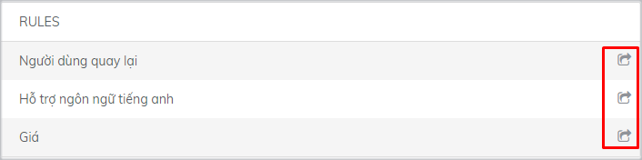

# Cách thức phân phối cuộc hội thoại

**Với** [**Subiz**](https://subiz.com/vi/)**, các cuộc hội thoại sẽ được phân phối một cách tự động tới một hay một nhóm Agent, bằng cách bạn thiết lập và sử dụng các Rule**

Bạn có thể sử dụng Rule mặc định ban đầu, sử dụng thư viện Rule có sẵn hoặc tạo “Rule Mới” để thực hiện phân phối tự động các cuộc hội thoại sao cho phù hợp với nhu cầu thực tế của doanh nghiệp

### **Sử dụng Rule mặc định ban đầu**

Là Rule phân phối tất cả các cuộc tương tác của tất cả các User \(khách hàng\) cho Agent chủ tài khoản \(Agent owner\) ngay sau khi tích hợp một hay nhiều kênh tương tác cho tài khoản [Subiz ](https://subiz.com/vi/)của bạn. **Đây là rule mặc định,** [**Subiz** ](https://subiz.com/vi/)**đã thiết lập ban đầu cho mọi tài khoản.**

**Bạn có thể xem chi tiết nội dung và cách thiết lập của rule mặc định này**

Bạn có thể **chỉnh sửa các điều kiện, cách thức phân phối** trong rule mặc định này để tạo ra một rule mới, ví dụ thêm Agent được nhận cuộc chat…. Xem hướng dẫn chi tiết [tạo rule mới](https://subiz.gitbook.io/subiz-document/bat-dau-voi-subiz/untitled/untitled/untitled#buoc-1-dat-ten-va-mo-ta-rule) và cách thức chỉnh sửa.

### **Sử dụng Thư viện Rule có sẵn**

Thư viện Rule là danh sách các Rule mà [Subiz](https://subiz.com/vi/) đã tạo sẵn cho bạn, bạn có thể chọn Rule phù hợp với cách thức hoạt động của doanh nghiệp, hoặc chỉnh sửa thêm để nhanh chóng tạo ra các Rule thích hợp nhất với doanh nghiệp của mình.

Để sử dụng rule có sẵn, bạn làm theo các bước sau:

​[1. Đăng nhập tài khoản](http://widgetv4.subiz.com/)​

2. Vào [**Cài đặt &gt; Tài khoản &gt; Tin nhắn &gt; Rule**](https://app.subiz.com/settings/rule-setting)\*\*\*\*

3. Chọn **Thư viện Rule**

4. Chọn biểu tượng nhập tại rule mà bạn muốn sử dụng

5. Chỉnh sửa Rule nếu muốn và chọn **Tạo rule**

### **Tạo Rule mới**

Bạn nên dựa trên tình hình thực tế của doanh nghiệp, như số lượng website,[ fanpage](https://subiz.com/vi/facebook-messenger.html%20), [email](https://subiz.com/vi/email.html%20) đã tích hợp, số lượng Agent đang sử dụng và cách thức quản lý, điều hành của doanh nghiệp để sáng tạo ra các Rule mới, giúp cho việc phân phối và xử lý các cuộc hội thoại được hiệu quả.


* Khi bạn có nhiều Agent, không tạo Rule để phân phối tương tác, các Agent khác sẽ không nhận được thông báo yêu cầu chat từ khách hàng, lúc này các yêu cầu chat đều chuyển tới cho Agent chủ tài khoản. Lúc đầu bạn có thể chọn các Rule trong Thư viện Rule mà [Subiz](https://subiz.com/vi/) đã tạo sẵn.
* Bạn có thể tạo nhiều Rule, [quản lý các Rule](https://subiz.gitbook.io/subiz-document/bat-dau-voi-subiz/untitled/untitled/quan-ly-danh-sach-rule) và thay đổi Rule theo thời gian, cho phù hợp với số lượng Agent và cách quản lý của bạn.


