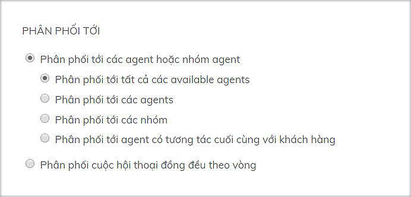
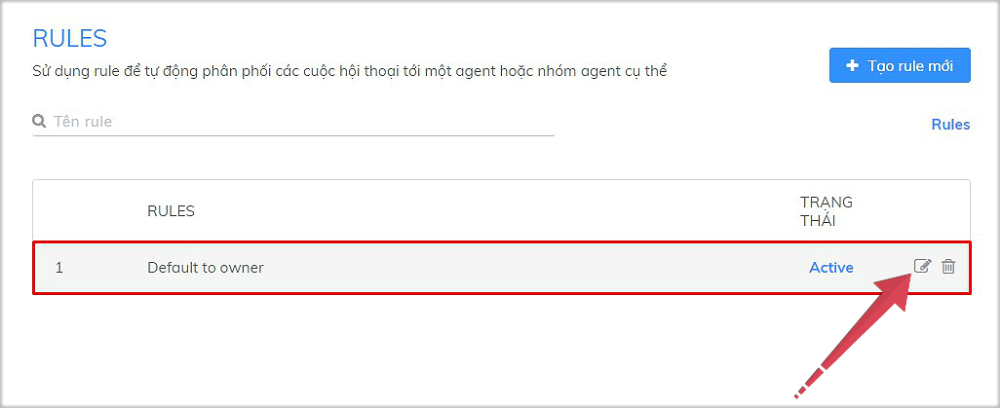

# Rule phân phối cuộc hội thoại

### Rule là gì?

[Rule](https://app.subiz.com/settings/rule-setting) là tính năng giúp bạn có thể phân phối cuộc hội thoại của khách hàng tới đúng agent phụ trách. Tại [Subiz](https://subiz.com/), bạn có thể cài đặt Rule phân phối tự động tới một agent hay nhiều agent cùng lúc. 

Trong đó [Rule](https://app.subiz.com/settings/rule-setting) có 5 cách thức phân phối hội thoại cho agent như sau:

* **Phân phối tới tất cả available agents**: Available agent là những agent online có kết nối trực tiếp với Subiz trên máy tính hoặc app mobile. Khi các agent offline, cuộc hội thoại của khách chuyển về Hội thoại chưa được phân phối. Agent có thể xem và trả lời khách hàng sau khi kết nối lại Subiz.
* **Phân phối tới các agents**: Chọn cụ thể Agent bạn muốn phân phối hội thoại của khách hàng
* **Phân phối tới các nhóm**: Chọn nhóm agent bạn đã tạo để phân phối hội thoại của khách hàng
* **Phân phối tới agent có tương tác cuối cùng với khách hàng**: Khi agent đã hỗ trợ khách hàng trước đó, bạn sẽ chọn chỉ định các cuộc hội thoại tiếp theo của khách cho agent tiếp tục chăm sóc và tư vấn.
* **Phân phối cuộc hội thoại đồng đều theo vòng**: Bạn có nhiều agent và muốn chỉ định theo vòng chia đều cuộc hội thoại của khách cho các agent. 

### Default to owner - Rule mặc định

Với các tài khoản mới, Subiz đã thiết lập sẵn **Rule mặc định -** [**Default to owner**](https://app.subiz.com/settings/rule-setting). Rule này phân phối tất cả các cuộc hội thoại của khách hàng cho Agent tài khoản chính \(Agent owner\).

Bạn có thể xem chi tiết  Rule Default to owner và tùy chỉnh cài đặt  cho phù hợp như: Tên Rule để dễ hiểu ý nghĩa cài đặt Rule, chọn điều kiện và cách thức Phân phối hội thoại của khách cho Agent.  
[Xem thêm hướng dẫn Tạo Rule mới](https://help.subiz.com/bat-dau-voi-subiz/trien-khai-hoat-dong/phan-phoi-cuoc-hoi-thoai/tao-rule-moi)

     

\*\*\*\*

