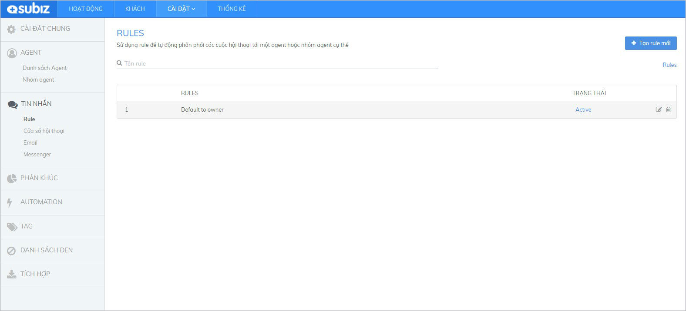
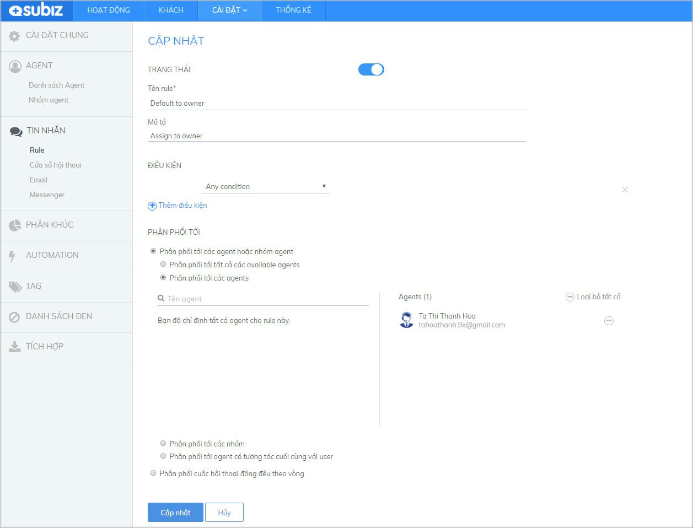

# Cách thức phân phối cuộc hội thoại

Rule là tính năng của [Subiz](https://subiz.com/) giúp bạn có thể phân phối cuộc hội thoại của khách hàng tới đúng agent phụ trách. Tại [Subiz](https://subiz.com/), bạn có thể phân phối Rule tự động tới một hay một nhóm agent. 

Với các tài khoản mới, Subiz đã thiết lập sẵn **Rule mặc định - Default to owner**. Rule này phân phối tất cả các cuộc hội thoại của khách hàng cho Agent chủ tài khoản \(Agent owner\) ngay sau khi tích hợp kênh tương tác vào tài khoản Subiz của bạn.

**Bạn có thể xem chi tiết nội dung và cách thiết lập của rule mặc định này**

Bạn có thể **chỉnh sửa các điều kiện, cách thức phân phối** trong rule mặc định này để tạo ra một rule mới, ví dụ thêm Agent được nhận cuộc chat…. Xem hướng dẫn chi tiết [tạo rule mới](https://subiz.gitbook.io/subiz-document/bat-dau-voi-subiz/untitled/untitled/untitled#buoc-1-dat-ten-va-mo-ta-rule) và cách thức chỉnh sửa.

\*\*\*\*

