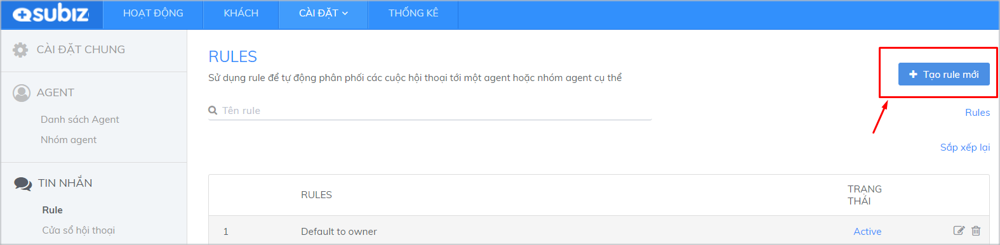
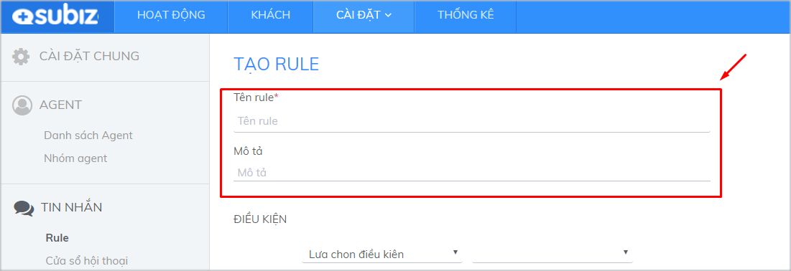
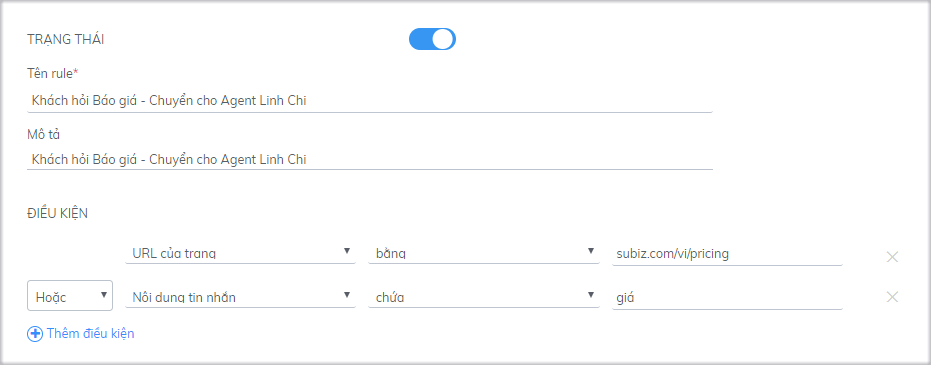
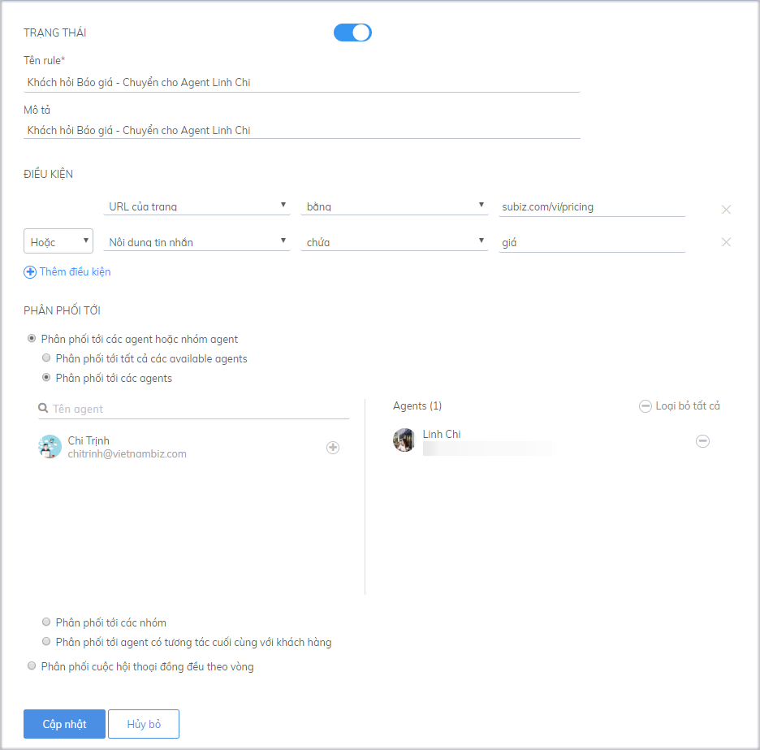

# Tạo Rule mới

Rule là tính năng tự động phân phối cuộc hội thoại của khách hàng cho các agent theo các điều kiện cài đặt. Bạn nên dựa trên tình hình thực tế, cách thức quản lý, điều hành của doanh nghiệp, cách thức phân chia công việc của tư vấn viên để sáng tạo ra các Rule mới, giúp cho việc phân phối và xử lý các cuộc hội thoại được hiệu quả.

Để tạo rule mới, bạn [đăng nhập tài khoản](https://app.subiz.com/login) và vào phần[ **Cài đặt &gt; Tài khoản &gt; Tin nhắn &gt; Rule &gt; Tạo Rule mới**](https://app.subiz.com/settings/add-rule)\*\*\*\*

### Bước 1: Đặt tên và mô tả Rule

* **Tên:** Đặt tên để quản lý trong bảng danh sách các rule.
* **Mô tả**: Mô tả điều kiện và đối tượng của rule để dễ nhận biết.

### Bước 2: Đặt các điều kiện cho Rule

Điều kiện trong Rule là các để một Rule được thực thi, giúp thiết lập các kịch bản phân phối cuộc hội thoại tới Agent một cách thông minh và hoạt động đúng lúc. 


**Lưu ý:** Một Rule **chỉ áp dụng cho một quy tắc phân phối hội thoại**. Tuy nhiên, bạn có thể kết hợp nhiều điều kiện để phân phối tới một hay nhóm agent tương ứng với điều kiện đó. 


  
Cách thiết lập các điều kiện trong Rule: 

* Click Thêm điều kiện để kết hợp nhiều điều kiện trong một rule.
* Chọn Và/ Hoặc để xác định mối quan hệ giữa các điều kiện.

  **Ví dụ:** Khách hỏi nội dung có ký tự “giá” hội thoại sẽ chuyển đến agent Linh Chi.

**Bạn có thể chọn một hay nhiều điều kiện trong danh sách các điều kiện trong Rule dưới đây:​**

<table>
  <thead>
    <tr>
      <th style="text-align:left"><b>CÁC ĐIỀU KIỆN</b>
      </th>
      <th style="text-align:left"><b>CÁCH SỬ DỤNG</b>
      </th>
      <th style="text-align:left"><b>VÍ DỤ</b>
      </th>
    </tr>
  </thead>
  <tbody>
    <tr>
      <td style="text-align:left">Any condition</td>
      <td style="text-align:left">Khi lựa chọn điều kiện này, các cuộc hội thoại sẽ luôn được phân phối
        cho các agent được thiết lập trong rule.</td>
      <td style="text-align:left"></td>
    </tr>
    <tr>
      <td style="text-align:left"><b>Date Time</b>
      </td>
      <td style="text-align:left"></td>
      <td style="text-align:left"></td>
    </tr>
    <tr>
      <td style="text-align:left">Giờ trong ngày</td>
      <td style="text-align:left">Dùng khi bạn muốn phân chia cuộc thoại cho các Agent theo các khung giờ
        trong ngày. Giờ trong ngày từ 0 - 23.</td>
      <td style="text-align:left">Ca sáng cho Agent A - Ca chiều cho Agent B - Ca tối cho Agent C.</td>
    </tr>
    <tr>
      <td style="text-align:left">Ngày trong tuần</td>
      <td style="text-align:left">Dùng điều kiện này để phân chia cuộc hội thoại theo ngày. Lưu ý: Ngày
        trong tuần được ghi nhận theo số thứ tự từ 2-8. Thứ Hai = 2, Thứ Ba = 3…
        , Chủ nhật = 8.</td>
      <td style="text-align:left">Ngày chẵn cho Agent A - Ngày lẻ cho Agent B, 3 ngày đầu tuần cho Agent
        C - 3 ngày cuối tuần cho Agent D.</td>
    </tr>
    <tr>
      <td style="text-align:left"><b>Hội thoại</b>
      </td>
      <td style="text-align:left"></td>
      <td style="text-align:left"></td>
    </tr>
    <tr>
      <td style="text-align:left">URL của trang</td>
      <td style="text-align:left">Mỗi trang URL thường tập trung giới thiệu về một Sản phẩm và Dịch vụ cụ
        thể, bạn có thể nhận diện khách hàng đang xem các trang cụ thể này và phân
        phối cuộc hội thoại cho từng Agent chuyên trách</td>
      <td style="text-align:left">
        
Khách vào trang Báo giá chuyển hội thoại cho agent A.

        
Điều kiện: URL của trang - bằng - banggia

      </td>
    </tr>
    <tr>
      <td style="text-align:left">Tiêu đề trang</td>
      <td style="text-align:left">Tiêu đề trang gần giống URL trang, dùng để phân phối cuộc hội thoại cho
        các trang cụ thể cho từng Agent chuyên trách</td>
      <td style="text-align:left">
        
Tiêu đề trang chứa các từ khóa sau: Các trang có tiêu đề chứa từ khóa
          “Máy Ảnh” phân phối cuộc hội thoại cho Agent A.

        
Điều kiện: Tiêu đề trang - chứa - máy ảnh

      </td>
    </tr>
    <tr>
      <td style="text-align:left">Nội dung tin nhắn</td>
      <td style="text-align:left">Khi khách hàng gửi tin nhắn đầu tiên có liên quan đến một nội dung nhất
        định, bạn có thể phân phối cuộc hội thoại này cho người chuyên trách về
        nội dung đó</td>
      <td style="text-align:left">
        
Cho xin “giá” sản phẩm A. Khi tin nhắn đầu tiên của khách hàng có chứa
          từ “giá”, cuộc hội thoại này sẽ được phân phối cho Agent A.

        
Điều kiện: Nội dung tin nhắn - chứa - giá

      </td>
    </tr>
    <tr>
      <td style="text-align:left">Ngôn ngữ trên trình duyệt</td>
      <td style="text-align:left">Ngôn ngữ trên trình duyệt tuân theo chuẩn <a href="http://www.lingoes.net/en/translator/langcode.htm">ISO Language Code</a>,
        ví dụ: vi- VN, en- US. Khách hàng sử dụng ngôn ngữ trình duyệt nào thì
        hãy phân phối cuộc hội thoại cho Agent biết ngôn ngữ đó</td>
      <td style="text-align:left">
        
Khách hàng sử dụng ngôn ngữ trên trình duyệt là Tiếng Anh phân phối cuộc
          chat cho Agent Tiếng Anh. Khách hàng sử dụng ngôn ngữ trên trình duyệt
          là Tiếng Việt phân phối cuộc chat cho Agent Tiếng Việt

        
Điều kiện: Ngôn ngữ trên trình duyệt - bằng - vi-VN

      </td>
    </tr>
    <tr>
      <td style="text-align:left"><b>User</b>
      </td>
      <td style="text-align:left"></td>
      <td style="text-align:left"></td>
    </tr>
    <tr>
      <td style="text-align:left">Quốc gia</td>
      <td style="text-align:left">Thực hiện phân phối hội thoại dựa trên quốc gia của user. Tên quốc gia
        là tên tiếng Anh của quốc gia, chỉ viết hoa các chữ cái đầu tiên của từ.
        Ví dụ: Vietnam, United States
         <a href="https://countrycode.org/">Tham khảo danh sách các quốc gia</a>
      </td>
      <td style="text-align:left">
        
Phân phối hội thoại cho agent dựa trên Quốc gia của User.

        
Vd: Quốc gia - bằng - Vietnam

        

      </td>
    </tr>
    <tr>
      <td style="text-align:left">Mã quốc gia</td>
      <td style="text-align:left">Thực hiện phân phối hội thoại dựa trên mã quốc gia. Mã quốc gia căn cứ
        theo ISO Code (2 ký tự), viết hoa cả 2 chữ cái.
         Ví dụ: Việt Nam = VN, Mỹ = US, Trung Quốc = CN, Hàn Quốc = KR, Nhật Bản
        = JP. <a href="https://en.wikipedia.org/wiki/ISO_3166-2">Tham khảo danh sách mã quốc gia</a>
      </td>
      <td style="text-align:left">
        
Phân phối hội thoại khách hàng đến từ Việt Nam cho agent A phụ trách.

        
Điều kiện: Mã quốc gia - bằng - VN

      </td>
    </tr>
    <tr>
      <td style="text-align:left">Thành phố</td>
      <td style="text-align:left">Thực hiện phân phối hội thoại với các user đến từ một thành phố cụ thể.
        Là tên tiếng Anh của các thành phố, chỉ viết hoa các chữ cái đầu tiên của
        từ.
         Ví dụ: Hanoi, Ho Chi Minh City, New York, Hong Kong. Danh sách mã thành
        phố của các quốc gia (<a href="https://countrycode.org/">Click vào từng quốc gia để tra cứu tên thành phố</a>)</td>
      <td
      style="text-align:left">
        
Phân phối hội thoại cho khách hàng đến từ Hà Nội cho agent A phụ trách,
          khách hàng đến từ thành phố Hồ Chí Minh cho agent B.

        
Điều kiện:
           - Thành phố - bằng - Hanoi.
           - Thành phố - bằng - Ho Chi Minh City

        

        </td>
    </tr>
    <tr>
      <td style="text-align:left">Múi giờ</td>
      <td style="text-align:left">
        
Thực hiện phân phối hội thoại dựa trên múi giờ của user. Mã múi giờ được
          căn cứ theo giờ UTC. <a href="https://vi.wikipedia.org/wiki/M%C3%BAi_gi%E1%BB%9D">Tham khảo danh sách múi giờ các khu vực</a>
        

        
Ví dụ: Việt Nam và khu vực Đông Nam Á - UTC +7 G

      </td>
      <td style="text-align:left">
        
Phân phối hội thoại cho khách hàng đến từ khu vực Đông Nam Á cho agent
          A phụ trách.

        
Điều kiện: Múi giờ - bằng - UTC +7 G

      </td>
    </tr>
    <tr>
      <td style="text-align:left">Tên</td>
      <td style="text-align:left">Chuyển cuộc thoại của khách hàng có tên cụ thể cho 1 Agent nào đó</td>
      <td
      style="text-align:left">
        
Phân phối cuộc hội thoại của khách hàng Nguyễn Văn A cho Agent A.

        
Tên - bằng - Nguyễn Văn A

        </td>
    </tr>
    <tr>
      <td style="text-align:left">Địa chỉ email</td>
      <td style="text-align:left">Chuyển cuộc thoại của khách hàng có email cụ thể cho 1 Agent nào đó</td>
      <td
      style="text-align:left">
        
Phân phối cuộc hội thoại của khách hàng có email là abc@gmail.com cho
          Agent A.

        
Điều kiện: Địa chỉ email - bằng - abc@gmail.com

        </td>
    </tr>
    <tr>
      <td style="text-align:left">Số điện thoại</td>
      <td style="text-align:left">Chuyển cuộc thoại của khách hàng có số điện thoại cụ thể cho 1 Agent nào
        đó. Số điện thoại là tập hợp các chữ số, viết liền không chứa ký tự đặc
        biệt</td>
      <td style="text-align:left">
        
Phân phối cuộc hội thoại của khách hàng có số điện thoại 0123456789 cho
          Agent A.

        
Điều kiện: Số điện thoại - bằng - 0123456789

      </td>
    </tr>
  </tbody>
</table>### Bước 3: Chọn cách thức phân phối các cuộc tương tác cho Agent

Bây giờ, bạn chọn cách thức phân phối cuộc các cuộc hội thoại thỏa mãn các điều kiện đã đặt ở trên.


* Rule là **điều kiện bắt buộc** để agent nhận được cuộc chat. Khi bạn xóa Rule mặc định nhưng không tạo Rule mới, tất cả các agent sẽ không nhận tương tác của khách hàng. Lúc này, tất cả hội thoại sẽ nằm trong mục **hội thoại chưa phân phối** trong phần **Hoạt động**.
* Bạn có thể tạo nhiều Rule, quản lý các Rule và thay đổi Rule theo thời gian, cho phù hợp với số lượng Agent và cách quản lý của bạn.


