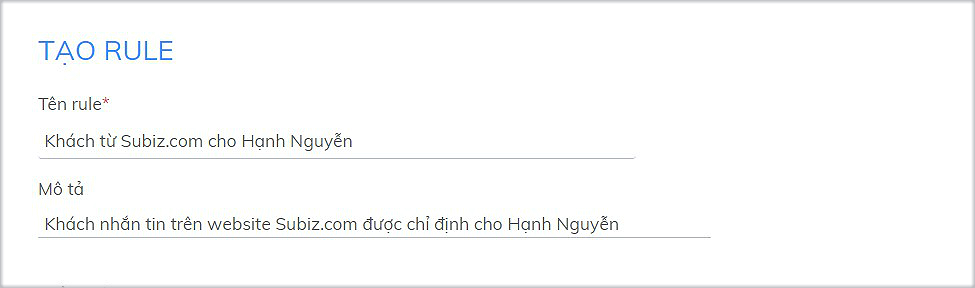

# Tạo Rule mới

Rule là tính năng tự động phân phối cuộc hội thoại của khách hàng cho các agent theo điều kiện cài đặt.

Bạn có thể cân nhắc cách thức quản lý và  phân chia công việc của Agent để tạo Rule mới, giúp cho việc phân phối và xử lý các cuộc hội thoại được kịp thời, hiệu quả.

Để tạo rule mới, bạn [đăng nhập Subiz](https://app.subiz.com/login) và vào phần[ **Cài đặt &gt; Tài khoản &gt; Rule &gt; Tạo Rule mới**](https://app.subiz.com/settings/add-rule)\*\*\*\*

### Bước 1: Điền tên và mô tả Rule

* **Tên:** Đặt tên để gọi và phân biệt các Rule cài đặt
* **Mô tả**: Mô tả mục đích cài đặt Rule

### Bước 2: Chọn Điều kiện cho Rule

Điều kiện trong Rule là những logic để một Rule hoạt động, tự động phân phối cuộc hội thoại của đúng khách hàng tới đúng agent phụ trách.

Bạn có thể chọn nhiều điều kiện để cài đặt Rule:

* Click Thêm điều kiện để thêm điều kiện cài đặt Rule
* Chọn Và / Hoặc để xác định mối quan hệ giữa các điều kiện.

  **Ví dụ:** Rule cài đặt Phân phối hội thoại của khách Việt Nam và nhắn tin từ web Subiz.com 

**Bạn có thể chọn một hay nhiều điều kiện trong danh sách các điều kiện trong Rule dưới đây:​**

<table>
  <thead>
    <tr>
      <th style="text-align:left"><b>C&#xC1;C &#x110;I&#x1EC0;U KI&#x1EC6;N</b>
      </th>
      <th style="text-align:left"><b>C&#xC1;CH S&#x1EEC; D&#x1EE4;NG</b>
      </th>
      <th style="text-align:left"><b>V&#xCD; D&#x1EE4;</b>
      </th>
    </tr>
  </thead>
  <tbody>
    <tr>
      <td style="text-align:left">B&#x1EA5;t k&#xEC; &#x111;i&#x1EC1;u ki&#x1EC7;n n&#xE0;o</td>
      <td style="text-align:left">Khi l&#x1EF1;a ch&#x1ECD;n &#x111;i&#x1EC1;u ki&#x1EC7;n n&#xE0;y, t&#x1EA5;t
        c&#x1EA3; cu&#x1ED9;c h&#x1ED9;i tho&#x1EA1;i s&#x1EBD; lu&#xF4;n &#x111;&#x1B0;&#x1EE3;c
        ph&#xE2;n ph&#x1ED1;i t&#x1EDB;i c&#xE1;c agent.</td>
      <td style="text-align:left">&#x110;i&#x1EC1;u ki&#x1EC7;n:<em>B&#x1EA5;t k&#xEC; &#x111;i&#x1EC1;u ki&#x1EC7;n n&#xE0;o</em>
      </td>
    </tr>
    <tr>
      <td style="text-align:left"><b>Date Time</b>
      </td>
      <td style="text-align:left"></td>
      <td style="text-align:left"></td>
    </tr>
    <tr>
      <td style="text-align:left">Gi&#x1EDD; trong ng&#xE0;y</td>
      <td style="text-align:left">D&#xF9;ng khi b&#x1EA1;n mu&#x1ED1;n ph&#xE2;n chia cu&#x1ED9;c tho&#x1EA1;i
        theo c&#xE1;c khung gi&#x1EDD; trong ng&#xE0;y. Gi&#x1EDD; trong ng&#xE0;y
        t&#x1EEB; 0 - 23.</td>
      <td style="text-align:left">
        
B&#x1EA1;n c&#xE0;i &#x111;&#x103;t 3 rule t&#x1B0;&#x1A1;ng &#x1EE9;ng:
          Ca s&#xE1;ng cho Agent A - Ca chi&#x1EC1;u cho Agent B - Ca t&#x1ED1;i
          cho Agent C.

        
&#x110;i&#x1EC1;u ki&#x1EC7;n:
           <em>Gi&#x1EDD; trong ng&#xE0;y - l&#x1EDB;n h&#x1A1;n ho&#x1EB7;c b&#x1EB1;ng - 7 V&#xE0; Gi&#x1EDD; trong ng&#xE0;y - nh&#x1ECF; h&#x1A1;n - 12</em>
        

        

      </td>
    </tr>
    <tr>
      <td style="text-align:left">Ng&#xE0;y trong tu&#x1EA7;n</td>
      <td style="text-align:left">D&#xF9;ng khi b&#x1EA1;n mu&#x1ED1;n ph&#xE2;n chia cu&#x1ED9;c tho&#x1EA1;i
        theo ng&#xE0;y trong tu&#x1EA7;n.
         L&#x1B0;u &#xFD;: Ng&#xE0;y trong tu&#x1EA7;n &#x111;&#x1B0;&#x1EE3;c
        ghi nh&#x1EAD;n theo s&#x1ED1; th&#x1EE9; t&#x1EF1; t&#x1EEB; 2-8. Th&#x1EE9;
        Hai = 2, Th&#x1EE9; Ba = 3&#x2026; , Ch&#x1EE7; nh&#x1EAD;t = 8.</td>
      <td
      style="text-align:left">
        
B&#x1EA1;n c&#xE0;i &#x111;&#x1EB7;t 2 Rule: 3 ng&#xE0;y &#x111;&#x1EA7;u
          tu&#x1EA7;n cho Agent A v&#xE0; 3 ng&#xE0;y cu&#x1ED1;i tu&#x1EA7;n cho
          Agent B

        
&#x110;i&#x1EC1;u ki&#x1EC7;n:
           <em>Ng&#xE0;y trong tu&#x1EA7;n - b&#x1EB1;ng - 2 Ho&#x1EB7;c  Ng&#xE0;y trong tu&#x1EA7;n - b&#x1EB1;ng - 3 Ho&#x1EB7;c  Ng&#xE0;y trong tu&#x1EA7;n - b&#x1EB1;ng - 4</em>
        

        

        </td>
    </tr>
    <tr>
      <td style="text-align:left"><b>H&#x1ED9;i tho&#x1EA1;i</b>
      </td>
      <td style="text-align:left"></td>
      <td style="text-align:left"></td>
    </tr>
    <tr>
      <td style="text-align:left">K&#xEA;nh</td>
      <td style="text-align:left">D&#xF9;ng khi b&#x1EA1;n mu&#x1ED1;n ph&#xE2;n ph&#x1ED1;i h&#x1ED9;i
        tho&#x1EA1;i theo k&#xEA;nh t&#x1B0;&#x1A1;ng t&#xE1;c kh&#xE1;ch h&#xE0;ng.
        V&#xED; d&#x1EE5; k&#xEA;nh Subiz chat tr&#xEA;n website, K&#xEA;nh Fanpage,
        k&#xEA;nh Subiz Email</td>
      <td style="text-align:left">
        
B&#x1EA1;n t&#x1EA1;o 3 Rule ph&#xE2;n chai h&#x1ED9;i tho&#x1EA1;i tr&#xEA;n
          3 k&#xEA;nh Subiz chat, Fanpage, Email nh&#x1B0; sau:

        
&#x110;i&#x1EC1;u ki&#x1EC7;n:
           <em>1.  K&#xEA;nh - b&#x1EB1;ng - Subiz chat</em>
        

        
<em>2. K&#xEA;nh - b&#x1EB1;ng - Subiz Email</em>
        

        
<em>3. K&#xEA;nh - b&#x1EB1;ng - Fanpage</em>
        

      </td>
    </tr>
    <tr>
      <td style="text-align:left">URL c&#x1EE7;a trang</td>
      <td style="text-align:left">D&#xF9;ng khi b&#x1EA1;n mu&#x1ED1;n ph&#xE2;n chia cu&#x1ED9;c h&#x1ED9;i
        tho&#x1EA1;i theo t&#x1EEB;ng URL website ri&#xEA;ng hay URL page s&#x1EA3;n
        ph&#x1EA9;m/ d&#x1ECB;ch v&#x1EE5; tr&#xEA;n 1 website</td>
      <td style="text-align:left">
        
Kh&#xE1;ch v&#xE0;o website c&#x1EE7;a Subiz s&#x1EBD; &#x111;&#x1B0;&#x1EE3;c
          ph&#xE2;n ph&#x1ED1;i cho Agent A

        
&#x110;i&#x1EC1;u ki&#x1EC7;n: <em>URL c&#x1EE7;a trang - ch&#x1EE9;a - Subiz.com</em>
        

      </td>
    </tr>
    <tr>
      <td style="text-align:left">Ti&#xEA;u &#x111;&#x1EC1; trang</td>
      <td style="text-align:left">Ti&#xEA;u &#x111;&#x1EC1; trang g&#x1EA7;n gi&#x1ED1;ng URL trang, d&#xF9;ng
        &#x111;&#x1EC3; ph&#xE2;n ph&#x1ED1;i h&#x1ED9;i tho&#x1EA1;i theo t&#x1EEB;ng
        ti&#xEA;u &#x111;&#x1EC1; c&#x1EE7;a trang s&#x1EA3;n ph&#x1EA9;m/ d&#x1ECB;ch
        v&#x1EE5;</td>
      <td style="text-align:left">
        
Kh&#xE1;ch v&#xE0;o trang c&#xF3; ti&#xEA;u &#x111;&#x1EC1; ch&#x1EE9;a
          t&#x1EEB; kh&#xF3;a &#x201C;M&#xE1;y &#x1EA2;nh&#x201D; ph&#xE2;n ph&#x1ED1;i
          cu&#x1ED9;c h&#x1ED9;i tho&#x1EA1;i cho Agent A.

        
&#x110;i&#x1EC1;u ki&#x1EC7;n: <em>Ti&#xEA;u &#x111;&#x1EC1; trang - ch&#x1EE9;a - m&#xE1;y &#x1EA3;nh</em>
        

      </td>
    </tr>
    <tr>
      <td style="text-align:left">N&#x1ED9;i dung tin nh&#x1EAF;n</td>
      <td style="text-align:left">D&#xF9;ng khi b&#x1EA1;n mu&#x1ED1;n d&#x1EF1;a v&#xE0;o n&#x1ED9;i dung
        tin nh&#x1EAF;n &#x111;&#x1EA7;u ti&#xEA;n c&#x1EE7;a kh&#xE1;ch g&#x1EED;i
        &#x111;&#x1EC3; ph&#xE2;n ph&#x1ED1;i h&#x1ED9;i tho&#x1EA1;i cho agent</td>
      <td
      style="text-align:left">
        
Khi tin nh&#x1EAF;n &#x111;&#x1EA7;u ti&#xEA;n c&#x1EE7;a kh&#xE1;ch h&#xE0;ng
          c&#xF3; ch&#x1EE9;a t&#x1EEB; &#x201C;gi&#xE1;&#x201D;, cu&#x1ED9;c h&#x1ED9;i
          tho&#x1EA1;i n&#xE0;y s&#x1EBD; &#x111;&#x1B0;&#x1EE3;c ph&#xE2;n ph&#x1ED1;i
          cho Agent A.

        
&#x110;i&#x1EC1;u ki&#x1EC7;n: <em>N&#x1ED9;i dung tin nh&#x1EAF;n - ch&#x1EE9;a - gi&#xE1;</em>
        

        </td>
    </tr>
    <tr>
      <td style="text-align:left">Ng&#xF4;n ng&#x1EEF; tr&#xEA;n tr&#xEC;nh duy&#x1EC7;t</td>
      <td style="text-align:left">D&#xF9;ng khi b&#x1EA1;n mu&#x1ED1;n d&#x1EF1;a v&#xE0;o ng&#xF4;n ng&#x1EEF;
        tr&#xEC;nh duy&#x1EC7;t c&#x1EE7;a kh&#xE1;ch &#x111;&#x1EC3; ph&#xE2;n
        ph&#x1ED1;i h&#x1ED9;i tho&#x1EA1;i. Ng&#xF4;n ng&#x1EEF; tr&#xEA;n tr&#xEC;nh
        duy&#x1EC7;t theo chu&#x1EA9;n <a href="http://www.lingoes.net/en/translator/langcode.htm">ISO Language Code</a>,
        v&#xED; d&#x1EE5;: vi- VN, en - US.</td>
      <td style="text-align:left">
        
Kh&#xE1;ch h&#xE0;ng s&#x1EED; d&#x1EE5;ng ng&#xF4;n ng&#x1EEF; English
          tr&#xEA;n tr&#xEC;nh s&#x1EBD; ph&#xE2;n ph&#x1ED1;i h&#x1ED9;i tho&#x1EA1;i
          cho nh&#xF3;m agent qu&#x1ED1;c t&#x1EBF;.

        
&#x110;i&#x1EC1;u ki&#x1EC7;n: <em>Ng&#xF4;n ng&#x1EEF; tr&#xEA;n tr&#xEC;nh duy&#x1EC7;t - b&#x1EB1;ng - en- US</em>
        

      </td>
    </tr>
    <tr>
      <td style="text-align:left"><b>User</b>
      </td>
      <td style="text-align:left"></td>
      <td style="text-align:left"></td>
    </tr>
    <tr>
      <td style="text-align:left">Qu&#x1ED1;c gia</td>
      <td style="text-align:left">D&#xF9;ng khi b&#x1EA1;n mu&#x1ED1;n d&#x1EF1;a v&#xE0;o Qu&#x1ED1;c gia
        c&#x1EE7;a kh&#xE1;ch h&#xE0;ng &#x111;&#x1EC3; ph&#xE2;n ph&#x1ED1;i h&#x1ED9;i
        tho&#x1EA1;i cho agent. T&#xEA;n Qu&#x1ED1;c gia theo chu&#x1EA9;n qu&#x1ED1;c
        t&#x1EBF;, <a href="https://countrycode.org/">tham kh&#x1EA3;o danh s&#xE1;ch qu&#x1ED1;c gia.</a>
         V&#xED; d&#x1EE5;: Vietnam, United States</td>
      <td style="text-align:left">
        
Kh&#xE1;ch h&#xE0;ng &#x1EDF; Vi&#x1EC7;t Nam s&#x1EBD; ph&#xE2;n ph&#x1ED1;i
          h&#x1ED9;i tho&#x1EA1;i cho c&#xE1;c agent n&#x1ED9;i &#x111;&#x1ECB;a

        
&#x110;i&#x1EC1;u ki&#x1EC7;n: <em>Qu&#x1ED1;c gia - b&#x1EB1;ng - Vietnam </em>
        

        
&lt;em&gt;&lt;/em&gt;

      </td>
    </tr>
    <tr>
      <td style="text-align:left">M&#xE3; qu&#x1ED1;c gia</td>
      <td style="text-align:left">D&#xF9;ng khi b&#x1EA1;n mu&#x1ED1;n d&#x1EF1;a v&#xE0;o M&#xE3; Qu&#x1ED1;c
        gia c&#x1EE7;a kh&#xE1;ch &#x111;&#x1EC3; ph&#xE2;n ph&#x1ED1;i h&#x1ED9;i
        tho&#x1EA1;i. M&#xE3; qu&#x1ED1;c gia c&#x103;n c&#x1EE9; theo ISO Code
        (2 k&#xFD; t&#x1EF1;), vi&#x1EBF;t hoa c&#x1EA3; 2 ch&#x1EEF; c&#xE1;i.
        <a
        href="https://en.wikipedia.org/wiki/ISO_3166-2">Tham kh&#x1EA3;o danh s&#xE1;ch m&#xE3; qu&#x1ED1;c gia</a>
           V&#xED; d&#x1EE5;: Vi&#x1EC7;t Nam = VN, M&#x1EF9; = US, Trung Qu&#x1ED1;c
          = CN, H&#xE0;n Qu&#x1ED1;c = KR, Nh&#x1EAD;t B&#x1EA3;n = JP.</td>
      <td style="text-align:left">
        
Ph&#xE2;n ph&#x1ED1;i h&#x1ED9;i tho&#x1EA1;i kh&#xE1;ch h&#xE0;ng n&#x1B0;&#x1EDB;c
          ngo&#xE0;i cho c&#xE1;c agent qu&#x1ED1;c t&#x1EBF;

        
&#x110;i&#x1EC1;u ki&#x1EC7;n: <em>M&#xE3; qu&#x1ED1;c gia - kh&#xF4;ng ph&#x1EA3;i l&#xE0; - VN</em>
        

      </td>
    </tr>
    <tr>
      <td style="text-align:left">Th&#xE0;nh ph&#x1ED1;</td>
      <td style="text-align:left">
        
D&#xF9;ng khi b&#x1EA1;n mu&#x1ED1;n d&#x1EF1;a v&#xE0;o &#x111;&#x1ECB;a
          ch&#x1EC9; Th&#xE0;nh ph&#x1ED1; c&#x1EE7;a kh&#xE1;ch &#x111;&#x1EC3;
          ph&#xE2;n ph&#x1ED1;i h&#x1ED9;i tho&#x1EA1;i. L&#xE0; t&#xEA;n ti&#x1EBF;ng
          Anh c&#x1EE7;a c&#xE1;c th&#xE0;nh ph&#x1ED1;, ch&#x1EC9; vi&#x1EBF;t hoa
          c&#xE1;c ch&#x1EEF; c&#xE1;i &#x111;&#x1EA7;u ti&#xEA;n c&#x1EE7;a t&#x1EEB;.
          <a
          href="https://countrycode.org/vietnam">Tham kh&#x1EA3;o t&#xEA;n Th&#xE0;nh ph&#x1ED1; t&#x1EEB;ng qu&#x1ED1;c
            gia</a>
             V&#xED; d&#x1EE5;: Hanoi, Ho Chi Minh City, New York, Hong Kong.

        

      </td>
      <td style="text-align:left">
        
Ph&#xE2;n ph&#x1ED1;i h&#x1ED9;i tho&#x1EA1;i cho kh&#xE1;ch h&#xE0;ng
          &#x111;&#x1EBF;n t&#x1EEB; H&#xE0; N&#x1ED9;i cho agent H&#xE0; N&#x1ED9;i

        
&#x110;i&#x1EC1;u ki&#x1EC7;n : <em>Th&#xE0;nh ph&#x1ED1; - b&#x1EB1;ng - Hanoi</em>
        

      </td>
    </tr>
    <tr>
      <td style="text-align:left">M&#xFA;i gi&#x1EDD;</td>
      <td style="text-align:left">
        
Th&#x1EF1;c hi&#x1EC7;n ph&#xE2;n ph&#x1ED1;i h&#x1ED9;i tho&#x1EA1;i
          d&#x1EF1;a tr&#xEA;n m&#xFA;i gi&#x1EDD; c&#x1EE7;a user. M&#xE3; m&#xFA;i
          gi&#x1EDD; &#x111;&#x1B0;&#x1EE3;c c&#x103;n c&#x1EE9; theo gi&#x1EDD;
          UTC. <a href="https://vi.wikipedia.org/wiki/M%C3%BAi_gi%E1%BB%9D">Tham kh&#x1EA3;o danh s&#xE1;ch m&#xFA;i gi&#x1EDD; c&#xE1;c khu v&#x1EF1;c</a>
        

        
V&#xED; d&#x1EE5;: Vi&#x1EC7;t Nam v&#xE0; khu v&#x1EF1;c &#x110;&#xF4;ng
          Nam &#xC1; - UTC +7 G

      </td>
      <td style="text-align:left">
        
Ph&#xE2;n ph&#x1ED1;i h&#x1ED9;i tho&#x1EA1;i cho kh&#xE1;ch h&#xE0;ng
          &#x111;&#x1EBF;n t&#x1EEB; khu v&#x1EF1;c &#x110;&#xF4;ng Nam &#xC1; cho
          agent A &#x110;&#xF4;ng Nam &#xC1;.

        
&#x110;i&#x1EC1;u ki&#x1EC7;n: <em>M&#xFA;i gi&#x1EDD; - b&#x1EB1;ng - UTC +7 G</em>
        

      </td>
    </tr>
    <tr>
      <td style="text-align:left">T&#xEA;n</td>
      <td style="text-align:left">D&#xF9;ng khi b&#x1EA1;n mu&#x1ED1;n d&#x1EF1;a v&#xE0;o th&#xF4;ng tin
        H&#x1ECD; t&#xEA;n c&#x1EE7;a kh&#xE1;ch &#x111;&#x1EC3; ph&#xE2;n ph&#x1ED1;i
        h&#x1ED9;i tho&#x1EA1;i cho agent.</td>
      <td style="text-align:left">
        
Ph&#xE2;n ph&#x1ED1;i cu&#x1ED9;c h&#x1ED9;i tho&#x1EA1;i c&#x1EE7;a kh&#xE1;ch
          h&#xE0;ng &#x111;&#xE3; c&#xF3; th&#xF4;ng tin H&#x1ECD; t&#xEA;n cho Agent
          D&#x1ECB;ch v&#x1EE5;

        
&#x110;i&#x1EC1;u ki&#x1EC7;n: <em>T&#xEA;n  - Kh&#xF4;ng tr&#x1ED1;ng</em>
        

      </td>
    </tr>
    <tr>
      <td style="text-align:left">&#x110;&#x1ECB;a ch&#x1EC9; email</td>
      <td style="text-align:left">D&#xF9;ng khi b&#x1EA1;n mu&#x1ED1;n d&#x1EF1;a v&#xE0;o th&#xF4;ng tin
        &#x111;&#x1ECB;a ch&#x1EC9; email c&#x1EE7;a kh&#xE1;ch &#x111;&#x1EC3;
        ph&#xE2;n ph&#x1ED1;i h&#x1ED9;i tho&#x1EA1;i cho agent.</td>
      <td style="text-align:left">
        
Ph&#xE2;n ph&#x1ED1;i cu&#x1ED9;c h&#x1ED9;i tho&#x1EA1;i c&#x1EE7;a kh&#xE1;ch
          h&#xE0;ng &#x111;&#xE3; c&#xF3; &#x111;&#x1ECB;a ch&#x1EC9; email cho Agent
          Kinh doanh

        
&#x110;i&#x1EC1;u ki&#x1EC7;n:<em> &#x110;&#x1ECB;a ch&#x1EC9; email  - Kh&#xF4;ng tr&#x1ED1;ng</em>
        

      </td>
    </tr>
    <tr>
      <td style="text-align:left">S&#x1ED1; &#x111;i&#x1EC7;n tho&#x1EA1;i</td>
      <td style="text-align:left">D&#xF9;ng khi b&#x1EA1;n mu&#x1ED1;n d&#x1EF1;a v&#xE0;o th&#xF4;ng tin
        s&#x1ED1; &#x111;i&#x1EC7;n tho&#x1EA1;i c&#x1EE7;a kh&#xE1;ch &#x111;&#x1EC3;
        ph&#xE2;n ph&#x1ED1;i h&#x1ED9;i tho&#x1EA1;i cho agent.</td>
      <td style="text-align:left">
        
Ph&#xE2;n ph&#x1ED1;i cu&#x1ED9;c h&#x1ED9;i tho&#x1EA1;i c&#x1EE7;a kh&#xE1;ch
          h&#xE0;ng &#x111;&#xE3; c&#xF3; &#x111;&#x1ECB;a ch&#x1EC9; email cho Agent
          T&#x1ED5;ng &#x111;&#xE0;i

        
&#x110;i&#x1EC1;u ki&#x1EC7;n: <em>S&#x1ED1; &#x111;i&#x1EC7;n tho&#x1EA1;i  - Kh&#xF4;ng tr&#x1ED1;ng</em>
        

      </td>
    </tr>
  </tbody>
</table>### Bước 3: Chọn cách thức phân phối tới Agent

Bây giờ, bạn chọn cách thức phân phối cuộc các cuộc hội thoại thỏa mãn các điều kiện đã đặt ở trên.

* **Phân phối tới tất cả available agents**: Available agent là những agent có kết nối trực tiếp với Subiz trên máy tính hoặc app mobile. Khi các agent không kết nối với Subiz, cuộc hội thoại của khách chuyển về Hội thoại chưa được phân phối. Agent có thể xem và trả lời khách hàng sau khi kết nối lại Subiz.
* **Phân phối tới các agents**: Chọn cụ thể Agent bạn muốn phân phối hội thoại của khách hàng
* **Phân phối tới các nhóm**: Chọn nhóm agent bạn đã tạo để phân phối hội thoại của khách hàng
* **Phân phối tới agent có tương tác cuối cung với khách hàng**: Khi agent đã hỗ trợ khách hàng trước đó, bạn sẽ chọn chỉ định các cuộc hội thoại tiếp theo của khách cho agent tiếp tục chăm sóc và tư vấn.
* **Phân phối cuộc hội thoại đồng đều theo vòng**: Bạn có nhiều agent và muốn chỉ định theo vòng chia đều cuộc hội thoại của khách cho các agent. 


* Rule là cài đặt **bắt buộc** để agent nhận được cuộc chat. Khi bạn xóa Rule mặc định nhưng không tạo Rule mới, tất cả các agent sẽ không nhận tương tác của khách hàng. Lúc này, tất cả hội thoại sẽ nằm trong phân khúc **Hội thoại chưa phân phối** trong phần **Hoạt động**.
* Bạn có thể tạo nhiều Rule và thay đổi Rule theo thời gian, cho phù hợp với số lượng Agent và cách phân chia công việc của doanh nghiệp.


