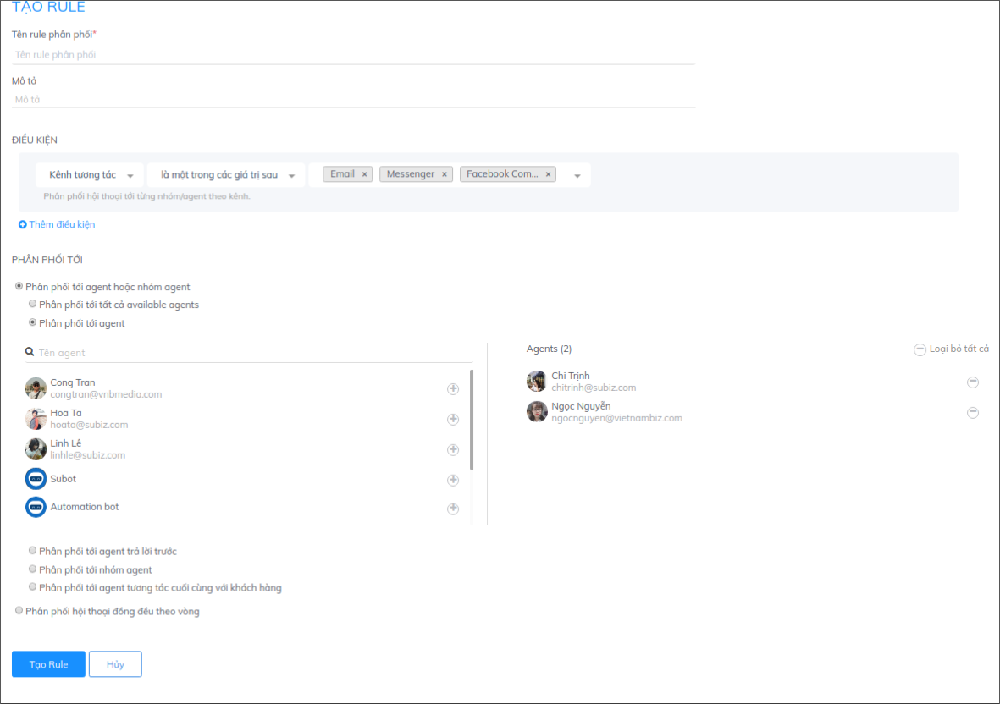
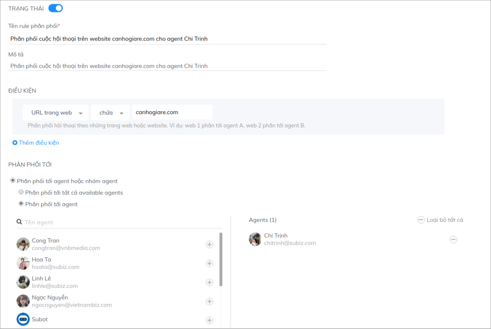
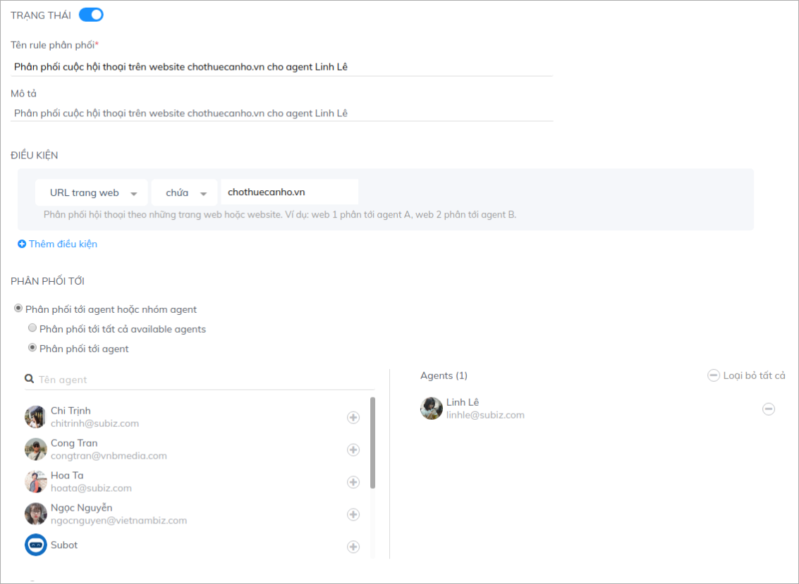
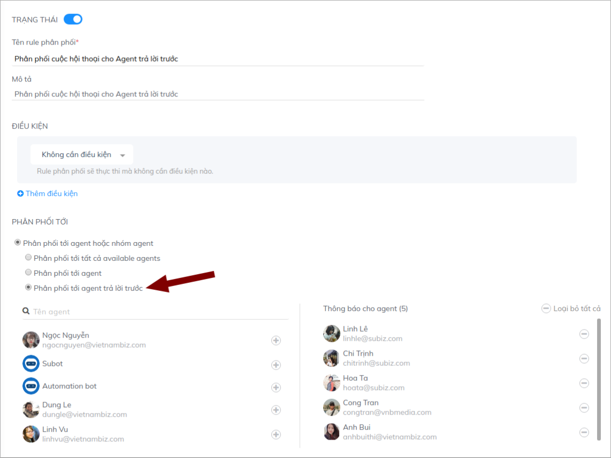

# Một số ví dụ Rule phân phối hội thoại

Cùng với việc hỗ trợ bạn có thể đưa nhiều người trong doanh nghiệp cùng tham gia và làm việc trên Subiz, Subiz cũng cung cấp chức năng Rule phân phối cuộc hội thoại giúp bạn có thể phân chia cuộc chat theo nhiều kịch bản, điều kiện khác nhau dựa trên những quy tắc điều phối công việc của doanh nghiệp. Bạn có thể tham khảo một số kịch bản rule phân phối như sau:

### **Phân phối cuộc hội thoại theo giờ làm việc**

Mối quan tâm của rất nhiều doanh nghiệp là có thể tiếp cận với khách hàng bất kể thời gian nào, ngay cả khi ngoài giờ làm việc. Tuy nhiên, khi nhân viên của bạn không sẵn sàng hỗ trợ trực tuyến trong thời gian này, việc không nhận được phản hồi sẽ tạo một trải nghiệm không tốt cho khách hàng. 

Chính vì vậy, bạn có thể nhờ đến sự hỗ trợ của Subot - trợ lý ảo giúp bạn tự động phản hồi khách hàng và thu thập thông tin ngoài giờ hành chính. Bạn có thể báo với khách hàng đang không có nhân viên online và yêu cầu khách để lại thông tin để liên hệ lại vào ngày hôm sau:

**Bước 1: Cài đặt Subot để phản hồi khách hàng ngoài giờ làm việc :** [**Hướng dẫn**](https://help.subiz.com/bat-dau-voi-subiz/trien-khai-hoat-dong/subot-bot-tu-dong-tra-loi-va-hoi-thong-tin#subot-la-gi)

**Bước 2: Cài đặt giờ làm việc của doanh nghiệp:** [**Hướng dẫn**](https://help.subiz.com/bat-dau-voi-subiz/trien-khai-hoat-dong/cai-dat-gio-lam-viec)\*\*\*\*

**Bước 3: Cài đặt Rule theo giờ làm việc**

Bạn cài đặt 2 Rule như sau:

* Rule 1: Phân cuộc hội thoại cho Agent trong giờ làm việc

* Rule 2**:** Phân cuộc hội thoại cho Agent ngoài giờ làm việc

### **Phân phối cuộc hội thoại theo ca trực của agent / ngày làm việc trong tuần.**

Bạn có nhiều Agent và phân chia theo ca làm việc khác nhau theo từng ngày làm việc trong tuần. Bạn hoàn toàn có thể cài đặt Rule để có thể phân phối tự động theo lịch làm việc cố định của Agent.

Ví dụ: Agent Hoa Tạ nhận cuộc chat vào các ngày 2, 4, 6 và chủ nhật. Agent Linh Lê nhận cuộc chat vào các ngày 3, 5, 7. Bạn sẽ cài đặt 2 Rule như sau**:**

* Rule 1: Phân cuộc hội thoại cho Agent Hoa Ta

* Rule 2**:** Phân cuộc hội thoại cho Agent Linh Lê

### **Phân phối cuộc hội thoại theo ngôn ngữ website**

Với nhu cầu hỗ trợ cả khách nội địa và khách quốc tế, nhiều doanh nghiệp đã thiết kế web với nhiều ngôn ngữ để khách hàng lựa chọn và bố trí nhân viên phụ trách theo từng ngôn ngữ. Nhờ vậy khách hàng có thể được hỗ trợ kịp thời, nhanh chóng và đúng vấn đề quan tâm.

Nếu doanh nghiệp của bạn đang làm việc với mô hình như vậy, bạn hoàn toàn có thể sử dụng Subiz kết hợp với cơ chế phân phối hội thoại theo ngôn ngữ trên website. Các khách hàng sẽ được gặp đúng nhân viên tư vấn với ngôn ngữ họ mong muốn, mà không cần thông qua các bước trung chuyển rườm rà phức tạp. 

Nếu website của bạn đang hỗ trợ 2 ngôn ngữ tiếng anh và tiếng việt, bạn có thể triển khai cơ chế phân phối rule như sau:

* Rule 1: Phân cuộc hội thoại web tiếng Việt cho Agent Hoa Ta

* Rule 2: Phân cuộc hội thoại web tiếng Anh cho Agent Linh Lê

### Phân phối cuộc hội thoại cho cuộc hội thoại từ các kênh khác nhau

Với những đơn vị sử dụng nhiều kênh tương tác: website, fanpage, email...và vẫn muốn quản trị tập trung các tương tác với khách hàng trên cùng một hệ thống, việc sử dụng Subiz là một giải pháp tối ưu. Không chỉ giúp người quản lý có thể theo dõi, nắm bắt toàn bộ hoạt động hỗ trợ khách hàng của doanh nghiệp, cách làm việc, hiệu suất của nhân viên, Subiz có thể giúp bạn theo dõi hiệu qủa của từng kênh riêng.

Nếu bạn có người phụ trách riêng cho từng kênh, bạn có thể sử dụng chức năng Rule để phân phối cuộc hội thoại theo kênh, giúp các agent chuyên biệt hóa kênh làm việc chính của mình. Bạn có thể cài đặt theo kênh tương tác như sau:  
Rule 1: Phân phối hội thoại từ kênh Website \( Subiz chat\)

Rule 2: Phân phối hội thoại từ kênh Email, Messenger và Facebook Comment

### Phân phối hội thoại theo vùng địa lý khách hàng 

Nếu doanh nghiệp của bạn có nhiều chi nhánh ở các tỉnh, thành phố và có nhân viên phụ trách cho từng chi nhánh, bạn hoàn toàn có thể mời những chi nhánh này tham gia vào hệ thống quản trị Subiz của bạn. 

Với bất cứ cuộc chat nào đến, dựa trên địa điểm truy cập của khách hàng, Subiz sẽ phân phối tới đúng chi nhánh gần khách hàng nhất, giúp cho việc kết nối giữa doanh nghiệp và khách hàng trở lên nhanh chóng hơn, khách hàng cũng sẽ không cần thông qua nhiều khâu chuyển thông tin để được hỗ trợ

Tương tự bạn sẽ cài đặt Rule cho các thành phố còn lại.

### Phân phối hội thoại theo link website

Nếu doanh nghiệp của bạn quản lý nhiều website kinh doanh các sản phẩm, dịch vụ trong cùng hoặc khác lĩnh vực, và có người phụ trách riêng cho từng site, bạn hoàn toàn có thể sử dụng cơ chế phân phối cuộc hôị thoại theo URL trang web để có thể phân phối cuộc chat theo từng web.

Với cơ chế này, bạn vẫn có thể quản trị tất cả các tương tác trên các web bên bạn, có sự thống kê, so sánh hiệu qủa của từng sản phẩm và hơn hết có thể tập trung các dữ liệu khách hàng trên cùng một kênh nhưng vẫn đảm bảo sự chuyên biệt trong hỗ trợ khách hàng.

Bạn có thể dựa vào domain của website để phân phối cuộc hội thoại như sau:

  
Rule 1: Phân phối hội thoại từ website canhogiare.com

**Rule 2**: Phân phối hội thoại từ website chothuecanho.vn

### Phân phối hội thoại cho Agent trả lời nhanh nhất

Đối với đơn vị có nhiều nhân viên cùng tham gia Subiz đặc biệt là một nhóm nhân viên sale, support...việc tạo sự cạnh tranh giữa các nhân viên sẽ góp phần thúc đẩy hiệu qủa làm việc, trách nhiệm với công việc cũng như cơ sở đánh giá KPI để thực hiện các cơ chế thưởng, phạt đổi với nhân viên.

Bạn có thể lựa chọn cơ chế phân phối tới Agent trả lời trước cho nhóm nhân viên của mình. Theo đó, cuộc hội thoại sẽ được phân cho một nhóm agent, người nào trả lời trước sẽ được phụ trách luôn cuộc chat đó và những người còn lại sẽ không trả lời được tiếp. Bạn sẽ thiết lập như sau:

