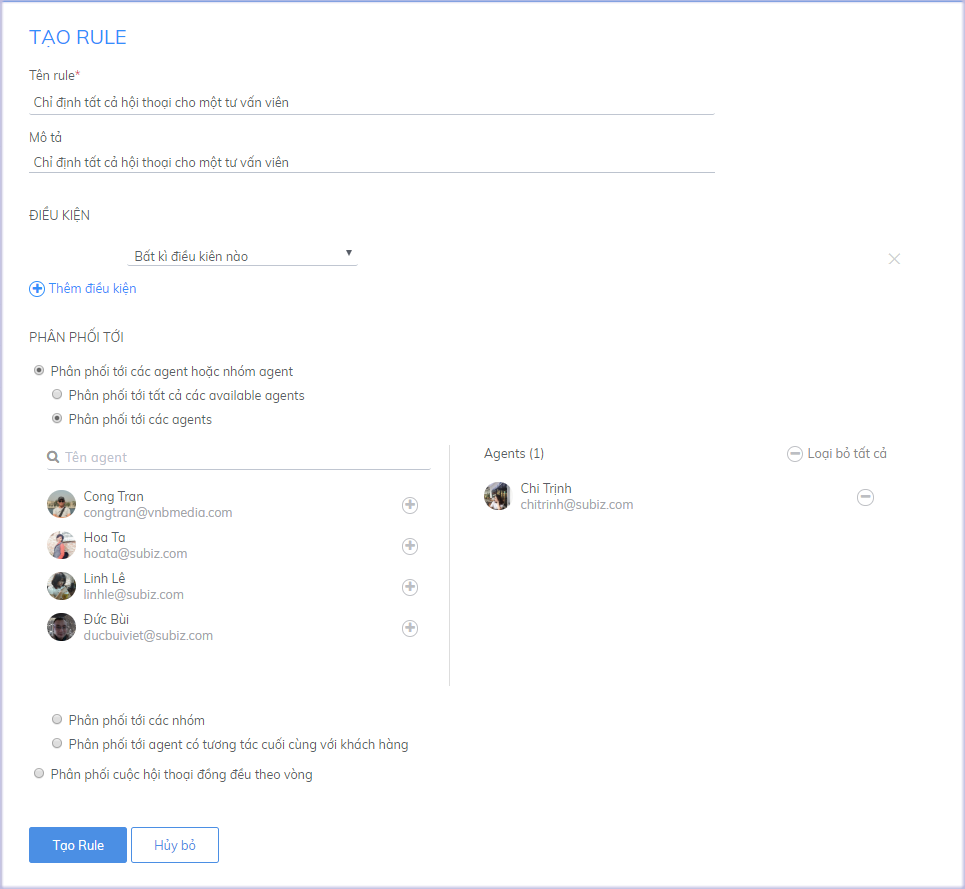
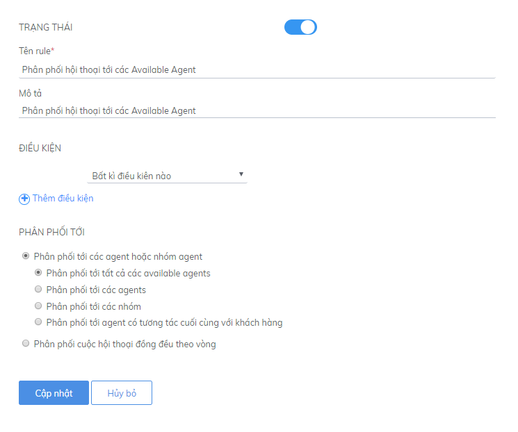
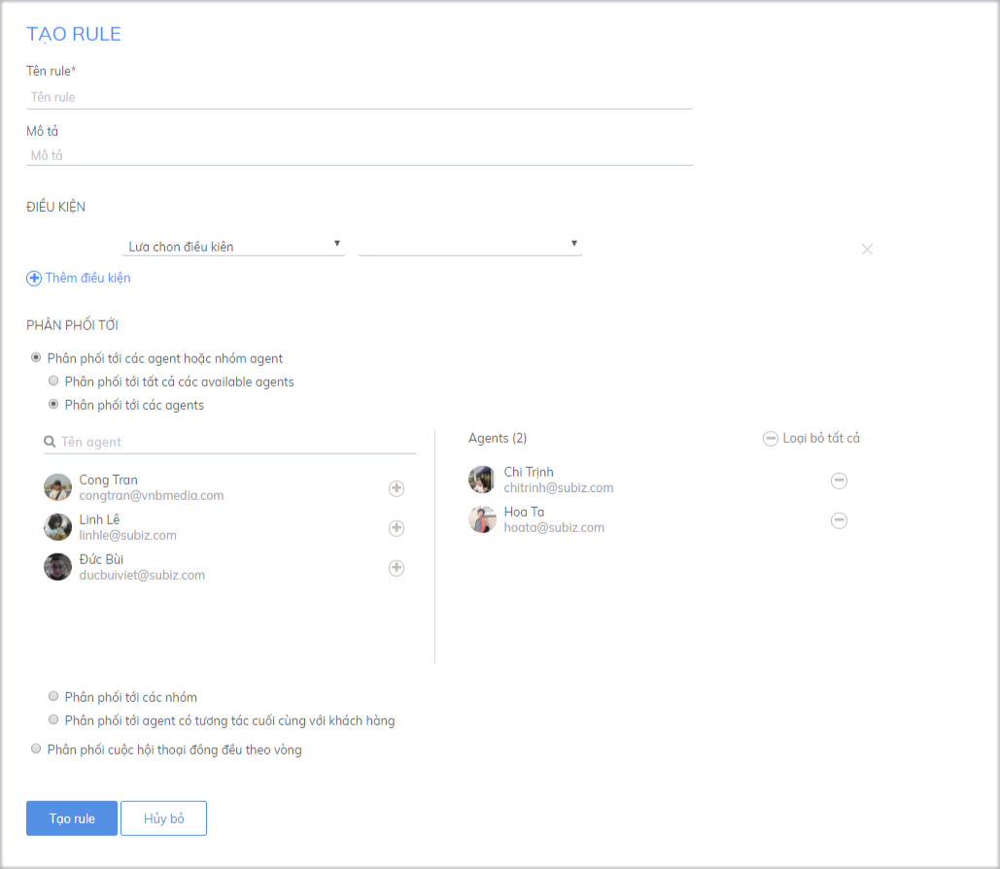
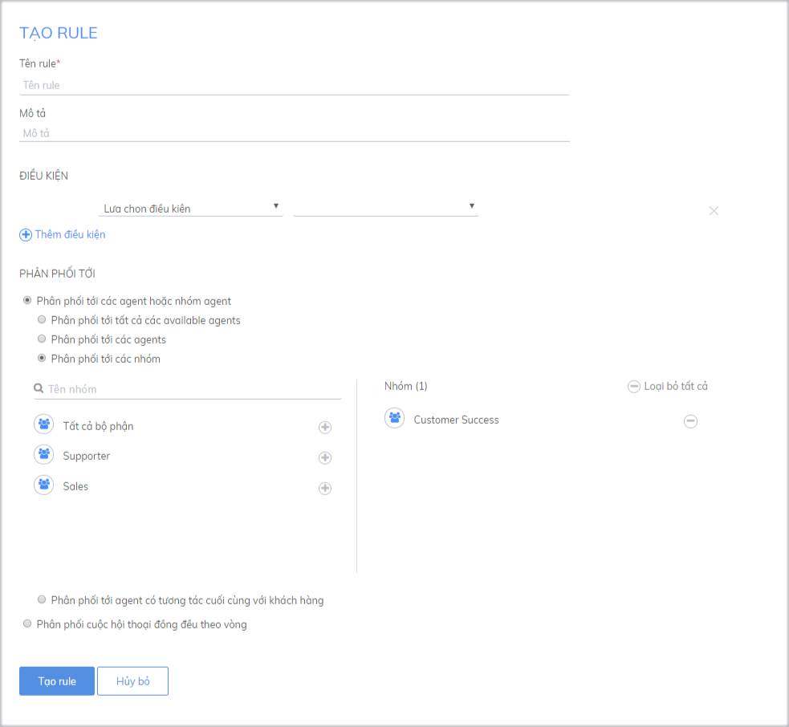
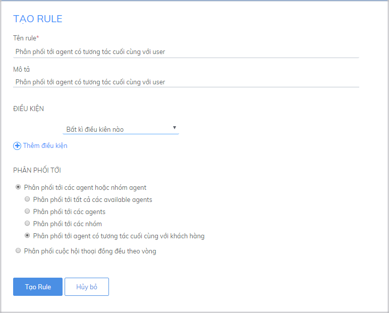
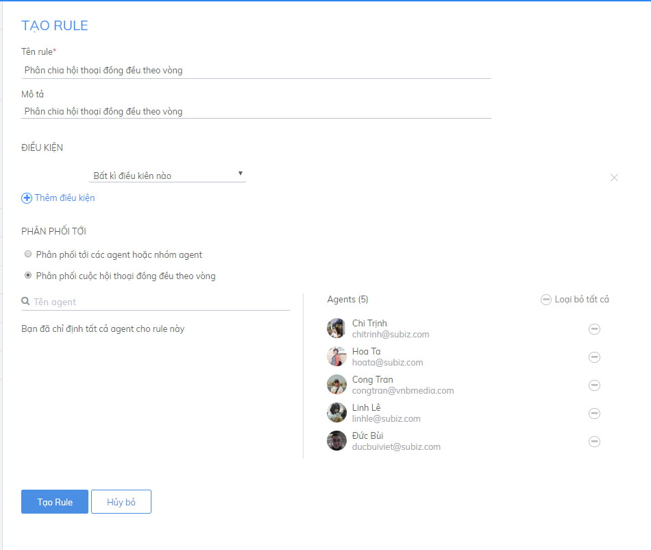
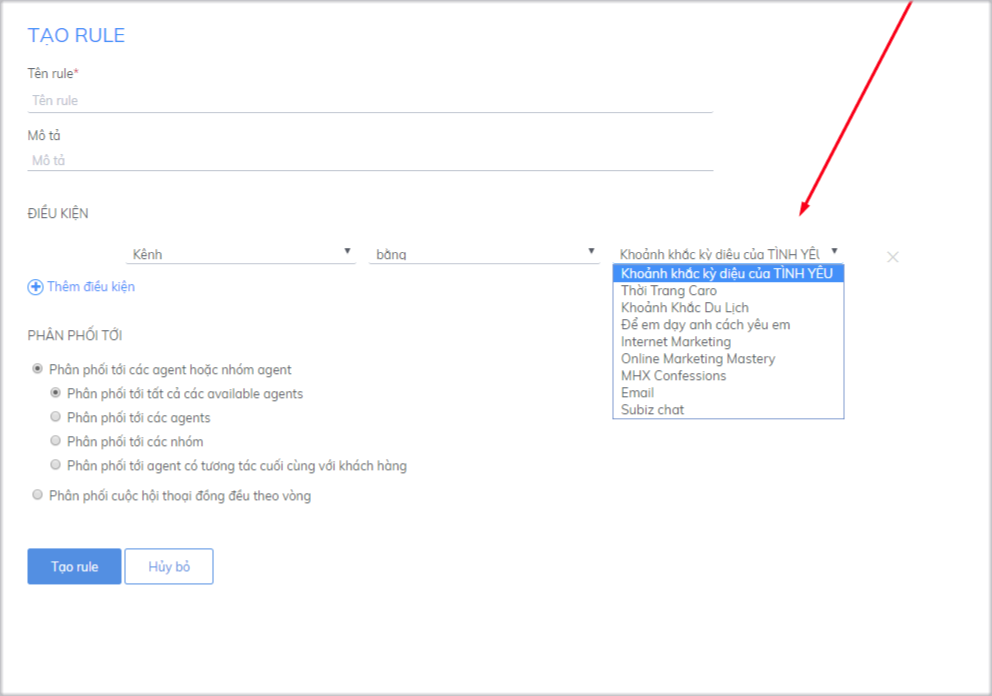
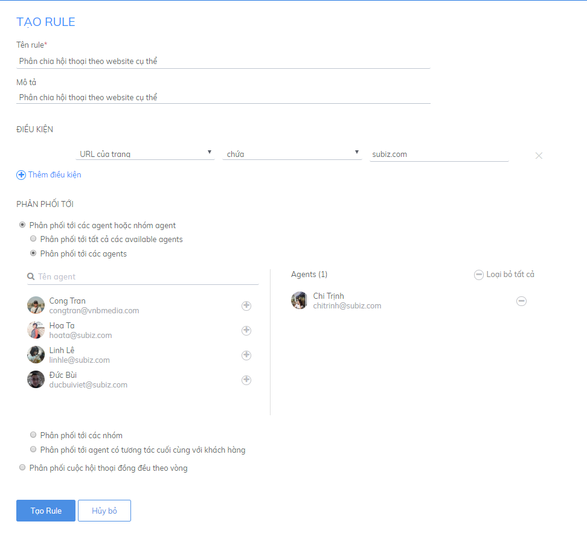
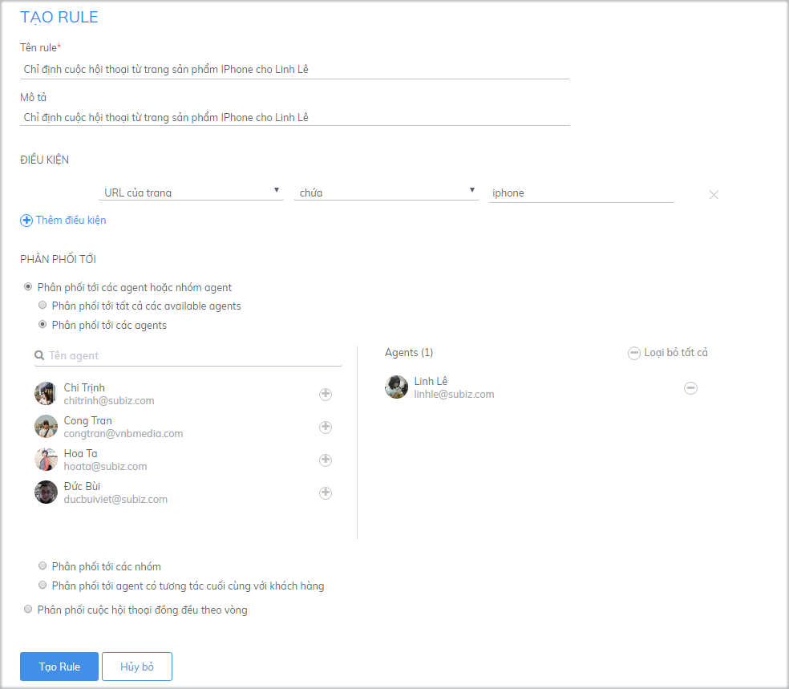
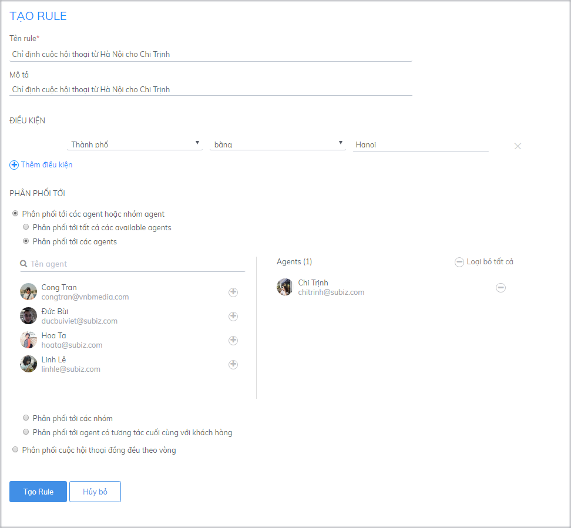

# Các ví dụ tự động phân phối hội thoại

### Chỉ định tất cả hội thoại cho một tư vấn viên 

Bạn có thể sử dụng Rule mặc định ban đầu nếu muốn chuyển hội thoại cho agent owner \(chủ tài khoản\). Trong trường hợp bạn muốn chuyển cho agent khác tư vấn khách hàng, bạn thao tác như sau:

### Phân phối tới các Agent hoặc nhóm Agent

Khi chọn cách phân phối tới các Agent hoặc nhóm Agent thì bất cứ Agent nào trong nhóm được phân phối đều có thể tham gia cùng lúc vào cuộc hội thoại.

Bạn cần chọn một trong những kiểu phân phối sau:

* _**Phân phối tới tất cả các available Agent:**_ phân phối cuộc hội thoại cho tất cả Agent đang log in tài khoản.

* _**Phân phối tới các agent:**_ Bạn muốn hội thoại đến các tư vấn viên sẽ đều nhận được hội thoại để cùng hỗ trợ khách hàng. Chọn điều kiện Phân phối tới các agent và chọn tư vấn viên bạn muốn phân phối hội thoại. 

* _**Phân phối tới các nhóm:**_ Khi bạn muốn phân phối hội thoại theo một nhóm nhất định, ví dụ: khách hỏi giá sản phẩm chuyển cho Sale, hỏi về bảo hành sản phẩm chuyển cho bộ phận kỹ thuật.

* _**Phân phối tới agent có tương tác cuối cùng với user:**_ Phân phối cuộc hội thoại cho Agent có tương tác gần nhất với user \(khách hàng\).

### Phân phối hội thoại đồng đều cho các tư vấn viên

Khi phân phối theo quy tắc này, hội thoại mới của khách hàng sẽ được phân bổ đều cho một vài agent hoặc một nhóm agent. Khi bạn có nhiều cuộc hội thoại, việc phân chia hội thoại sẽ giúp giảm áp lực và tăng tốc độ phản hồi của tư vấn viên. Bạn có thể cài đặt như sau:

### Phân phối hội thoại theo kênh tương tác 

Bạn có nhiều kênh tương tác: Website, Email, Fanpage và muốn phân phối hội thoại cho tư vấn viên theo từng kênh để phân loại khách hàng nhưng vẫn quản lý được dữ liệu tập trung. Bạn thao tác như sau:

### Phân phối hội thoại theo website cụ thể 

Bạn có nhiều website và muốn giao mỗi website cho một tư vấn viên phụ trách để quản lý đội ngũ tư vấn viên và theo dõi hiệu quả làm việc của từng người trên trang quản trị. Bạn cài đặt như sau:

### Phân phối hội thoại theo trang sản phẩm 

Bạn có website bán hàng kinh doanh nhiều sản phẩm, bạn có thể phân quyền cho các tư vấn viên theo từng mặt hàng. Điều này sẽ giúp các tư vấn viên dễ dàng nắm bắt được nhu cầu khách hàng và tư vấn hiệu quả hơn. Bạn cài đặt Rule như sau:

### Phân phối hội thoại theo vùng địa lý khách hàng 

Khi doanh nghiệp của bạn có chi nhánh ở các tỉnh thành khác nhau và muốn phân chia hội thoại cho tư vấn viên ở địa phương đó hỗ trợ khách hàng, Subiz sẽ giúp bạn nhận diện và chuyển hội thoại đến đúng tư vấn viên khách cần gặp.

