# Một số ví dụ Rule phân phối hội thoại

### **Phân phối cuộc hội thoại  theo giờ làm việc**

Cùng với việc ứng dụng Subot và phân chia rule theo giờ làm việc của doanh nghiệp, bạn hoàn toàn có thể yên tâm khi ngoài giờ hành chính, bạn vẫn có thể tự động phản hồi tin nhắn của khách và thu thập thông tin khách hàng để hôm sau bạn có thể liên hệ lại khách.

**Bước 1: Cài đặt Subot để phản hồi khách hàng ngoài giờ làm việc :** [**Hướng dẫn**](https://help.subiz.com/bat-dau-voi-subiz/trien-khai-hoat-dong/subot-bot-tu-dong-tra-loi-va-hoi-thong-tin#subot-la-gi)

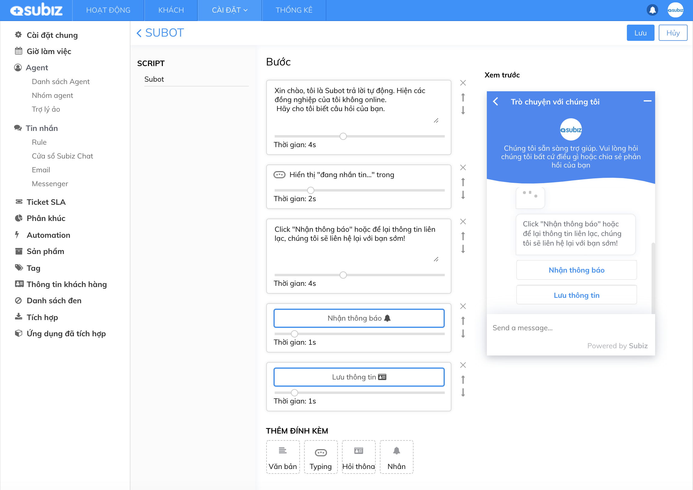

**Bước 2: Cài đặt giờ làm việc của doanh nghiệp:** [**Hướng dẫn**](https://help.subiz.com/bat-dau-voi-subiz/trien-khai-hoat-dong/cai-dat-gio-lam-viec)\*\*\*\*

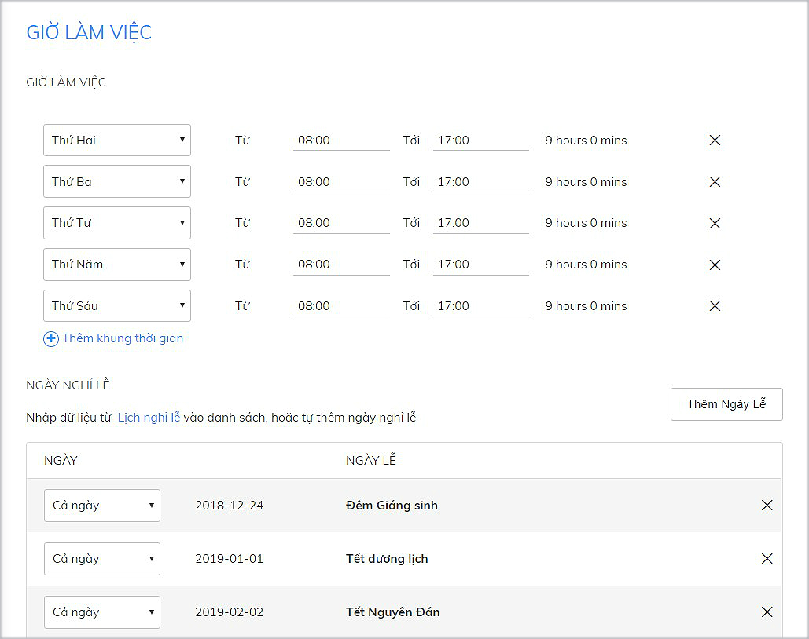

**Bước 3: Cài đặt Rule theo giờ làm việc**

Bạn cài đặt 2 Rule như sau:

* **Rule 1:** Phân cuộc hội thoại cho Agent trong giờ làm việc

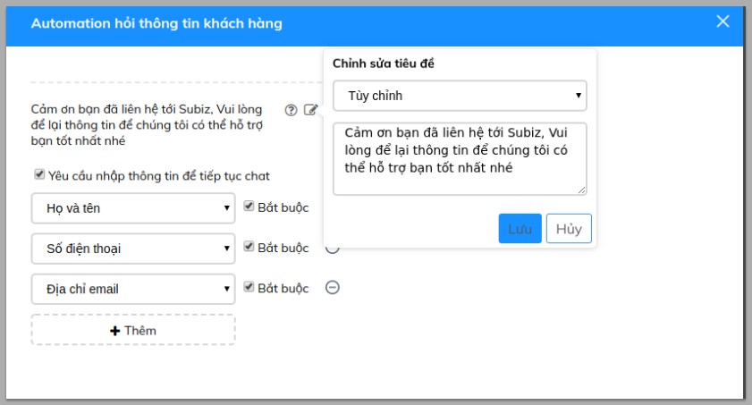

* **Rule 2:** Phân cuộc hội thoại cho Agent ngoài giờ làm việc

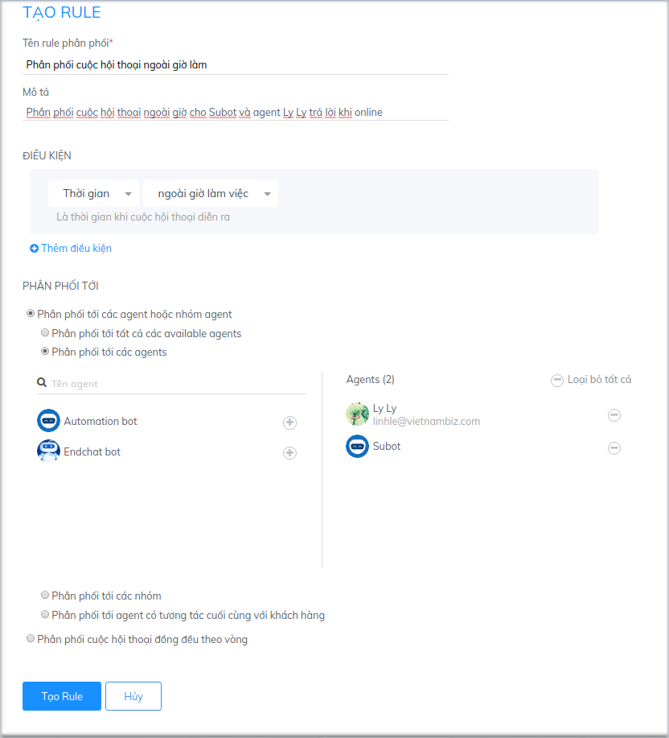

### **Phân phối cuộc hội thoại theo ca trực của agent / ngày làm việc trong tuần.**

Bạn có nhiều Agent và phân chia theo ca làm việc khác nhau theo từng ngày làm việc trong tuần. Bạn hoàn toàn có thể cài đặt Rule để có thể phân phối tự động theo lịch làm việc cố định của Agent.

**Ví dụ:** Agent Hoa Tạ nhận cuộc chat vào các ngày 2, 4, 6 và chủ nhật. Agent Linh Lê nhận cuộc chat vào các ngày 3, 5, 7. Bạn sẽ cài đặt 2 Rule như sau**:**

* **Rule 1:** Phân cuộc hội thoại cho Agent Hoa Ta

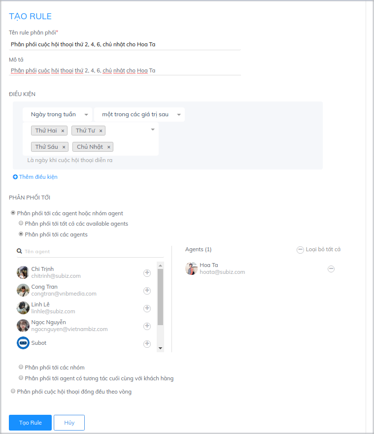

* **Rule 2:** Phân cuộc hội thoại cho Agent Linh Lê

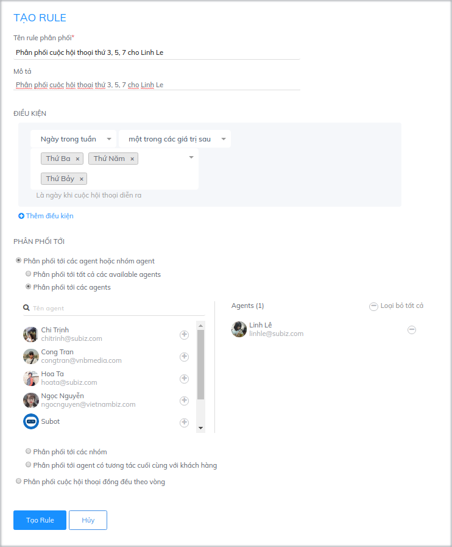

### **Phân phối cuộc hội thoại theo ngôn ngữ website**

Website bạn ngoài việc hỗ trợ khách hàng nội địa, còn có nhiều khách hàng quốc tế. Bạn có Agent phụ trách khách nước ngoài và khách Việt Nam riêng biệt. Cài đặt 2 rule sau để có thể phân cuộc hội thoại theo đúng Agent phụ trách theo ngôn ngữ trên website

* **Rule 1**: Phân cuộc hội thoại web tiếng Việt cho Agent Hoa Ta

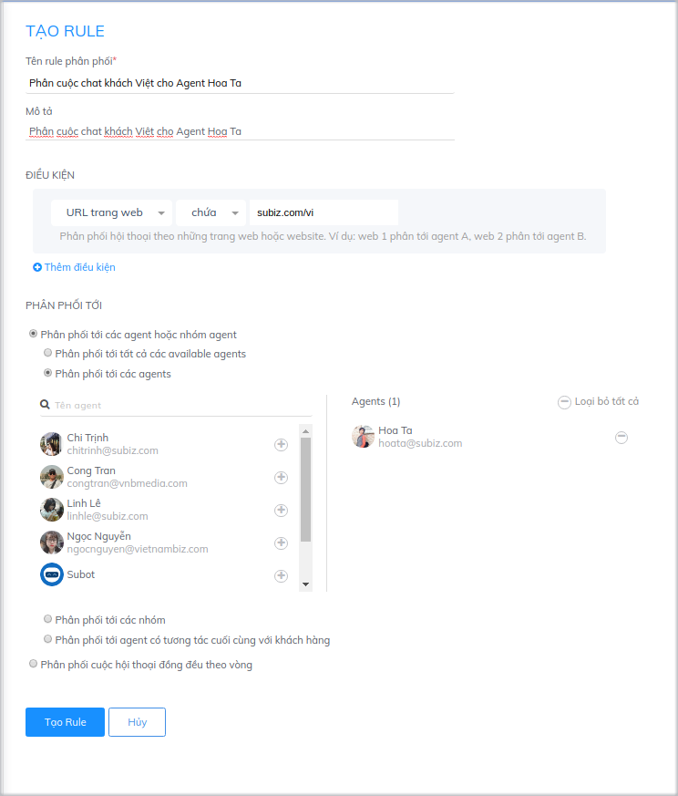

* **Rule 2**: Phân cuộc hội thoại web tiếng Anh cho Agent Linh Lê

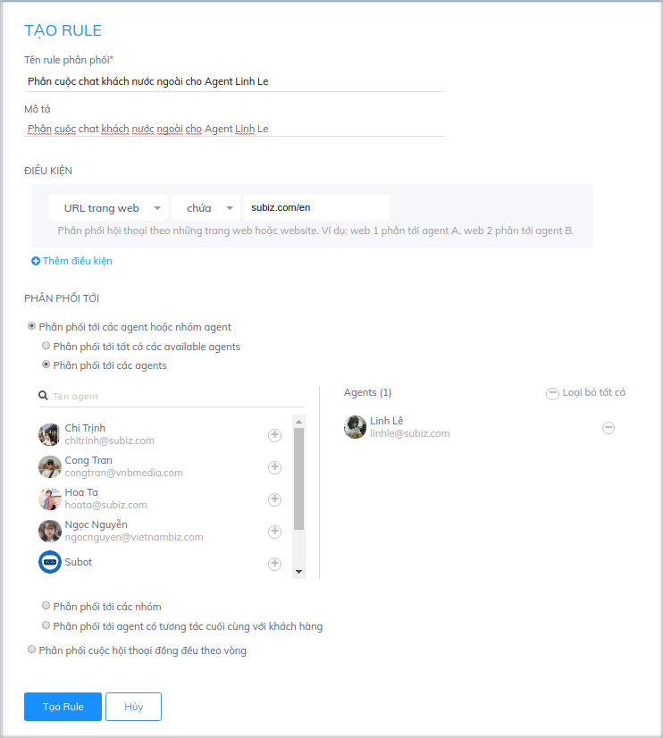

### Phân phối cuộc hội thoại cho cuộc hội thoại từ các kênh khác nhau

Bạn tích hợp cả Subiz lên Website, Fanpage và Email và có Agent để phụ trách riêng cho từng kênh. Bạn hoàn toàn có thể sử dụng chức năng Rule để phân phối cuộc hội thoại theo kênh:  
**Rule 1**: Phân phối hội thoại từ kênh Website \( Subiz chat\)

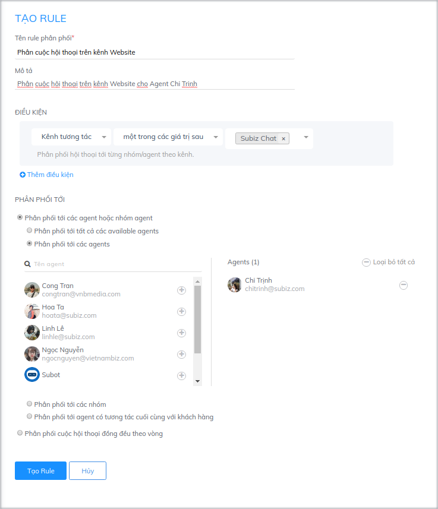

**Rule 2**: Phân phối hội thoại từ kênh Email và Messenger

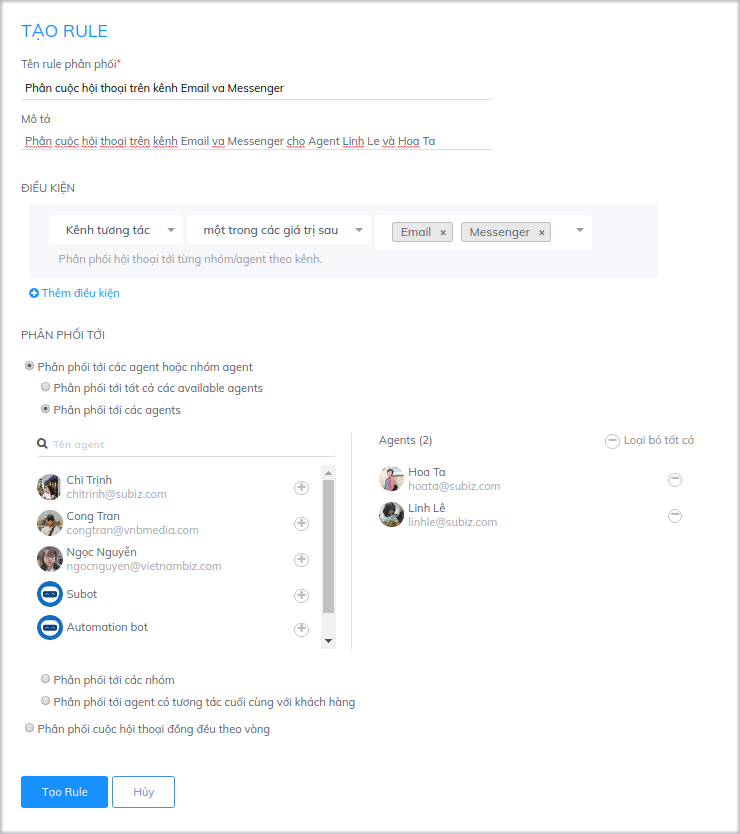

### Phân phối hội thoại theo vùng địa lý khách hàng 

Khi doanh nghiệp của bạn có chi nhánh ở các tỉnh thành khác nhau và muốn phân chia hội thoại cho tư vấn viên ở địa phương đó hỗ trợ khách hàng, Subiz sẽ giúp bạn nhận diện và chuyển hội thoại đến đúng tư vấn viên khách cần gặp.

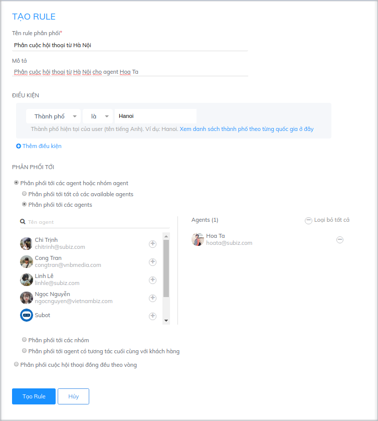

Tương tự bạn sẽ cài đặt Rule cho các thành phố còn lại.

