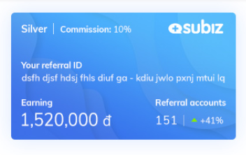
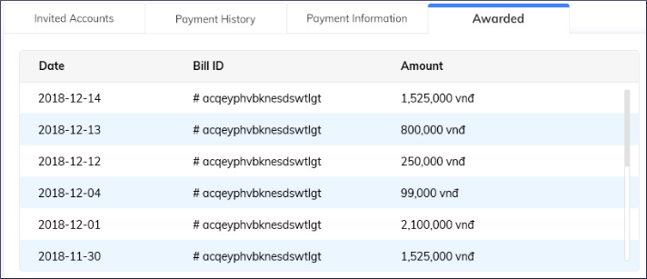

# Chương trình giới thiệu Subiz cho Bạn bè

### Tổng quan  

[Chương trình giới thiệu Subiz](https://app.subiz.com/referral) cho bạn bè là cách bạn giúp Subiz phát triển và kiếm thêm thu nhập từ Subiz. Bạn sẽ được Subiz lập một đường dẫn riêng, gửi đường dẫn này cho bạn bè của bạn bằng bất kể cách nào: Facebook, Email, message... Nếu họ chưa đăng ký ngay, một cookie lưu trữ 120 ngày sẽ ghi trên máy họ và trong khoảng thời gian này nếu họ quay lại đăng ký thì bạn vẫn được tính là người giới thiệu. Subiz cũng có những chương trình quảng cáo để kéo họ quay lại website Subiz để đăng ký.

Việc tiếp sau khi họ đăng ký sẽ do các chuyên viên Subiz lo. Chúng tôi giúp họ sử dụng Subiz hiệu quả và tiến tới trả phí. Trên mỗi hóa đơn họ thanh toán, bạn sẽ nhận được tiền hoa hồng - như một lời cảm ơn của Subiz dành cho bạn vì tham gia chương trình. Không chỉ hóa đơn đầu tiên, các hóa đơn sau bạn cũng sẽ nhận được tiền hoa hồng. Vì khách hàng Subiz là khách thuê bao và sử dụng dài hạn.

Bạn cần biết, chương trình này áp dụng cho riêng từng agent và không phân biệt agent nhóm quyền nào. Chỉ cần bạn là agent Subiz bạn sẽ được tham gia. Bạn cần quyền login Subiz để tham gia chương trình này. Nếu bạn không đăng nhập được Subiz, chúng tôi sẽ không có cơ sở để trả hoa hồng cho bạn.

### Các mức hoa hồng và cách Subiz trả tiền hoa hồng

Subiz có ba mức hoa hồng như sau:

* Silver: 0 - 50 Khách giới thiệu. 10%
* Gold: 51 - 150 Khách giới thiệu. 20%
* Diamond: Từ 151 Khách giới thiệu trở lên. 25%

Trong đó, Silver là mức mặc định. Subiz sẽ tự chuyển mức khi bạn đạt ngưỡng.

Tiền hoa hồng của bạn sẽ được Subiz trả vào 15 hàng tháng khi số tiền bạn kiếm được đạt mức thanh toán mà bạn cài đặt tại Tab Thanh toán. Subiz trả qua hình thức chuyển khoản. Nếu tài khoản của bạn ở Việt Nam, chúng tôi sẽ trả bằng tiền Việt Nam Đồng và quy đổi theo tỉ giá USD/VNĐ của Vietcombank bán ra.

Mức thanh toán là mức tiền để bạn nhận hoa hồng. Ví dụ bạn để $50, thì khi số tiền bạn kiếm được từ $50 trở lên Subiz sẽ thanh toán cho bạn vào ngày 15 trong tháng.

### Quản lý tiền hoa hồng

Subiz cung cấp đầy đủ thông tin tại [Menu agent của bạn](https://app.subiz.com/referral). Bạn quản lý danh sách tài khoản đã giới thiệu, những hóa đơn họ thanh toán, thông tin bạn nhận tiền hoa hồng...

### Các quy định của chúng tôi.

* Khi bạn tham gia chương trình, là bạn đã đồng ý với những nội dung trong Tài liệu này.
* Bạn sẽ chỉ được trả hoa hồng khi tài khoản agent của bạn có thể đăng nhập vào Subiz và truy cập được chương trình này trong tài khoản của bạn.
* Bạn không được chạy quảng cáo cạnh tranh trực tiếp với Subiz. Nếu bạn vi phạm, chúng tôi sẽ khóa chương trình này trong tài khoản của bạn.

### Các câu hỏi thường gặp

* Tôi có thể chuyển tiền hoa hồng hay các tài khoản giới thiệu giữa hai Agents? Không, bạn không thể chuyển bất kỳ dữ liệu nào.
* Tài khoản agent của tôi bị xóa, tôi có nhận được tiền hoa hồng không? Không, vì lúc đó tất cả dữ liệu của bạn đã không còn. Chúng tôi sẽ không có cơ sở để làm việc này. Hãy giữ tài khoản của bạn luôn hoạt động.
* Những tài khoản tôi đã giới thiệu, họ mua thêm các dịch vụ trong tương lai của Subiz thì tôi có được nhận tiền hoa hồng? Có, bạn sẽ được tính trên hóa đơn thanh toán của bất kỳ dịch vụ nào của Subiz.
* Có cách nào để tôi giới thiệu bạn bè Offline không? Có, Subiz có mã promotion để bạn có thể làm điều này. Ví dụ như tặng trong lớp học, hội thảo... Hãy liên hệ support@subiz.com và yêu cầu cấp Referral Promotion code.
* Nếu có thắc mắc, tôi cần liên hệ với ai: Liên hệ với chúng tôi bất cứ kênh nào email Support@Subiz.com, Subiz chat, hay Facebook Messenger.

_Cảm ơn bạn đã hợp tác và đồng hành cùng Subiz!_

