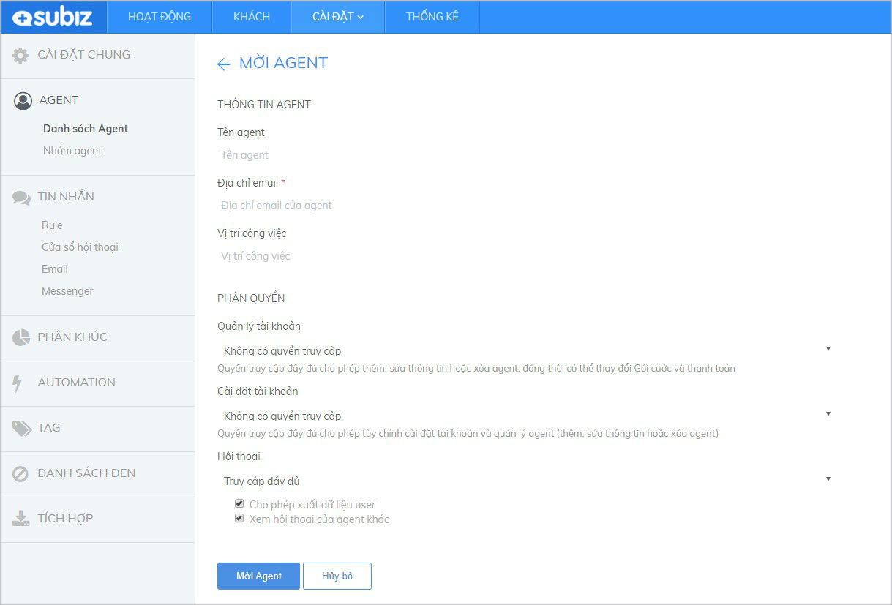
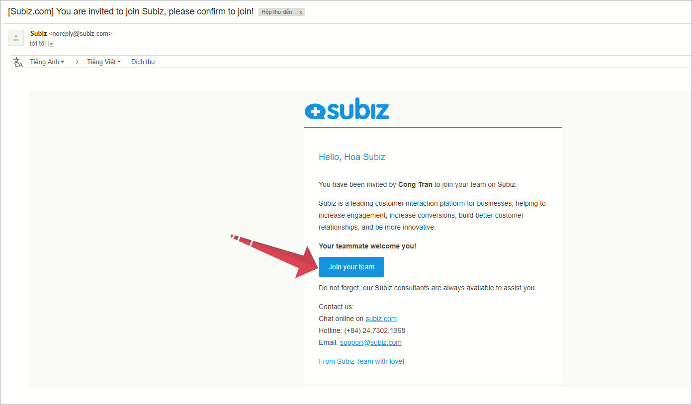
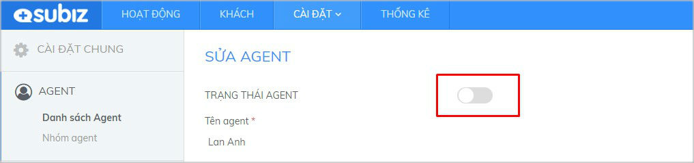

# Tạo thêm và quản lý Agent

**Từ tài khoản chính đăng ký Subiz \(Agent owner\), bạn có thể tạo thêm nhiều tài khoản Agent thành viên cùng đăng nhập Subiz và tương tác với khách hàng.**


* Bạn hãy mời các đồng nghiệp tham gia sử dụng Subiz tùy theo nhu cầu của Doanh Nghiệp.
* Với gói trả phí, số lượng Agent có thể sử dụng Subiz là số lượng Agent bạn đã đăng ký trả phí.
* Bạn có thể cài đặt phân quyền và quản lý hoạt động của các Agent.


### Mời Agent cùng sử dụng Subiz {#them-agent-moi}

Tạo thêm tài khoản Agent có hai bước như sau:



_Hướng dẫn Mời Agent_: Đăng nhập **App.subiz.com** &gt; Chọn **Cài đặt** &gt; **Tài Khoản** &gt; **Danh sách Agent** &gt; Mời **Agent**

Tại đây, bạn **nhập thông tin của Agent và chọn phân quyền** &gt; chọn **Lưu**


Lưu ý: Xem lại các loại Agent và chức năng phân quyền [TẠI ĐÂY.](https://subiz.gitbook.io/subiz-document/~/edit/primary/bat-dau-voi-subiz/untitled/quan-ly-agent/cac-loai-agent)




Người được Mời Agent sẽ nhận Mail xác nhận kích hoạt tài khoản từ Subiz. 

Agent này cần **đăng nhập Email được mời** &gt; **Kiểm tra mail Subiz** &gt; Chọn "**Join your team**"


Khi một Agent được mời mà chưa kích hoạt tài khoản, thì trạng thái của Agent này trong danh sách Agent là "Pending"




### Tùy chỉnh Agent thành viên

Khi bạn \(Agent\) được phân quyền **Truy cập đầy đủ** chức năng **Quản lý tài khoản** và **Cài đặt tài khoản,** bạn có thể Tùy chỉnh PHÂN QUYỀN hoặc Khóa hoặc Xóa tài khoản của Agent thành viên khác.


* Tài khoản Agent bị khóa \(Inactive Agent\) là bạn tùy chỉnh TRẠNG THÁI AGENT sang OFF.  Khi cần, bạn có thể kích hoạt ON agent để tiếp tục sử dụng lại tài khoản agent này.  Khi một Agent được chuyển sang trạng thái Inactive, sẽ đồng thời bị xóa khỏi các group và rule mà Agent tham gia. Nếu chỉ có duy nhất Agent đó ở trong một hội thoại đang mở, cuộc hội thoại đó sẽ được chuyển về danh sách cuộc hội thoại chưa được phân phối. 
* Tài khoản Agent bị xóa sẽ không thể sử dụng để đăng ký lại tài khoản Subiz. 


Hướng dẫn thao tác: Đăng nhập **App.subiz.com** &gt; **Cài đặt** &gt; **Tài khoản** &gt; **Danh sách Agent** &gt; Chọn **Agent muốn tùy chỉnh/ xóa** &gt; Chọn nút **Tùy Chỉnh/ Xóa**

Hướng dẫn Khóa tài khoản Agent \(Inactive Agent\) như sau: Chọn **nút Chỉnh/ Xóa** &gt; Tắt **OFF** trạng thái Agent ****&gt; Chọn **Lưu** 

###  {#tao-nhom-agent}

