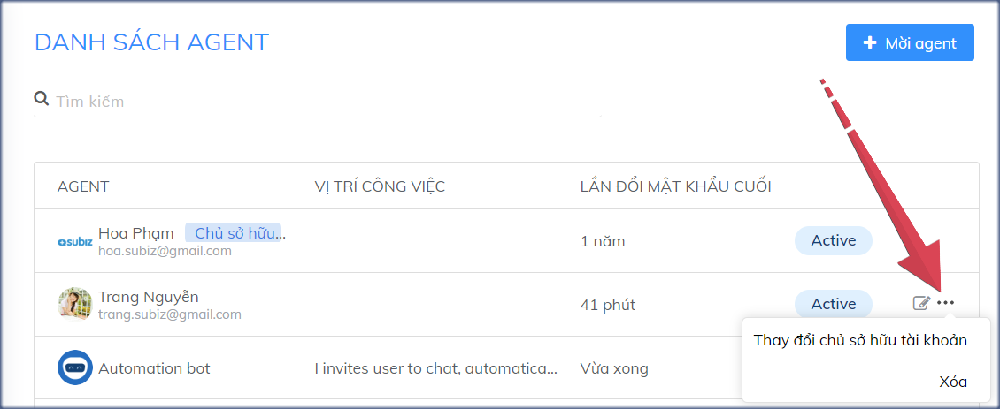

# Thay đổi chủ sở hữu tài khoản Subiz

Bạn cần thay đổi địa chỉ email quản lý tài khoản Subiz? 

Rất dễ dàng, bạn có thể trực tiếp thay đổi cài đặt ngay trên Subiz.


Lưu ý:

* Chủ sở hữu tài khoản Subiz được mặc định là email đăng ký tài khoản Subiz.
* Chủ sở hữu tài khoản có quyền truy cập đầy đủ 3 phân quyền trên Subiz: Quản lý tài khoản, Cài đặt tài khoản và Hội thoại. [**Xem thêm phân quyền của agent**](https://help.subiz.com/bat-dau-voi-subiz/trien-khai-hoat-dong/quan-ly-agent/cac-loai-agent).
* Chỉ chủ sở hữu tài khoản có quyền Thay đổi chủ sở hữu mới của tài khoản.


Hướng dẫn thay đổi chủ sở hữu tài khoản:

1. [**Đăng nhập Subiz**](https://app.subiz.com/) bằng địa chỉ email chủ sở hữu tài khoản Subiz. 
2. Mời thêm agent có địa chỉ email là chủ sở hữu mới của tài khoản tại trang [**Danh sách agent**](https://app.subiz.com/settings/agents-list) [**Xem hướng dẫn mời thêm agent**](https://help.subiz.com/bat-dau-voi-subiz/trien-khai-hoat-dong/quan-ly-agent/tao-them-va-quan-ly-agent#them-agent-moi) Chủ sở hữu tài khoản mới phải là 1 agent đã được kích hoạt trạng thái Active hoạt động. \(Bỏ qua bước này nếu bạn có sẵn agent chủ sở hữu mới trong Danh sách agent\) 
3. Chọn agent chủ sở hữu mới &gt; Chọn Thay đổi chủ sở hữu tài khoản. Agent chủ sở hữu mới chọn F5 tải lại trang [**App.subiz.com**](https://app.subiz.com/) để cập nhật tài khoản.


Lưu ý: Khi bạn cần xóa email chủ sở hữu cũ trong tài khoản Subiz, agent chủ sở hữu mới sẽ chọn Xóa agent tại trang [**Danh sách agent**](https://app.subiz.com/settings/agents-list).


> Bạn cần thêm hỗ trợ từ Subiz, hãy gửi ngay email tới Support@Subiz.com!

