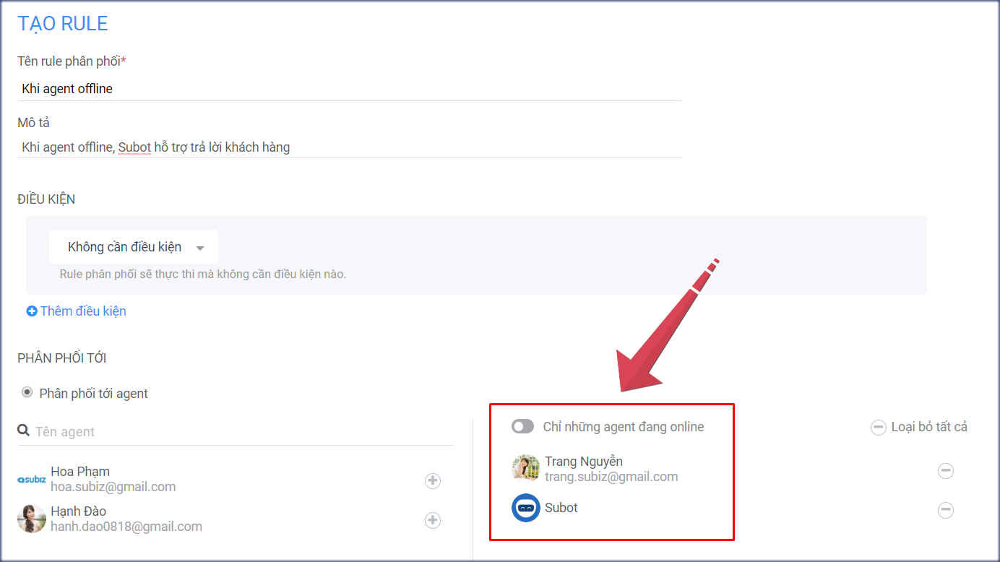

# Subot - Bot tự động Trả lời và Hỏi thông tin

### Subot là gì?

[Subot](https://app.subiz.com/settings/bots) hay gọi là Trợ lý ảo trên Subiz, là một ứng dụng trên Subiz giúp tự động hóa kết nối Trả lời và Hỏi thông tin khách hàng. Từ đó, doanh nghiệp sẽ tăng tương tác với khách hàng 24/7 mà không bị phụ thuộc vào con người, chuyển đổi khách hàng tiềm năng bằng việc xin thông tin và xác định các yêu cầu cụ thể.

Bạn \(Agents\) có thể xây dựng những kịch bản có sẵn cho Subot hoạt động như: Tự động trả lời khách hàng; Hiển thị đang nhắn tin;  Hỏi thông tin liên hệ của khách hàng.



### Subot hoạt động trên kênh nào?

Subiz hoạt động trên các kênh Chat như: Subiz chat, Messenger, Zalo OA.

### Tích hợp Subot

Để bắt đầu sử dụng Subot, bạn cần tích hợp Subot vào Subiz và thiết lập các kịch bản hoạt động cho Subot như sau:

* **Bước 1: Tích hợp Subot**  Tại link [https://app.subiz.com/settings/bots](https://app.subiz.com/settings/bots) &gt; chọn Tích hợp &gt; chọn Subot

* **Bước 2: Thiết lập kịch bản cho Subot** Subot đã được cài đặt mặc định 4 hành động: + Nội dung trả lời tự động sau 4s khách hàng nhắn tin. + Hiển thị đang nhắn tin sau 2s tiếp theo, tạo cảm giác được tiếp tục hỗ trợ. + Mời khách hàng để lại thông tin liên hệ và nhận thông báo tin nhắn mới trên trình duyệt của khách. + Hiển thị các nút Lưu thông tin và Nhận thông báo sau 1s tiếp theo.

Bạn có thể thay đổi lại kịch bản Subot bằng cách sửa nội dung, thêm bớt đính kèm Văn bản hay Hiện thị đang nhắn tin hay Hỏi thông tin và hẹn thời gian chạy \(tính theo đơn vị giây\) cho từng hành động này.


**Lưu ý:**   
+ Subot là một agent, được tích hợp miễn phí.  
+ Subot có thể thay đổi tên và ảnh đại diện tại link [https://app.subiz.com/settings/agents-list](https://app.subiz.com/settings/agents-list).  
+ Subot được quyền hoạt động trên tất cả hội thoại khách hàng gửi tin nhắn.


### Một số kịch bản sử dụng Subot

**1. Subot tự động trả lời và hỏi yêu cầu của tất cả khách hàng**

Bạn chỉ cần tích hợp Subiz và cài đặt kịch bản Subot trả lời khách hàng và hiển thị đang nhắn tin.  
Ví dụ kịch bản Subiz tự động chào và trả lời chat của khách hàng.

**2. Subot trả lời khi agent offline/ ngoài giờ làm việc**

* **Bước 1: Cài đặt kịch bản cho Subot** + Chào khách, thông báo agent offline, hỏi yêu cầu khách hàng. + Hiển thị đang nhắn tin. + Mời khách hàng để lại thông tin liên hệ và nhận thông báo tin nhắn mới trên trình duyệt của khách.

* **Bước 2: Cài đặt 2 Rule phân phối** + Rule 1 phân phối hội thoại tới agent, Bật ON chỉ những agent đang online và thêm các agent có quyền trả lời khách hàng. + Rule 2 phân phối hội thoại cho Subot và agent phụ trách khi agent offline/ ngoài giờ làm việc.

> Bạn cần thêm hỗ trợ sử dụng Subot, vui lòng gửi email tới Support@Subiz.com!

