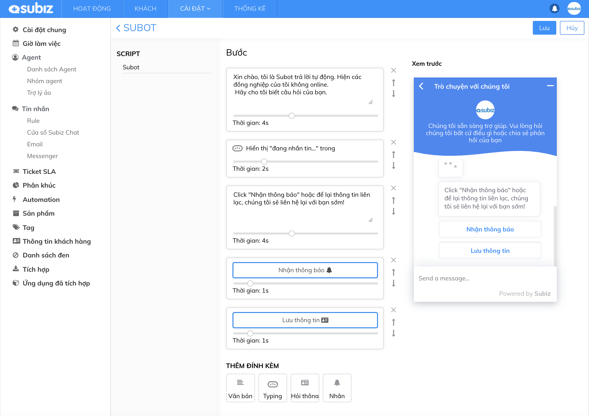

# Subot - Bot tự động Trả lời và Hỏi thông tin

### Subot là gì?

[Subot](https://app.subiz.com/settings/bots) hay gọi là Trợ lý ảo trên Subiz, là một ứng dụng trên Subiz giúp tự động hóa kết nối Trả lời và Hỏi thông tin khách hàng. Từ đó, doanh nghiệp sẽ tăng tương tác với khách hàng 24/7 mà không bị phụ thuộc vào con người, chuyển đổi khách hàng tiềm năng bằng việc xin thông tin và xác định các yêu cầu cụ thể.

Bạn \(Agents\) có thể xây dựng những kịch bản có sẵn cho Subot hoạt động như: Tự động trả lời khách hàng; Hiển thị đang nhắn tin; Mời khách hàng nhận thông báo trên trình duyệt; Hỏi thông tin liên hệ của khách hàng.



### Tích hợp Subot

Để bắt đầu sử dụng Subot, bạn cần tích hợp Subot vào Subiz và thiết lập các kịch bản hoạt động cho Subot như sau:

* **Bước 1: Tích hợp Subot**  Tại link [https://app.subiz.com/settings/bots](https://app.subiz.com/settings/bots) &gt; chọn Tích hợp &gt; chọn Subot

* **Bước 2: Thiết lập kịch bản cho Subot** Subot đã được cài đặt mặc định 4 hành động: + Trả lời tự động sau 4s khách hàng nhắn tin + Hiển thị đang nhắn tin sau 2s tiếp theo + Mời nhận thông báo trên trình duyệt và mời khách hàng để lại thông tin liên hệ sau 4s tiếp theo + Hiển thị các button Nhận thông báo và Lưu thông tin sau 1s tiếp theo  Bạn có thể click vào Subot để tùy chỉnh các hành động của Subot, nội dung tin nhắn, thời gian chạy của từng hành động hoặc xóa/ thêm hành động bất kỳ.

* **Bước 3: Phân phối cuộc hội thoại cho Subot** Bạn vào cài đặt Rule qua link [https://app.subiz.com/settings/rule-setting](https://app.subiz.com/settings/rule-setting) để thêm Subot vào nhận hội thoại. Subot được thiết kế như một agent nên cuộc hội thoại sẽ phân phối đồng thời cho cả Subot và các Agent khác.

### Một số kịch bản sử dụng Subot

**1. Subot tự động chào và hỏi yêu cầu của tất cả khách hàng**

* Bước 1: Cài đặt kịch bản Subot chào khách hàng và hiển thị đang nhắn tin
* Bước 2: Cài đặt Rule phân phối tất cả hội thoại cho Subot và các Agents

**2. Subot trả lời khi agent offline/ ngoài giờ làm việc**

* Bước 1: Cài đặt kịch bản cho Subot + Chào khách, thông báo agent offline, hỏi yêu cầu khách hàng + Hiển thị đang nhắn tin + Mời khách hàng nhận thông báo và để lại thông tin liên hệ

* Bước 2: Cài đặt 2 Rule + Rule 1 phân phối hội thoại cho available agents khi agent online + Rule 2 phân phối hội thoại cho Subot và Agent phụ trách khi agent offline/ ngoài giờ làm việc

