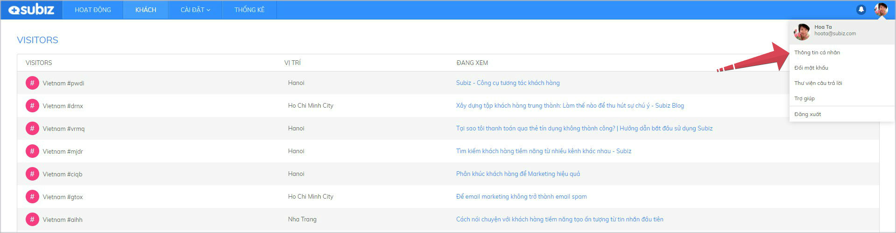
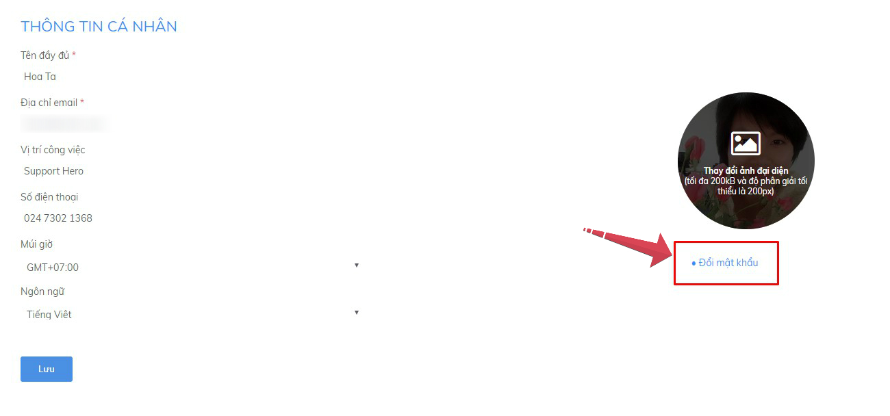

# Định nghĩa Agent

### Agent là gì?

**Agent là thuật ngữ chỉ người sử dụng Subiz để làm việc và tương tác với khách hàng**. Agent có thể là người quản lý, tư vấn viên, hoặc bất kỳ nhân viên nào trong doanh nghiệp. Mỗi Agent sẽ có một tài khoản đăng nhập riêng.

### **Các loại Agent**

Mỗi tài khoản Subiz sẽ có 2 đối tượng Agent sau;

* **Agent chủ tài khoản \(Agent owner\)**: Là tài khoản chính đăng ký Subiz cho doanh nghiệp
* **Agent thành viên**: Là tài khoản được Agent owner mời thêm cùng tham gia sử dụng Subiz

### Phân quyền tài khoản Agent

Một Agent sẽ có **3 Quyền** khi sử dụng tài khoản Subiz. 

Bạn có thể lựa chọn phân quyền Agent là “**Không có quyền truy cập**” hoặc “**Truy cập đầy đủ**”.

1. **Quản lý tài khoản**: Quyền truy cập đầy đủ cho phép thêm, sửa thông tin hoặc xóa agent, đồng thời có thể thay đổi Gói cước và thanh toán.
2. **Cài đặt tài khoản**: Quyền truy cập đầy đủ cho phép tùy chỉnh cài đặt tài khoản và quản lý agent \(thêm, sửa thông tin hoặc xóa agent\)
3. **Hội thoại**: Quyền truy cập cho phép xuất dữ liệu user và xem conversation của các Agent khác.

### Thông tin cá nhân của Agent

**Thông tin cá nhân của Agent là thông tin tài khoản đăng nhập Subiz của bạn, sẽ hiển thị trong cửa sổ chat Subiz trên website.** Khi bạn thiết lập đầy đủ các thông tin của Agent, hình ảnh của bạn sẽ chuyên nghiệp và uy tín hơn trong mắt khách hàng.

_Hướng dẫn tùy chỉnh thông tin cá nhân_: Chọn **Ảnh đại diện góc phải màn hình** &gt; Chọn **Thông tin cá nhân**

Tại đây, bạn có thể tùy chỉnh:

1. Thông tin cá nhân
2. Ảnh đại diện
3. Mật khẩu đăng nhập Subiz



_Hướng dẫn tùy chỉnh thông tin_: **Thay đổi các trường thông tin cần thiết** &gt; chọn **Lưu**

* **Tên** **đầy đủ:** Tên hiển thị của Agent trên cửa sổ chat Subiz
* **Địa chỉ email:** Email đăng nhập Subiz của Agent, **không thể thay đổi**
* **Vị trí công việc:** Công việc mà Agent đảm nhiệm
* **Số điện thoại:** Số điện thoại liên hệ của Agent
* **Múi giờ:** Múi giờ nơi Agent làm việc. Chú ý cài đặt múi giờ tương ứng trên máy tính để dữ liệu cập nhật được chính xác.
* **Ngôn ngữ:** Ngôn ngữ hiển thị trên ứng dụng App.subiz.com của Agent




_Hướng dẫn thay đổi ảnh đại diện_: Chọn **Thay đổi ảnh đại diện** &gt; **Tải ảnh lên** &gt; Chọn **Lưu**




_Hướng dẫn thay đổi mật khẩu_: chọn **Đổi mật khẩu** &gt; **Nhập mật khẩu mới** &gt; **Xác nhận**




