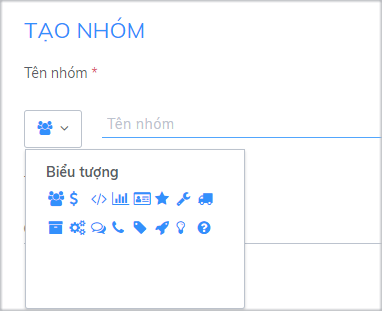
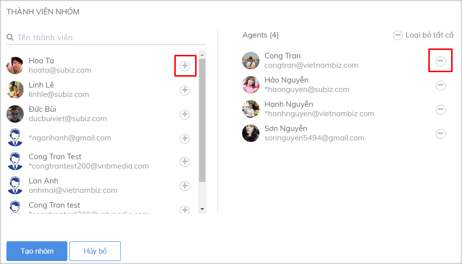
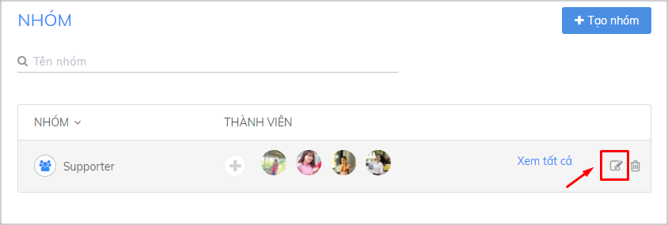
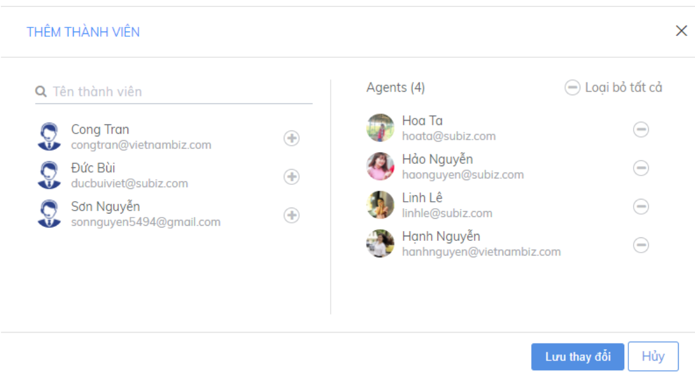

# Quản lý nhóm Agent

**Nhóm Agent được thiết lập để tạo thành một đội nhóm chuyên nghiệp cùng hỗ trợ khách hàng.** Khi tạo đội nhóm hỗ trợ khách hàng, bạn sẽ phát huy sức mạnh và hạn chế điểm yếu cá nhân của từng Agent.

Bạn hãy dựa vào số lượng Agent mình đang có và **đặc biệt là nhu cầu, phạm vi công việc để tạo ra các nhóm Agent khác nhau**, ví dụ:

* Nhóm Agent tư vấn bán hàng 1 \(bao gồm tư vấn bán hàng và tư vấn kỹ thuật…\)
* Nhóm Agent tư vấn bán hàng 2 \(bao gồm tư vấn bán hàng và tư vấn kỹ thuật…\)
* Nhóm Agent hỗ trợ khách hàng 1
* Nhóm Agent hỗ trợ khách hàng 2
* Nhóm Agent chuyên phụ trách sản phẩm 1
* Nhóm Agent chuyên phụ trách sản phẩm 2

### **1. Tạo Nhóm Agent**

Để tạo group Agent, bạn vào **Cài đặt &gt; Tài khoản &gt; Agent &gt; Nhóm Agent, click vào Tạo nhóm.**

* Nhập tên và chọn biểu tượng cho nhóm

* Click \(+\) hoặc \(-\) để chọn/ bỏ chọn Agent là thành viên trong group

*  Click chọn **Tạo nhóm**

### **2. Sửa thông tin nhóm** Agent

Để sửa đổi thông tin về 1 nhóm, bạn vào **Cài đặt &gt; Tài khoản &gt; Nhóm Agent** &gt; chọn nhóm muốn sửa &gt; chọn biểu tượng chỉnh sửa.

Tại trang Sửa nhóm, thực hiện chỉnh sửa và click chọn **Lưu thay đổi**.

