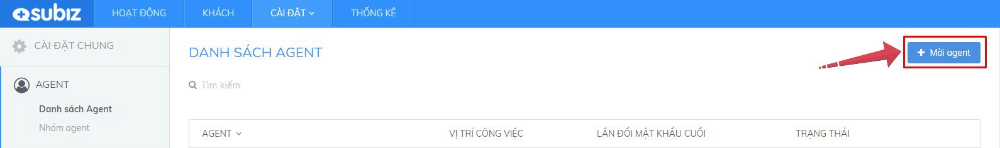
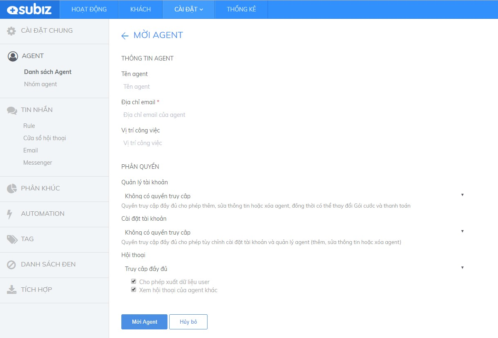
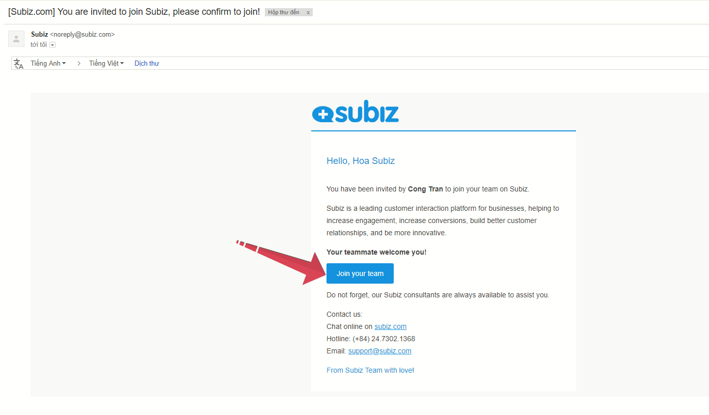
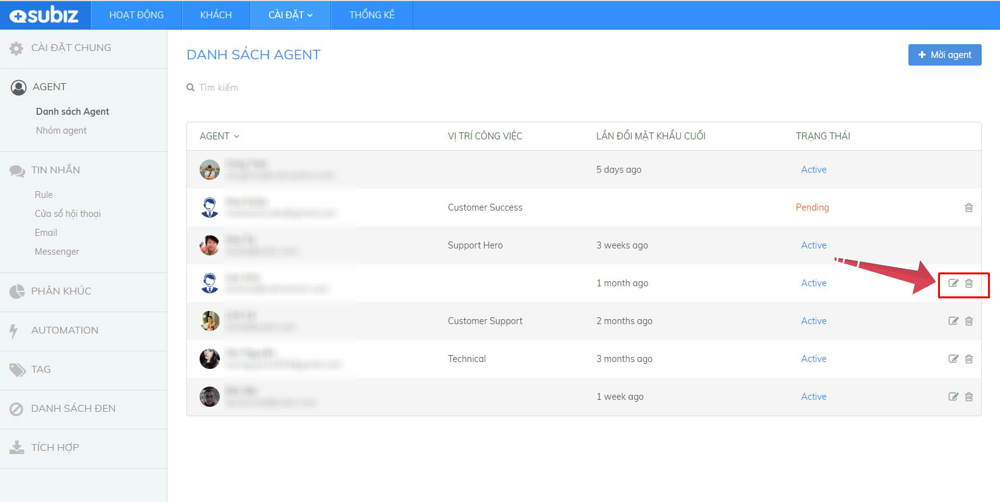

# Tạo thêm tài khoản đăng nhập Subiz

**Từ tài khoản chính đăng ký Subiz \(Agent owner\), bạn có thể tạo thêm nhiều tài khoản Agent thành viên cùng đăng nhập Subiz và tương tác với khách hàng.**


* Bạn hãy mời các đồng nghiệp tham gia sử dụng Subiz dựa trên trách nhiệm công việc và nhu cầu của doanh nghiệp
* Số lượng Agent có thể sử dụng Subiz là số lượng bạn đăng ký sử dụng với Subiz.
* Bạn cần phân quyền và quản lý hoạt động của các Agent.


### Mời Agent {#them-agent-moi}

Tạo thêm tài khoản Agent có hai bước như sau:



_Hướng dẫn Mời Agent_: Đăng nhập **App.subiz.com** &gt; Chọn **Cài đặt** &gt; **Tài Khoản** &gt; **Danh sách Agent** &gt; Mời **Agent**

Tại đây, bạn **nhập thông tin của Agent và chọn phân quyền** &gt; chọn **Lưu**


Lưu ý: Xem lại các loại Agent và chức năng phân quyền [TẠI ĐÂY.](https://subiz.gitbook.io/subiz-document/~/edit/primary/bat-dau-voi-subiz/untitled/quan-ly-agent/cac-loai-agent)




Người được Mời Agent sẽ nhận Mail xác nhận kích hoạt tài khoản từ Subiz. 

Agent này cần **đăng nhập Email được mời** &gt; **Kiểm tra mail Subiz** &gt; Chọn "**Join your team**"


Khi một Agent được mời mà chưa kích hoạt tài khoản, thì trạng thái của Agent này trong danh sách Agent là "Pending"




### Tùy chỉnh Agent thành viên

Khi bạn \(Agent\) được phân quyền **Truy cập đầy đủ** chức năng "**Quản lý tài khoản**" và "**Cài đặt tài khoản**", bạn có thể Tùy chỉnh thông tin hoặc Xóa tài khoản của Agent thành viên khác.

Hướng dẫn thao tác: Đăng nhập **App.subiz.com** &gt; **Cài đặt** &gt; **Tài khoản** &gt; **Danh sách Agent** &gt; Chọn **Agent muốn tùy chỉnh/ xóa** &gt; Chọn **nút Chỉnh/ Xóa**


Lưu ý: Tài khoản Agent bị xóa sẽ không thể sử dụng để đăng ký lại tài khoản Subiz. Bạn có thể dùng chức năng Inactive \(Khóa\) Agent để có thể tiếp tục sử dụng tài khoản khi cần.


_Hướng dẫn Khóa tài khoản Agent \(Inactive Agent\) như sau_: Chọn **nút Chỉnh/ Xóa** &gt; Tắt **OFF** trạng thái Agent ****&gt; Chọn **Lưu** 

###  {#tao-nhom-agent}

