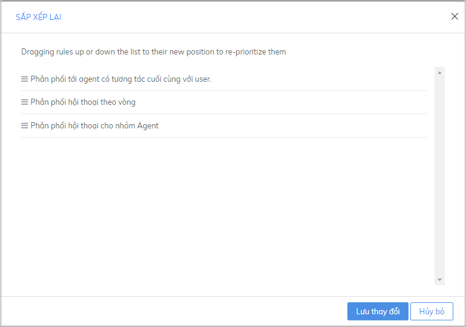
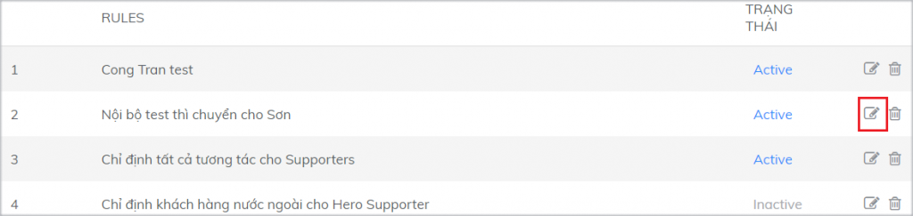
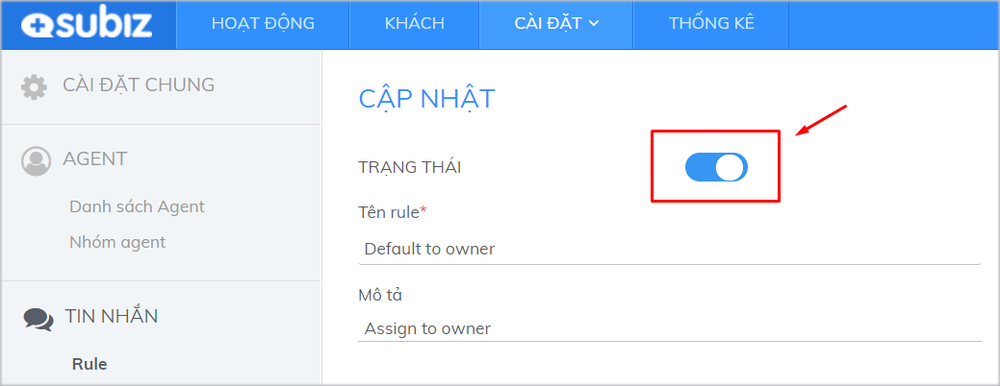
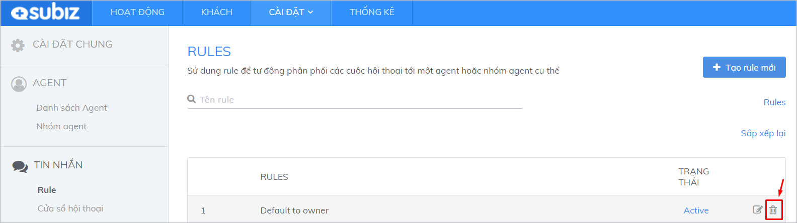
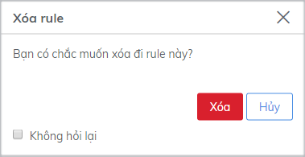

# Quản lý danh sách Rule

**Mỗi khi có sự thay đổi về số lượng Agent, có thêm sản phẩm, có thêm trang giới thiệu trên website, có thêm các kênh bán hàng khác** thì… việc phân phối các cuộc hội thoại cần có sự điều chỉnh cho phù hợp, tránh sự quá tải công việc hoặc phân phối cuộc chat cho người chưa phù hợp về chuyên môn.

Lúc này, **bạn cần thay đổi thứ tự các rule, hoặc chỉnh sửa điều kiện của các rule đã có và loại bỏ những rule không còn phù hợp** với yêu cầu hiện tại của doanh nghiệp

Bạn cần quan tâm và thực hiện 3 vấn đề sau:

### **Sắp xếp thứ tự của rule**

Các rule sẽ hoạt động **theo thứ tự ưu tiên từ trên xuống dưới**.

Ví dụ, khi có một cuộc hội thoại mới, nếu thỏa mãn điều kiện của rule 1, cuộc hội thoại sẽ được phân phối cho Agent/ nhóm Agent của rule 1. Nếu chưa thỏa mãn, hệ thống tiếp tục lần lượt kiểm tra điều kiện của rule 2, 3 …


_Lưu ý: Chỉ rule trong trạng thái Active mới có thể hoạt động_


Để sắp xếp lại thứ tự các rule, bạn click vào **Sắp xếp lại**.

Sử dụng chuột kéo thả để sắp xếp mức độ ưu tiên của các rule theo mong muốn, sau đó chọn **Lưu thay đổi**.

### **Chỉnh sửa rule**

* Chọn biểu tượng sửa tương ứng của rule muốn chỉnh sửa

* Thay đổi lại thông tin trên trang cập nhật

* Click vào **Cập nhật** để hoàn tất.

Tại trang cập nhật, bạn có thể thay đổi trạng thái Active/ Inactive cho rule đó.

### **Xóa rule**

* Chọn biểu tượng xóa tương ứng trên rule

* Click Xóa để xác nhận

​

