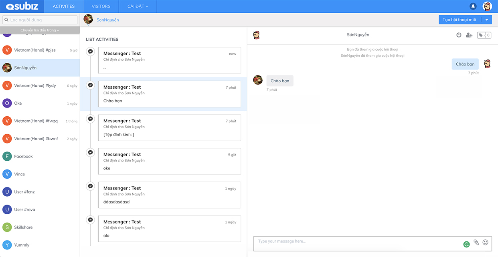
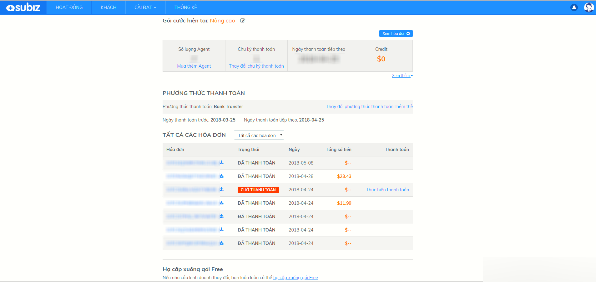

# Subiz hoạt động như thế nào?

### Subiz hoạt động như thế nào?

Mọi hoạt động trên Subiz diễn ra dựa trên 2 phần:

**Cửa sổ Subiz Chat:** Với các khách truy cập website, khi cần sự tư vấn, khách hàng sẽ tương tác với bạn từ cửa sổ Subiz nằm trên website của bạn.

Ngay tại cửa sổ Subiz Chat, bạn có thể thực hiện các automation tự động gửi tin nhắn như những lời chào thu hút khách truy cập, những thông báo, các chương trình khuyến mại hay hỏi thông tin khách hàng

**Dashboard – Bảng điều khiển**: Là nơi bạn đăng nhập để làm việc hàng ngày, bạn có thể theo dõi khách hàng đang truy cập website, tương tác khách hàng trên nhiều kênh, thực hiện các chiến lược chăm sóc , quản lý hoạt động kinh doanh của công ty. Tất cả các thông tin, tương tác, dữ liệu sẽ được chuyển về Dashboard của bạn

Tại Dashboard bao gồm các mục chức năng chính như sau:



Đây là nơi hiển thị danh sách khách hàng tương tác với bạn. Tại đây, bạn có thể:

* Phản hồi các tin nhắn của khách hàng đến từ các kênh tương tác
* Chủ động tương tác với khách hàng quay lại
* Cập nhật và tùy chỉnh thông tin khách hàng
* Xem lịch sử tương tác với khách hàng trên các kênh
* Lọc khách hàng ngay trên thanh “Lọc người dùng” 
* Quản lý và gửi email cho khách hàng
* Chủ động gửi Email Marketing, chăm sóc khách hàng đúng mục tiêu vào đúng thời điểm, gia tăng cơ hội bán hàng hiệu quả.




Tại trang này, bạn có thể quan sát khách hàng trên Website, biết được khách hàng từ đâu đến, khách hàng đang xem sản phẩm gì,.... qua sự cập nhật theo thời gian thực hoạt động của khách hàng. 




Tại mục **Cài đặt**, bạn có thể thiết lập các tính năng có trong Subiz ngay sau khi mới tạo tài khoản hoặc thay đổi, chỉnh sửa các tính năng khi có bất cứ sự thay đổi trong mô hình kinh doanh của mình nhằm triển khai sử dụng Subiz và tương tác khách hàng hiệu quả.




Bạn có thể thống kê số lượng tương tác với khách hàng, nắm được tình hình tương tác, những vấn đề khách hàng thường gặp phải và đưa ra hướng cải thiện chất lượng dịch vụ khách hàng ngay tại mục Thống kê trên Dashboard. 

Tại đây, bạn có thể thống kê các cuộc tương tác dựa theo từng tư vấn viên, nhóm tư vấn viên theo thời gian hoặc theo dõi, phân tích các cuộc tương tác về các vấn đề cụ thể dựa vào Tag.




Bạn có thể kiểm tra gói cước sử dụng, quản lý các thanh toán sử dụng Subiz và gia hạn thanh toán bằng cách click vào **Cài đặt** =&gt; **Thanh toán**




### **Các thuật ngữ có trong Subiz**

Thuật ngữ trong Subiz là các từ hoặc cụm từ dùng đề mô tả các yếu tố, hành động liên quan trong quá trình sử dụng Subiz.

Sau đây là một số khái niệm bạn cần nắm được để sử dụng chính xác và tối ưu hiệu quả sử dụng Subiz:

| Agent | Người đăng nhập tài khoản Subiz để thực hiện các tương tác với khách hàng. Agent có thể là người quản lý, tư vấn viên, hoặc bất kì nhân viên nào trong doanh nghiệp. |
| --- | --- | --- | --- | --- | --- | --- | --- |
| Visitor | Khách truy cập website của bạn |
| User | Khách  hàng có tương tác với bạn qua Subiz |
| Cuộc hội thoại | Cuộc hội thoại giữa Agent và User trên các kênh khác nhau |
| Kênh | Các kênh tương tác của bạn với khách hàng qua Subiz, bao gồm: Subiz Chat, Email, Facebook Messenger… |
| Rule | Các quy tắc để phân chia cuộc hội thoại về cho từng Agent hoặc nhóm Agent |
| Phân khúc | Các nhóm user được phân chia theo tiêu chí cụ thể |
| Automation | Thiết lập tin nhắn tự động gửi tới khách hàng với các điều kiện đặt trước |

### Những trình duyệt được Subiz hỗ trợ

Bạn có thể sử dụng Subiz trên các trình duyệt sau:

Trang quản lý \(Dashboard\) Subiz được hỗ trợ trên hầu hết các trình duyệt phổ biến hiện nay:

* ​[Chrome](http://www.google.com/chrome/) – phiên bản 61 trở lên
* ​[Firefox](http://www.firefox.com/) – phiên bản 56 trở lên
* ​[Cốc cốc](https://coccoc.com/vi/en) – phiên bản 68 trở lên
* ​[Safari](http://www.apple.com/safari/) – phiên bản 10.1 trở lên \(không hỗ trợ trên Window\)
* ​[Opera](https://www.opera.com/) – phiên bản 50 trở lên
* ​[Edge](https://www.microsoft.com/en-us/windows/microsoft-edge) – phiên bản 15 trở lên \(không xem được hoạt động của user\)

Với Cửa sổ chat trên máy tính. Subiz hỗ trợ đầy đủ nhất trên những nền tảng sau:

* ​[Chrome](http://www.google.com/chrome/) – phiên bản 49 và từ 61 trở lên
* ​[Firefox](http://www.firefox.com/) – phiên bản 56 trở lên
* ​[Cốc cốc](https://coccoc.com/vi/en) – phiên bản 68 trở lên
* ​[Safari](http://www.apple.com/safari/) – phiên bản 10.1 trở lên \(không hỗ trợ trên Window\)
* ​[Opera](https://www.opera.com/) – phiên bản 50 trở lên
* ​[Edge](https://www.microsoft.com/en-us/windows/microsoft-edge) – phiên bản 15 trở lên

