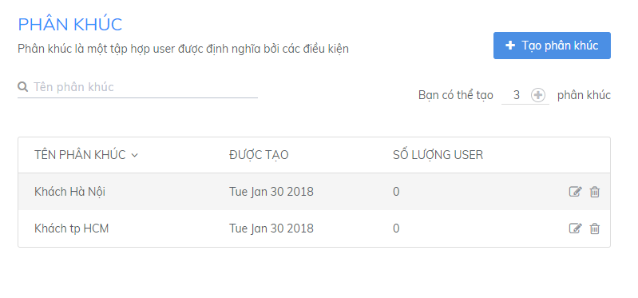

# Khám phá tính năng trong Subiz

Doanh nghiệp sử dụng Subiz hàng ngày để tương tác khách truy cập. Tuy vậy, có những tính năng của Subiz có thể bạn chưa biết đến và chưa biết cách ứng dụng vào công việc kinh doanh của mình. Bài viết này sẽ đưa ra 3 tính năng chính cực kì hữu dụng có trên Subiz mà bạn có thể đã "đánh giá thấp" giá trị mà chúng mang lại cho bạn.

### **Rule**

**Rule là các quy tắc do bạn thiết lập để tự động phân phối cuộc hội thoại tới một hoặc một nhóm Agent**.  Đây là thiết lập cực kì quan trọng khi bắt đầu sử dụng Subiz.

Bạn có thể phân phối cuộc hội thoại tới các tư vấn viên của mình hoặc chuyển cuộc hội thoại đang chat cho các tư vấn viên khác hỗ trợ.  

Chẳng hạn: Những cuộc tư vấn của khách hàng nước ngoài sẽ giao cho một hay một nhóm tư vấn viên chuyên phụ trách mảng nước ngoài

### **Automation**

**Bạn có thể tự động hóa việc tương tác với khách hàng, thu hút sự chú ý của khách ngay khi họ vào website bằng cách cài đặt các Automation** như:

* Tự động gửi lời chào đến khách hàng
* Tự động hỏi thông tin, địa chỉ email của khách truy cập

Ngoài ra, bạn còn có thể cài đặt các Automation thực hiện các hành động khác nhau với từng đối tượng khách hàng với các điều kiện nhất định.

### **Phân khúc khách hàng**

**Phân khúc là việc phân chia khách hàng thành từng nhóm theo tiêu chí nhất định.**

Bạn có thể phân nhóm khách hàng dựa trên những tiêu chí phù hợp với mô hình kinh doanh của mình

Từ danh sách khách hàng đã được phân chia như vậy, bạn có thể gửi các tin nhắn tự động hoặc các email marketing cho từng nhóm khách hàng đúng mục tiêu.  
  
  

