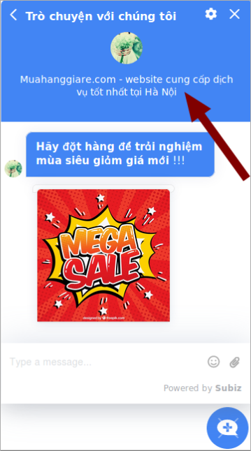

# API Javascript của Subiz Widget

Để có thể hiển thị thành công những tùy chỉnh, bạn cần đặt các mã API này ngay phía sau của mã nhúng Subiz trên website. 

### Update User Attributes

API cho phép cập nhật dữ liệu khách hàng ngay từ Website. Ví dụ khi khách truy cập đăng nhập trên web, bạn có thể cập nhật email, họ tên...  lên Subiz để quản lý cũng như tương tác.  

```javascript
<script>
    subiz('updateUserAttributes', [{ key: 'fullname',   text : 'David' }]);
</script>
//Cập nhật tên. Trong đó fullname là Attributes Key của trường dữ liệu Fullname.
```

Bạn có thể tạo và lấy Attributes Key tại [trang cài đặt Thông tin khách hàng](https://app.subiz.com/settings/user-attributes).

```c
<script>
    subiz('updateUserAttributes', [{ key: 'so_thich',   list :['Máy ', 'EnglDu lịch']);
</script>
//Cập nhật một trường dữ liệu khách hàng tùy chỉnh, và là dạng nhiều giá trị. 
```

Bạn cũng có thể cập nhật nhiều trường giá trị cùng lúc. 

```javascript
<script>
    subiz('updateUserAttributes', [{ key: 'fullname',   text : 'David' },{ key: 'phones',   text : '+84983123456' }]);
</script>
//Update trường fullname và phones cùng lúc. 
```

### Lấy dữ liệu User từ Subiz \(get user attributes\)

API cho phép lấy dữ liệu Khách truy cập từ Subiz để cho website sử dụng. Ví dụ, một khách truy cập quay lại, bạn có thể lấy dữ liệu đã lưu trong Subiz và hiển thị lên website. Ví dụ như dữ liệu Vị trí địa lý để web hiển thị thông tin phù hợp.

```javascript
<script>
    subiz('getUserAttributes', (attributes) => {console.log('user attributes', attributes)});
</script>
//Lấy dữ liệu User Attributes từ Subiz về.
```

### ForgetMe - API xóa toàn bộ dữ liệu một User

Chức năng cho phép bạn thiết kế cơ chế để Khách truy cập có thể xóa dữ liệu của họ. Dữ liệu bị xóa bao gồm tất cả thông tin trên trình duyệt của khách truy cập và trong Subiz. Do vậy, khi bị xóa thì agents cũng không nhìn thấy User này.

```javascript
<script>
    subiz('forgetMe');
</script>
//API Để xóa dữ liệu User.
```

### Chỉ định ngôn ngữ cho Subiz Widget

API cho phép web chỉ định ngôn ngữ hiển thị của Subiz Widget.  Khi đó, bạn có thể quyết định trang nào hiển thị tiếng Việt, trang nào hiển thị tiếng Anh.

```javascript
<script>
    subiz('setLanguage', 'en');
</script>
//Chỉ định ngôn ngữ tiếng Anh. Trong đó 'en' là mã ngôn ngữ.  
```

Mã ngôn ngữ là Mã đại diện của ngôn ngữ theo chuẩn [ISO 639-1](https://en.wikipedia.org/wiki/ISO_639-1)  \( hai ký tự\) và là những ngôn ngữ mà Subiz hiện đang có. [Xem danh sách ngôn ngữ Subiz đang hỗ trợ](http://help.subiz.com/bat-dau-voi-subiz/thiet-lap-moi-truong-tuong-tac/tich-hop-subiz-len-website/cac-ngon-ngu-ho-tro-tren-cua-so-subiz-chat). 

### Mở /  Đóng Subiz Widget 

API cho phép bạn ra lệnh mở Subiz Widget. Ví dụ, bạn có thể tạo một nút trên website để khi khách truy cập click vào nút đó, cửa sổ Subiz sẽ mở ra.

```javascript
<script type="text/javascript">
    window.subiz('expandWidget')
</script>
// API mở Subiz widget qua function Javascript. 
```

```markup
<a href="#nogo" onclick="subiz('expandWidget')">Text của </a>
//Gắn vào một link để ra lệnh mở Subiz widget.
```

```javascript
<script type="text/javascript">
    window.subiz('shrinkWidget')
</script>
//API đóng cửa sổ Subiz.
```

```markup
<a href="#nogo" onclick="subiz('shrinkWidget')">text của </a>
//Gắn vào link để đóng Subiz widget.
```

### Tùy chỉnh CSS

API cho phép bạn truyền một đoạn mã CSS để thay đổi lại Subiz Widget theo nhu cầu của bạn.  Chức năng giúp bạn có thể sáng tạo ra cửa sổ Subiz cho từng website với phong cách riêng của nó.

```javascript
<script type="text/javascript">
    window.subiz('changeCss', '.widget_mini .widget_body {height: 750px !important; max-height: 800px !important;}')
</script>
```

Bạn tham khảo thêm [Bảng CSS tùy chỉnh cửa sổ Subiz chat](https://help.subiz.com/bat-dau-voi-subiz/thiet-lap-moi-truong-tuong-tac/tich-hop-subiz-len-website/bang-css-tuy-chinh-cua-so-chat)!

### Vị trí của cửa sổ sổ chat

Bạn có thể tùy chỉnh vị trí cửa sổ chat trên website sang bên trái hoặc phải để phù hợp với thiết kế web và tối ưu hiển thị:

```csharp
subiz('setPosition', 'left') 
// Tùy chỉnh cửa sổ chat sang bên trái 
```

```csharp
subiz('setPosition', 'right') 
// Tùy chỉnh cửa sổ chat sang bên phải 
```

### Loại cửa sổ chat

Bạn có thể lựa chọn loại cửa sổ chat mở rộng hoặc thu nhỏ:

```csharp
subiz('setWindowMode', 'full') 
// Tùy chỉnh loại cửa sổ chat mở rộng 
```

```csharp
subiz('setWindowMode', 'mini') 
// Tùy chỉnh loại cửa sổ chat thu nhỏ 
```

### Thay đổi nội dung trên cửa sổ chat 

Trước hết bạn cần tải file ngôn ngữ của Subiz để biết mục nào mình muốn thay 

[Đăng nhập App.subiz.com &gt; Cài đặt &gt; Tài khoản &gt; Cửa sổ Subiz chat hội thoại ](https://app.subiz.com/settings/widget-setting)

* Tại mục NGÔN NGỮ &gt; chọn Tiếng Việt &gt; chọn Tùy chỉnh nội dung
* Chọn **Tải về tệp nội dung gốc tại đây** **&gt;** Tệp định dạng .po sẽ được lưu về máy tính

Sau đó sử dụng đoạn mã API sau:

```csharp
subiz('setLanguageData', {}) . VD subiz('setLanguageData', {message_input_help: "Nhập tin", joined_the_conversation: "joined"})
Tùy chỉnh cùng lúc nội dung nhập tin và tham gia hội thoại 
```

Chẳng hạn bạn muốn thay đổi nội dung lời giới thiệu trên thanh tiêu đề, bạn tìm kiếm phần giới thiệu đó trong file ngôn ngữ đã tải và thay đổi trên web bằng cách gắn API như sau:

```csharp
subiz('setLanguageData', {team_intro: "Muahanggiare.com - website cung cấp dịch vụ tốt nhất tại Hà Nội"})
Tùy chỉnh nội dung thanh tiêu đề 
```



### API Subscribe Push Notification

API cho phép bạn chủ động hỏi user đồng ý nhận thông báo qua trình duyệt khi cửa sổ Subiz của họ có tin nhắn mới. Bạn có thể đặt vào một nút trên trang web hay một link bất kỳ để có thể gia tăng số người đồng ý nhận thông báo.

```javascript
<script type="text/javascript">
    subiz('subscribePushNotification')
</script>
//API để hỏi user đồng ý nhận thôn .
```

```javascript
<script type="text/javascript">
    subiz('unsubscribePushNotification')
</script>
//API để hủy đăng ký nhận thông .
```

```javascript
<script type="text/javascript">
  subiz('checkPushNotification', function(status) {
    console.log(status)
  })
</script>
//API để kiểm tra tình trạng user đã đồng ý nhận thông báo chưa? 
```


