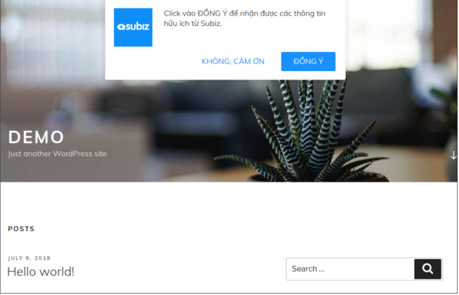

# Mã nhúng Mời khách nhận thông báo

[Thông báo trên trình duyệt User](http://help.subiz.com/bat-dau-voi-subiz/thiet-lap-moi-truong-tuong-tac/tich-hop-subiz-len-website/thong-bao-tren-trinh-duyet-users) là một tính năng mạnh giúp bạn kèo User quay lại web dựa vào tin nhắn tương tác trên cửa sổ Subiz. Trong tài liệu này,  chúng tôi đưa ra ví dụ để giúp bạn thu hút được nhiều User đồng ý nhận thông báo trên màn hình.

### Kịch bản thực hiện  

Kịch bản là thiết lập một popup hỏi khách truy cập có đồng ý nhận thông báo. Khi khách click đồng ý,  sẽ gọi đến [Subiz API Javascript đăng ký nhận thông báo](http://help.subiz.com/su-dung-subiz-nang-cao/api-javascript-cua-subiz-widget#api-subscribe-push-notification) để kích hoạt cài đặt.



### Cách triển khai

Bạn sao chép đoạn mã html sau đặt dưới mã nhúng Subiz trên code website trước thẻ &lt;body&gt;. 

```csharp
<style type="text/css">
@import url('https://fonts.googleapis.com/css?family=Muli:300,400,700&subset=latin-ext,vietnamese');
body{margin:0px; padding: 0px;font-family: 'Muli', sans-serif; font-weight: 400; font-size: 16px; color: #4a4a4a; -webkit-font-smoothing: antialiased; -moz-osx-font-smoothing: grayscale;}
*{box-sizing: border-box;}
.popup-subscribire{position: fixed; top: 20px; width:500px; left: 50%; margin-left:-250px; padding: 18px; border-radius: 3px; background: #FFF; box-shadow: 0px 0px 20px rgba(5,25,62, .15);z-index:99999;display: none;}
.popup-logo{ display: inline-block; vertical-align: top; width:80px; margin-right:20px;}
.popup-logo img{max-width:100%;}
.popup-summary{display: inline-block; width:calc(100% - 80px - 25px); line-height: 21px;}
.popup-bottom{position: relative; width:100%; padding: 5px 0 0 0; text-align: right;}
.popup-bottom a{ display: inline-block;vertical-align: middle; margin:0 3px; height: 40px; line-height: 38px; padding: 0 25px; color: #1890ff; font-size: 16px; font-weight:500; text-transform: uppercase; text-decoration: none; border-radius: 3px;}
.popup-bottom a.ok{ color: #FFF; background-color: #1890ff;}
</style>
​
<div class="popup-subscribire">
  <div class="popup-logo"></div>
  <div class="popup-summary">Click vào ĐỒNG Ý để nhận được các thông tin hữu ích từ Subiz.</div>
  <div class="popup-bottom">
    <a href="#" onclick="closePopUp();">Không, cảm ơn</a>
    <a href="#" class="ok" onclick="subiz('subscribePushNotification');closePopUp()">Đồng ý</a>
  </div>
</div>
​
<script type="text/javascript">
  function closePopUp(e) {
    document.querySelector('.popup-subscribire').style.display = 'none'
    if ( typeof(Storage) !== 'undefined') {
        sessionStorage.setItem('closePopUp', 1);
    }    
  }
  navigator.getBattery().then(function(battery) {
    if (battery.charging && battery.chargingTime === 0) {
      console.log("I'm a desktop")
      if(!window.subiz) {
        console.log('Have no code subiz')
        return
      }
      subiz('checkPushNotification', function(status) {
      if(status || (typeof(Storage) !== 'undefined' && sessionStorage.getItem('closePopUp'))) return
        document.querySelector('.popup-subscribire').style.display = 'block'
      })
    }
  });
</script>
```

Bạn chú ý: 

* Thay đường dẫn **logo.png** bằng đường dẫn logo của bạn.
* Sửa lại phong cách và mầu sắc để phù hợp bằng cách sửa từ CSS. Ghép đoạn CSS với file css của web để cho gọn gàng.
* Popup hỏi sẽ hiển thị đến khi khách Đóng lại. 

