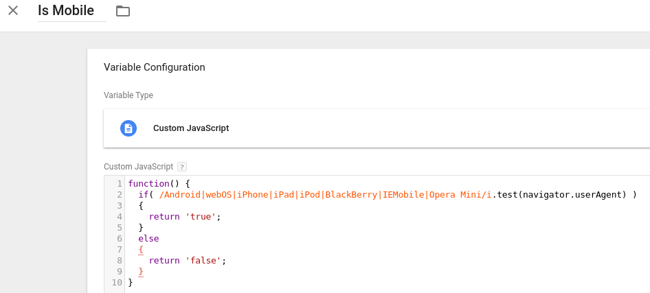
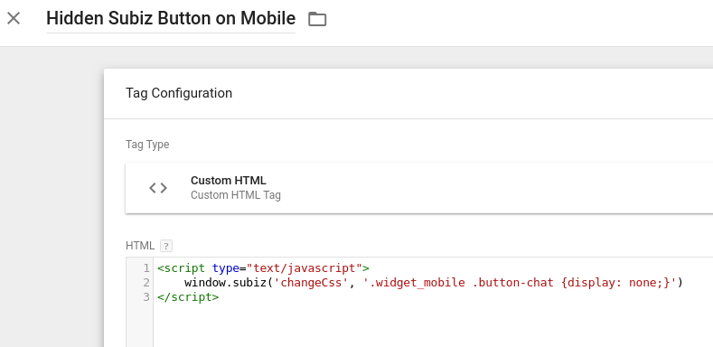
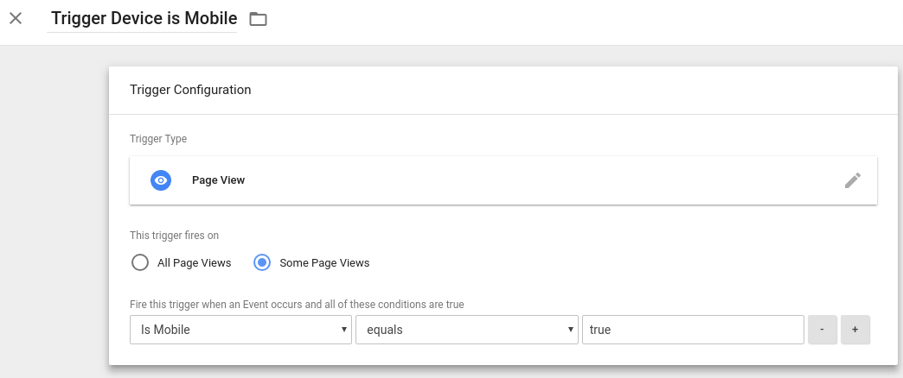

# Sử dụng API Js với Google Tag

### Cửa sổ Subiz mở lên khi khách cuộn chuột xuống dưới. 

Tại ví dụ này, kịch bản là Khi khách cuộn chuột xuống 60% màn hình khi vào một landing page thì cửa sổ chat sẽ bật lên. 

**Bước 1**: Login tài khoản Google Tag Manager của bạn, chọn website và workspace bạn làm việc. Tiếp đến, bạn tạo 1 tag mới với loại tag là "Custom HTML" và sử dụng [API Javascript Mở Subiz Widget](https://help.subiz.com/su-dung-subiz-nang-cao/api-javascript-cua-subiz-widget#mo-dong-subiz-widget). 


**Bước 2**: Bạn tạo Trigger cho tag trên.

Click tạo mới Trigger, chọn loại Scroll Depth. Trên màn hình, chọn "Vertical Scroll Depths" \(nghĩa là chuột cuộn dọc, nếu bạn muốn cuộn ngang thì chọn "Horizontal Scroll Depths"\). 

Tại ô "Percentages", chọn số phần trăm và bạn mong muốn khi khách hàng cuộn đến khoảng đó, thì cửa sổ Subiz sẽ mở. Ở ví dụ này, tôi chọn 60%.

Tại đề mục "This trigger fires on", bạn có thể chọn All page - Nghĩa là nó hoạt động trên mọi page; hoặc Some Pages - xác định một page cụ thể.   
Tôi chọn "Some Pages" và dưới tôi sẽ chọn url chứa từ "LandingPage". Điều đó có nghĩa, nó chỉ hoạt động trên URL có chứa "landingPage". 


Sau đó, bạn SAVE &gt; SUBMIT &gt; PUBLISH. Sử dụng chức năng Previews để kiểm tra nếu cần thiết. Cửa sổ Subiz sẽ tự mở khi khách hàng cuộn chuột 60% màn hình. 

Trong ví dụ này, bạn có thể thay Trigger Scroll Depth bằng: 

* Đồng hồ Timer: Ví dụ với kịch bản, khách vào page 3 giây thì cửa sổ chat mở, hoặc sau khi khách click form Đăng ký trên web 2 giây thì cửa sổ chat mở ... 
* Sự kiện Click vào một element: Ví dụ với kịch bản khi khách click nút đăng ký, cửa sổ chat mở; khách click nút mua hàng hay yêu cầu hỗ trợ... 
* Sự kiện Submit form Lỗi/Thành công: Để xuất hiện đúng thời điểm khi khách cần hay cung cấp dịch vụ VIP cho những khách hàng quan trọng.

### Dùng Google Tag Manager để tùy chỉnh Widget

Trong ví dụ này, tôi sẽ sử dụng Google Tag Manager để ẩn đi chat button Subiz khi truy cập bằng mobile. 

**Bước 1: Dùng Google Tag Manager để nhận biết thiết bị là Mobile.**

* Login Google Tag, vào phần Variable và tạo mới Variable với loại là Custom Javascript. Sử dụng function dưới đây để nhận biết thiết bị Mobile

```javascript
function() {
 if( /Android|webOS|iPhone|iPad|iPod|BlackBerry|IEMobile|Opera Mini/i.test(navigator.userAgent) ) 
 {
  return 'true';
 } 
 else 
 {
  return 'false';
 }
}
```



**Bước 2: Tạo Tag để gọi đến** [**Subiz API Javascript để thay đổi CSS**](http://help.subiz.com/su-dung-subiz-nang-cao/api-javascript-cua-subiz-widget#tuy-chinh-css)**.** 

Tạo tag mới với loại là Custom HTML và nhập đoạn mã sau để ẩn cửa sổ Subiz trên mobile:

```javascript
<script type="text/javascript">
    window.subiz('changeCss', '.widget_mobile .button-chat {display: none;}')
</script>
```



**Bước 3: Tạo trigger cho tag trên.**

Tại trang trigger, tạo trigger mới với loại là Page View. Sử dụng Variables "is Mobile" để nhận biết Page View bằng Mobile.Bạn thiết lập như hình dưới:



Bây giờ bạn SAVE &gt; SUBMIT &gt; PUBLISH lên website. Dùng chức năng Preview để kiểm tra lại sự hoạt động.

Qua ví dụ này, bạn có thể thay thế việc ẩn bằng sáng tạo riêng cho mình những Button khác để hấp dẫn hơn trên thiết bị Mobile. Hoặc bạn cũng có thể lập trình đơn giản để mỗi ngày, cửa sổ Subiz có một diện mạo khác nhau.

