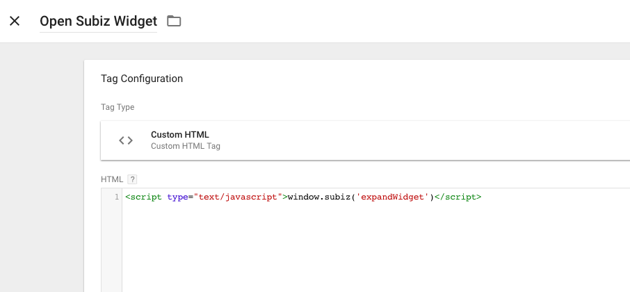
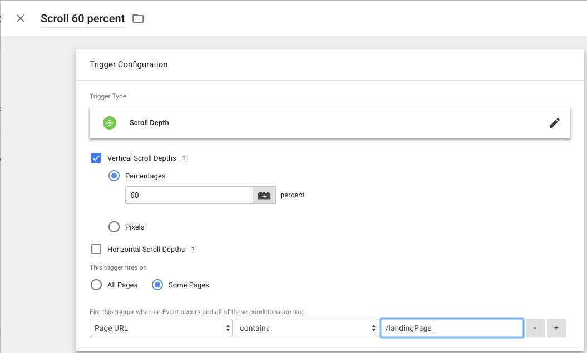

# Sử dụng API Js với Google Tag

### Cửa sổ Subiz mở lên khi khách cuộn chuột xuống dưới. 

Tại ví dụ này, kịch bản là Khi khách cuộn chuột xuống 60% màn hình khi vào một landing page thì cửa sổ chat sẽ bật lên. 

Bước 1: Login tài khoản Google Tag Manager của bạn, chọn website và workspace bạn làm việc. Tiếp đến, bạn tạo 1 tag mới với loại tag là "Custom HTML" và sử dụng [API Javascript Mở Subiz  Widget](https://help.subiz.com/su-dung-subiz-nang-cao/api-javascript-cua-subiz-widget#mo-dong-subiz-widget). 

Bước 2: Bạn tạo trigger cho tag trên.

Click tạo mới Triggerr, chọn loại Scroll Depth. Trên màn hình, chọn "Vertical Scroll Depths" \(nghĩa là chuột cuộn dọc, nếu bạn muốn cuộn ngang thì chọn "Horizontal Scroll Depths"\). 

Tại ô "Percentages", chọn số phần trăm và bạn mong muốn khi khách hàng cuộn đến khoảng đó, thì cửa sổ Subiz sẽ mở. Ở ví dụ này, tôi chọn 60%.

Tại đề mục "This trigger fires on", bạn có thể chọn All page - Nghĩa là nó hoạt động trên mọi page; hoặc Some Pages - xác định một page cụ thể. Tôi chọn "Some Pages" và dưới tôi sẽ chọn url chưa từ "landingPage". Điều đó có nghĩa, nó chỉ hoạt động trên URL có chưa "landingPage". 

Sau đó, bạn Save và Publish. Sửu dụng chức năng Previews để kiểm tra nếu cần thiết. Cửa sổ Subiz sẽ tự mở khi khách hàng cuộn chuột 60% màn hình. 

Trong ví dụ này, bạn có thể thay Trigger Scroll Depth bằng: 

* Đồng hồ Timer: Ví dụ với kịch bản, khách vào page 3 giây thì cửa sổ chat mở, hoặc sau khi khách click form Đăng ký trên web 2 giây thì cửa sổ chat mở ... 
* Sự kiện Click vào một element: Ví dụ với kịch bản khi khách click nút đăng ký, cửa sổ chat mở; khách click nút mua hàng hay yêu cầu hỗ trợ... 
* Sự kiện Submit form Lỗi/Thành công: Để xuất hiện đúng thời điểm khi khách cần hay cung cấp dịch vụ VIP cho những khách hàng quan trọng.

