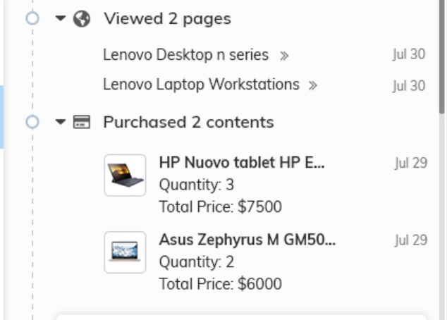
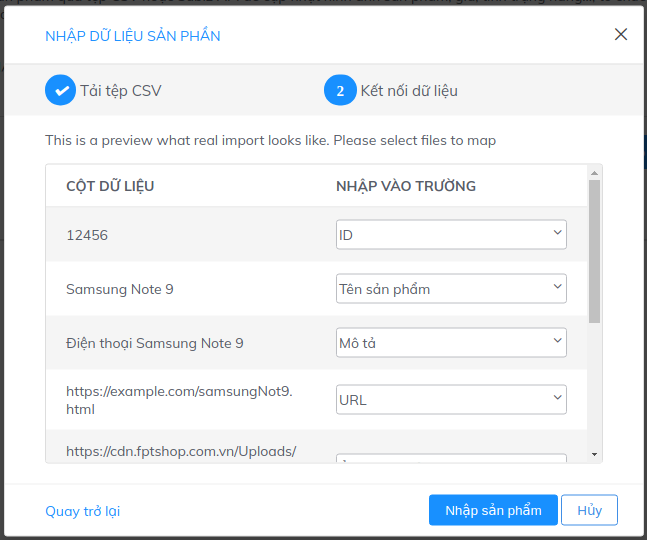

# Sản phẩm

### Quản lý sản phẩm là gì?

Chức năng quản lý sản phầm là cách dễ dàng nhất để bạn lưu trữ thông tin sản phẩm mà doanh nghiệp bạn đang kinh doanh lên Subiz, từ đó bạn có thể gửi sản phẩm cho khách hàng, mời khách hàng mua sản phẩm ngay trên cửa sổ Subiz, hỏi phản hồi về một sản phẩm cụ thể...

Chức năng quản lý sản phẩm giúp bạn lưu trữ chứ không thay thế phần mềm quản lý kho của doanh nghiệp. Nhưng nó có khả năng đồng bộ dữ liệu giúp nhân viên trong công ty dễ dàng tiếp cận thông tin và kho hàng. Các cách sau để bạn nhập dữ liệu vào Subiz.

### Sử dụng Sản phẩm lưu trên 

Dưới đây là các ví dụ để bạn sử dụng Sản phẩm trên Subiz.

* Subiz nhận biết khách hàng xem sản phẩm gì và hiển thị lên trên màn hình của agent.

* Sử dụng Sản phẩm để tạo những Tin nhắn mẫu, từ đó gửi tới Khách hàng. 

* Sử dụng trong Automation.

### Nhập dữ liệu sản phẩm từ file CSV.

CSV \(Comma Separated Values\) là một loại định dạng văn bản đơn giản mà trong đó, các giá trị được ngăn cách với nhau bằng dấu phẩy. File CSV cũng mở được bằng Google Sheet hay Excel. Xem file [Google Sheet Demo](https://docs.google.com/spreadsheets/d/1yvMHsSmljV29gNQKdyRj-YMNn2rzeswVfzOTeUOiEAg/edit?usp=sharing), từ Google Sheet bạn có thể tải về file CSV.

Sau khi bạn đã chuẩn bị file CSV chứa dữ liệu sản phẩm. Bạn thực hiện các bước sau:

* Bước 1: Truy cập Subiz Cài đặt &gt; [Sản phẩm](https://app.subiz.com/settings/content). Chọn nút "**Nhập sản phẩm**". Làm theo hướng dẫn để tải file CSV sản phẩm của bạn lên.
* Bước 2: Khai báo các cột dữ liệu trong file CSV để khớp với các trường dữ liệu của Subiz cung cấp. Sau đó click nút "**Nhập sản phẩm**"  

Các trường dữ liệu Subiz như sau: 

<table>
  <thead>
    <tr>
      <th style="text-align:left">Tên trường</th>
      <th style="text-align:left">Mô</th>
    </tr>
  </thead>
  <tbody>
    <tr>
      <td style="text-align:left"><em>ID</em>
      </td>
      <td style="text-align:left">
        
Là mã của sản phẩm do bạn tự đặt. Subiz sử dụng để nhận diện

        
sản phẩm. Ví dụ: 12456

      </td>
    </tr>
    <tr>
      <td style="text-align:left"><em>Tên sản ph</em>
      </td>
      <td style="text-align:left">Tên của sản phẩm.</td>
    </tr>
    <tr>
      <td style="text-align:left"><em>Mô tả</em>
      </td>
      <td style="text-align:left">Mô tả ngắn về sản phẩm.</td>
    </tr>
    <tr>
      <td style="text-align:left"><em>URL</em>
      </td>
      <td style="text-align:left">
        
Đường dẫn về sản phẩm, có thể là trang chi tiết một sản phẩm

        
trên website.

      </td>
    </tr>
    <tr>
      <td style="text-align:left"><em>Ảnh</em>
      </td>
      <td style="text-align:left">Là đường dẫn tới ảnh của Sản phẩm.</td>
    </tr>
    <tr>
      <td style="text-align:left"><em>Tình tr</em>
      </td>
      <td style="text-align:left">
        
Là tình trạng sản phẩm còn hàng hay không.

        
Ví dụ: in stock; out of stock; preorder; discontinued...

      </td>
    </tr>
    <tr>
      <td style="text-align:left"><em></em>
      </td>
      <td style="text-align:left">Giá của sản phẩm. Ví dụ: 1,000,000.</td>
    </tr>
    <tr>
      <td style="text-align:left"><em>Đơn vị tiền tệ</em>
      </td>
      <td style="text-align:left">Là đơn vị tiền tệ cho giá. Ví dụ $ hoặc VNĐ.</td>
    </tr>
    <tr>
      <td style="text-align:left"><em>Giá khuyến mại</em>
      </td>
      <td style="text-align:left">Là giá đã giảm giá. ví dụ 980,000.</td>
    </tr>
    <tr>
      <td style="text-align:left"><em>Fields</em>
      </td>
      <td style="text-align:left">Là những dữ liệu tùy biến khác bạn muốn đưa lên.</td>
    </tr>
  </tbody>
</table>### Câu hỏi thường gặp về Sản phâm. 

1. Cập nhật dữ liệu một sản phẩm thế nào? Bạn có thể tạo một file CSV chứa riêng sản phẩm đó. Subiz sẽ nhận diện bằng ID \(mã sản phẩm\) để ghi đè dữ liệu.
2. Subiz có đồng bộ dữ liệu tự động từ web về? Chúng tôi đang phát triển chức năng này. 

