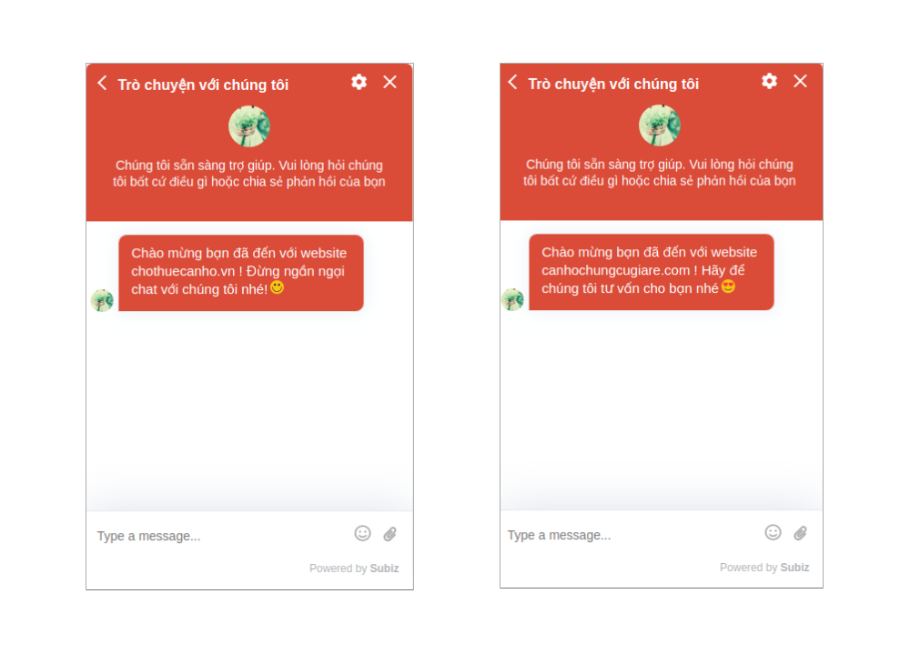
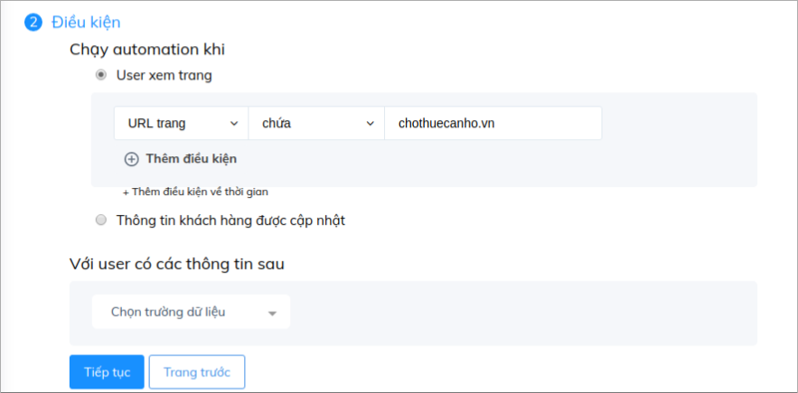
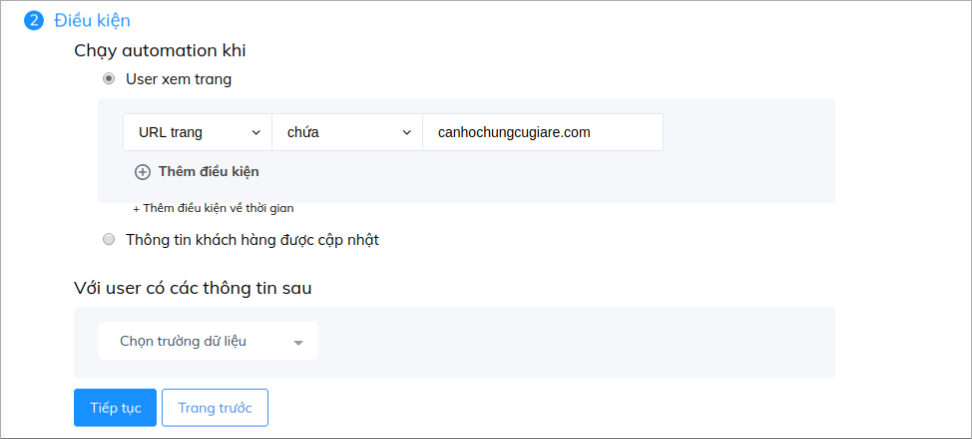
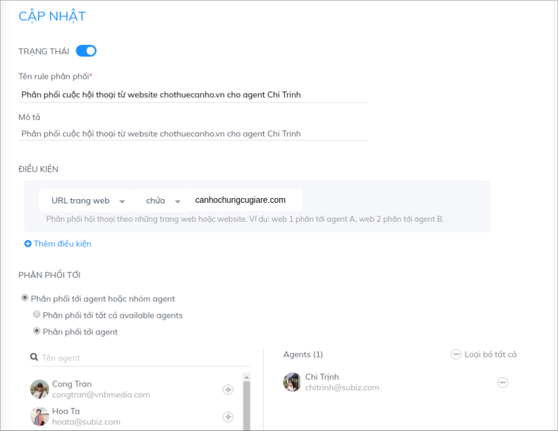
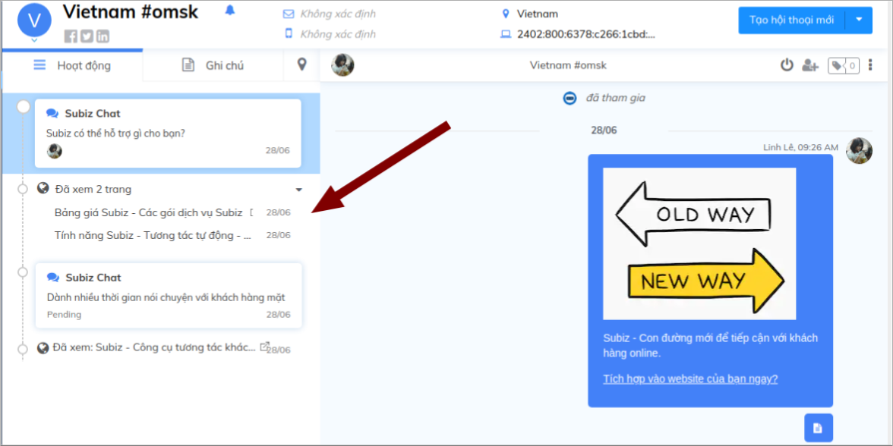

# Sử dụng Subiz trên nhiều website

Thay vì sử dụng nhiều tài khoản Subiz để hỗ trợ khách hàng trên nhiều website , bạn hoàn toàn có thể chỉ sử dụng một tài khoản Subiz duy nhất để có thể quản lý toàn bộ tương tác của doanh nghiệp và lưu trữ dữ liệu khách hàng tập trung. Subiz sẽ được tùy chỉnh để phù hợp với giao diện từng web, đặc trưng của từng lĩnh vực và giúp bạn có thể quản trị riêng biệt từng website hiệu qủa.

### Tùy chỉnh cửa sổ chat riêng biệt trên từng web

Cùng với sự kết hợp với mã API Javascript, bạn hoàn toàn có thể tùy chỉnh button Subiz và giao diện widget phù hợp với từng website bạn quản lý.

* _**Tùy chỉnh mẫu button Subiz riêng biệt**_

Bước 1: Copy và paste đoạn code sau vào code html của website, tương tự như cách đặt mã nhúng widget:

```text
<script type="text/javascript">window.subiz(‘changeCss’, ‘[css_custom]’)</script>
```

Bước 2: Thay đoạn CSS sau vào phần “\[css\_custom\]”

| Button trên Desktop  |
| :---: |
| .widget\_desktop .button-chat {border-radius:  0; -webkit-mask-image: none; background-image: url\(**image-link**\); background-repeat: no-repeat;}  .widget\_desktop .button-chat-icon { display:  none;} @supports \(-ms-ime-align:auto\) { .widget\_desktop .button-chat{border-radius:50%;}  .widget\_desktop .button-chat-icon {display: inline-block;} } .widget\_desktop .widget-button {**width: 90px; height: 90px;**} .widget\_desktop .widget-button:after {display:none;} .widget\_desktop .widget\_mini .close-widget-icon {display: none;} .widget\_desktop .button-chat .avatar-preview img {display: none;} .widget\_desktop .button-chat {border-radius: 0; box-shadow: none; background-color: transparent; position: inherit;} |

| Button trên Mobile  |
| :---: |
| widget\_mobile .button-chat {border-radius:  0; -webkit-mask-image: none; background-image: url\(**image-link**; background-repeat: no-repeat;}  widget\_mobile .button-chat-icon { display:  none;} @supports \(-ms-ime-align:auto\) { .widget\_mobile .button-chat{border-radius:50%;}  .widget\_mobile .button-chat-icon {display: inline-block;} } .widget\_mobile .widget-button {**width: 90px; height: 90px;**} .widget\_mobile .widget-button:after {display:none;} .widget\_mobile .widget\_mini .close-widget-icon {display: none;} .widget\_mobile .button-chat .avatar-preview img {display: none;} .widget\_mobile .button-chat {border-radius: 0; box-shadow: none; background-color: transparent; position: inherit;}  |


**Lưu ý:** image -link: Link ảnh

Bạn có thể thay đổi kích cỡ button tại phần **Width** và **Height**.


* _**Tùy chỉnh cửa sổ chat Subiz**_

Tùy chỉnh vị trí cửa sổ chat

```text
 subiz('setPosition', 'left') . giá trị left hoặc right
```

Lựa chọn kiểu cửa sổ chat Mở rộng hoặc Thu nhỏ

```text
subiz('setWindowMode', 'full') . giá trị full hoặc mini
```

* _**Tùy chỉnh nội dung trên thanh tiêu đề**_

```text
subiz('setLanguageData', {}) 
VD subiz('setLanguageData', {team_intro: "Chúng tôi sẵn sàng trợ giúp. Vui lòng hỏi chúng tôi bất cứ điều gì hoặc chia sẻ phản hồi của bạn"})
```

* _**Tùy chỉnh CSS khác**_

Ngoài ra bạn có thể sử dụng API tùy chỉnh CSS để thay đổi các yếu tố khác của cửa sổ chat 

```javascript
<script type="text/javascript">
    window.subiz('changeCss', '.widget_mini .widget_body {height: 750px !important; max-height: 800px !important;}')
</script>
```

Bạn tham khảo thêm [Bảng CSS tùy chỉnh cửa sổ Subiz chat](https://help.subiz.com/bat-dau-voi-subiz/thiet-lap-moi-truong-tuong-tac/tich-hop-subiz-len-website/bang-css-tuy-chinh-cua-so-chat)!

### Tạo lời chào riêng biệt trên từng web

Cùng với chức năng [**Automation gửi tin nhắn tự động**](https://app.subiz.com/settings/automations/add-conversation), bạn hoàn toàn có thể tạo những lời chào thu hút ấn tượng trên từng website.

Tham khảo : [Hướng dẫn tạo lời chào tự động trên website ](https://help.subiz.com/su-dung-subiz-nang-cao/tuong-tac-tu-dong/mot-so-automation-thong-dung/automation-gui-tin-nhan-tu-dong)



Bạn cần thiết lập điều kiện theo URL trang để tạo các Automation này:





### Phân phối cuộc chat trên từng web cho tư vấn viên

Với việc tích hợp Subiz trên nhiều website, bạn có thể mời thêm các Agent tham gia vào tài khoản và phân phối cuộc hội thoại từ từng web cho họ nhờ chức năng [**Rule phân phối .** ](https://app.subiz.com/settings/rule-setting)Với vai trò là người quản lý, bạn vẫn có thể theo dõi và quản lý hoạt động chung trên các web.




Ngoài ra, việc chủ động quan sát lịch sử hoạt động của khách trên website ví dụ như họ đang xem trang hay sản phẩm nào cũng giúp bạn có thể biết được khách đến từ website nào và chủ động cung cấp thông tin phù hơp:




