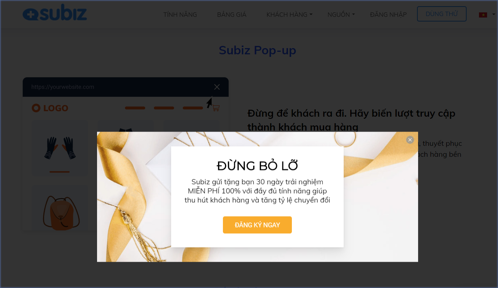

# Pop-up chuyển đổi khách hàng

### 1. Pop-up là gì?

Pop-up là một hình thức quảng cáo, bằng cách tự động hiện cửa sổ nổi bật trên website với mục đích tạo ấn tượng và kêu gọi khách hàng hành động.

Doanh nghiệp sử dụng Pop-up để truyền tải mạnh mẽ thông điệp khuyến mãi hoặc sản phẩm dịch vụ và chuyển đổi khách hàng mục tiêu như mua hàng, điền thông tin,....

### 2. 4 lợi ích khi sử dụng pop-up

Pop-up là công cụ quảng cáo hiệu quả dành cho doanh nghiệp vì 4 lợi ích chính sau: 

* **Quảng cáo thu hút và kích thích mua hàng** Hiện thị thông tin sản phẩm, dịch vụ và chuyển hướng khách hàng xem trang đích quảng cáo. Đồng thời, sử dụng chiến thuật tâm lý khách hàng để thôi thúc khách hàng mua hàng qua các chương trình khuyến mãi hoặc đếm ngược thời gian mua hàng.
* **Thu thập thông tin khách hàng** Xây dựng kịch bản thu hút khách hàng điền thông tin liên hệ. Bạn sẽ chủ động kết nối và gia tăng bán hàng qua các công cụ khác như email, điện thoại.
* **Tổng hợp kiến đánh giá của khách hàng** Ý kiến của khách hàng là thước đo sự hài lòng của họ về Doanh nghiệp. Từ đó, bạn có kế hoạch phát triển doanh nghiệp cho phù hợp.
* **Mời khách hàng trò chuyện tư vấn** Kêu gọi khách hàng trò chuyện tư vấn ngay trên cửa sổ chat hoặc chat Facebook, Zalo giúp bạn hiểu đúng nhu cầu của khách hàng mục tiêu.

### **3. Một số câu hỏi thường gặp về pop-up**

* _**Cài đặt pop-up có dễ dàng không?**_ Rất dễ dàng với Subiz pop-up. Subiz có sẵn thư viện pop-up mẫu cho bạn chọn sử dụng nhanh chóng. Không cần kỹ thuật hay code web.
* _**Ưu điểm của pop-up Subiz là gì?**_ Dễ dàng cài đặt với thư viện pop-up mẫu đa dạng Chọn đúng thời điểm chạy pop-up theo hành vi của khách truy cập web Sàng lọc đúng khách hàng mục tiêu dựa vào nhiều dữ liệu người dùng
* _**Tôi có thể thay đổi được hình ảnh thiết kế của pop-up?**_ Có, bạn có thể chọn các hình ảnh có sẵn trên Subiz hoặc tải ảnh bạn thiết kế cho pop-up
* _**Tôi có thể gửi email cho khách điền thông tin vào pop-up?**_ Có, khi khách hàng đã điền địa chỉ email vào pop-up, bạn có thể thiết lập tự động gửi email thông báo tới khách hàng. 
* _**Tôi có thống kê và thông tin khách hàng từ pop-up?** Có, bạn sẽ có số liệu thống kê chi tiết hoạt động của pop-up, tỷ lệ chuyển đổi và danh sách khách hàng chuyển đổi qua pop-up._

Bạn được tạo nhiều pop-up trên Subiz cho những mục tiêu khác nhau.   
[**SỬ DỤNG NGAY POP-UP SUBIZ**](https://app.subiz.com/campaigns)  
[**XEM HƯỚNG DẪN CÀI ĐẶT POP-U**P ****](https://help.subiz.com/su-dung-subiz-nang-cao/pop-up-chuyen-doi-khach-hang/cai-dat-pop-up-campaign)\*\*\*\*

