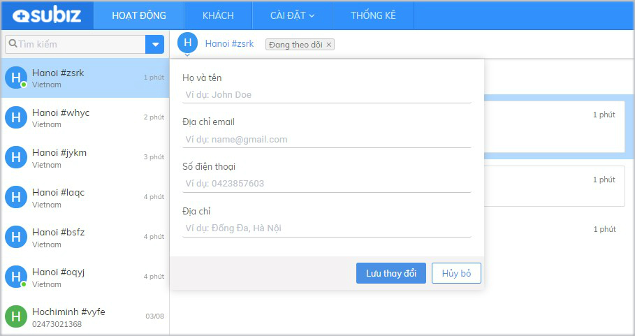
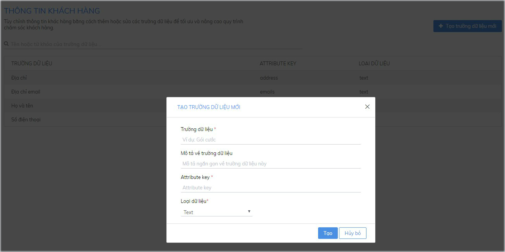

# API đồng bộ dữ liệu website và Subiz

API là giao thức chuyển dữ liệu giữa các ứng dụng. Subiz cung cấp Javascript API cho phép đồng bộ dữ liệu khách hàng giữa ứng dụng Subiz và website. Bạn có thể cập nhật dữ liệu khách hàng, lấy thông tin khách hàng và gửi các dữ liệu hành động của khách hàng từ website lên Subiz.


 **Lưu ý khi sử dụng API:**

1. Các đoạn mã API cần được đặt sau mã nhúng Subiz trong trang code website. Không cần đặt sát sau, chỉ cần đảm bảo mã nhúng Subiz được đặt trên mã API. 
2. Để sử dụng API, chỉ lập trình viên có thể cài đặt theo hướng dẫn. Nếu doanh nghiệp không có lập trình viên riêng , hãy tìm thuê lập trình viên làm việc thời vụ để họ giúp bạn.


### 1. Dữ liệu khách hàng

Subiz lưu trữ thông tin khách hàng với 4 trường dữ liệu khách hàng mặc định: Họ tên, Địa chỉ email , Số điện thoại, Địa chỉ. 



Tùy  theo nhu cầu doanh nghiệp, bạn có thể tạo trường dữ liệu mới để thu thập và tổng hợp thông tin khách hàng với các đặc tính riêng. 

Để thêm trường dữ liệu khách hàng, bạn đăng nhập App.subiz.com &gt;[ **Cài đặt &gt; Tài khoản &gt; Thông tin khách hàng &gt; Tạo trường dữ liệu mới**](https://app.subiz.com/settings/user-attributes#)**​**



### **2. API cập nhật dữ liệu khách hàng trên Subiz**

Bạn có thể sử dụng Subiz API Javascript để cập nhật dữ liệu khách hàng mặc định trên Subiz hoặc cập nhật các trường dữ liệu tạo thêm của riêng doanh nghiệp.

Để chuyển đúng dữ liệu qua API, bạn cần xác định được  2 thông số:

* Key là: Attribute key 
* Loại dữ liệu: Subiz có 5 loại dữ liệu gồm Text, Number, Boolean, List, Date Time . \(Xem chú thích chi tiết\) 

**2.1 API cập nhật một trường dữ liệu mặc định** 



```text
<script>
subiz('updateUserAttributes', [{ key: 'fullname',   text : 'David’ }]);
</script>
```



```text
<script>
subiz('updateUserAttributes', [{ key: ’phones’,   text : '09123456789', '0987654321' }]);
</script>
```



```text
<script>
subiz('updateUserAttributes', [{ key: 'emails’,   text :'example1@domain.com, example2@domain.com' }]);
</script>
```



**2.2. API cập nhật đồng thời nhiều trường dữ liệu mặc định** 

```text
<script>
subiz('updateUserAttributes', [{ key:'fullname',   text : 'David' },{ key:'phones',   text : '09123456789' } ]);
</script>
```

**2.3 API cập nhật trường dữ liệu thêm mới**

Subiz ví dụ 2 API cập nhật 2 trường dữ liệu thêm mới là Ngôn ngữ và Khách hàng như sau:



```text
<script>
subiz('updateUserAttributes', [{ key:'ngon_ngu',   list : [‘Vietnamese’, ‘English’] } ]);
</script>
```



```text
<script>
subiz('updateUserAttributes', [{ key:'khach_hang',   boolean : true }]);
</script>
```



### 3. API xóa dữ liệu khách hàng

API cho phép xóa dữ liệu khách hàng trên ứng dụng Subiz. Dữ liệu khách hàng bị xóa sẽ mất hoàn toàn trên trình duyệt \(Client\) và trên ứng dụng Subiz để agent không nhìn thấy các khách hàng này nữa.



```text
<script>
subiz('forgetMe');
</script>
```



### 4. API lấy dữ liệu khách hàng hàng từ Subiz vào website

API cho phép đọc dữ liệu khách hàng đã lưu trữ trong Subiz để website có thể sử dụng.



```text
<script>
subiz('getUserAttributes', (attributes) => {console.log('user attributes', attributes)});
</script>
```



> Đọc thêm [API tùy biến ngôn ngữ cửa sổ Subiz theo ngôn ngữ website tại đây.](https://help.subiz.com/bat-dau-voi-subiz/thiet-lap-moi-truong-tuong-tac/tich-hop-subiz-len-website/cac-ngon-ngu-ho-tro-tren-cua-so-subiz-chat)


