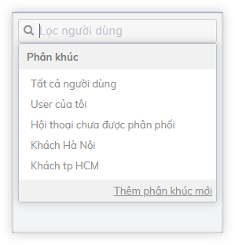
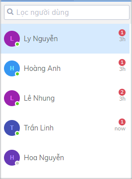
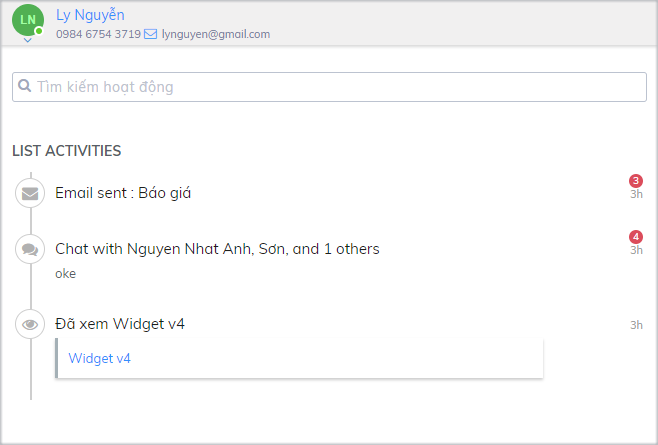
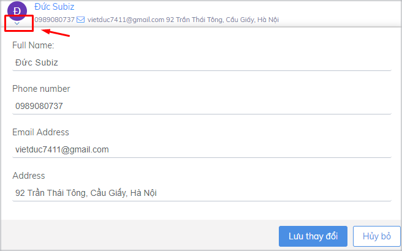

# Cập nhật và chỉnh sửa thông tin user

**User là các khách hàng đã có tương tác với bạn qua** [**Subiz**](https://subiz.com/vi/)**,** bao gồm các khách hàng tương tác với bạn trên website, từ [Fanpage](https://subiz.com/vi/facebook-messenger.html) và [Email](https://subiz.com/vi/email.html). Danh sách user được hiển thị ở khung đầu tiên bên trái trên trang **Hoạt động.**

Tại trang **Hoạt động**, bạn có thể đồng thời theo dõi danh sách các user, lịch sử hoạt động của từng user và tương tác trực tiếp với họ.

### **Danh sách User** {#danhsachuser}

**Danh sách user hiển thị là các user đã được chỉ định cho bạn.** Ngoài ra, bạn có thể sử dụng bộ lọc để tìm kiếm user theo phân khúc và kiểm tra danh sách các user chưa được phân phối.

**User sẽ được hiển thị theo tên và ảnh đại diện**. Tại ảnh đại diện của user có trạng thái online \(màu xanh\) hoặc offline \(màu xám\). Nếu có tương tác mới từ user, bạn sẽ thấy hiển thị số tin nhắn màu đỏ và thời gian tin nhắn được gửi đến.

Khi click vào từng user, bạn có thể kiểm tra lịch sử hoạt động của user đó \(trong phần Danh sách hoạt động\) và bắt đầu các cuộc hội thoại với user.

### **List Activities** {#listactivities}

**Khi chọn một user cụ thể, bạn sẽ thấy hiển thị lịch sử hoạt động và tương tác của user với doanh nghiệp,** ví dụ xem 1 trang trên website và tương tác của user đó với bạn qua [Subiz Chat ](https://subiz.com/vi/live-chat.html)hoặc [Email](https://subiz.com/vi/email.html)\).

Các cuộc hội thoại có tin nhắn chưa đọc sẽ hiển thị thông báo đỏ.

Với các hoạt động là cuộc hội thoại, khi click vào từng hoạt động sẽ hiển thị chi tiết tại cửa sổ tương tác ở cột thứ 3.

### **Thông tin user** {#thongtinuser}

Bạn có thể theo dõi thông tin cụ thể của từng user bao gồm:

* Tên
* Số điện thoại
* Địa chỉ Email
* Địa chỉ liên hệ

**Để nhập thông tin cho user**, bạn click vào mũi tên phía dưới ảnh đại diện của Agent phía trên Danh sách hoạt động, nhập thông tin và chọn Lưu thay đổi.

